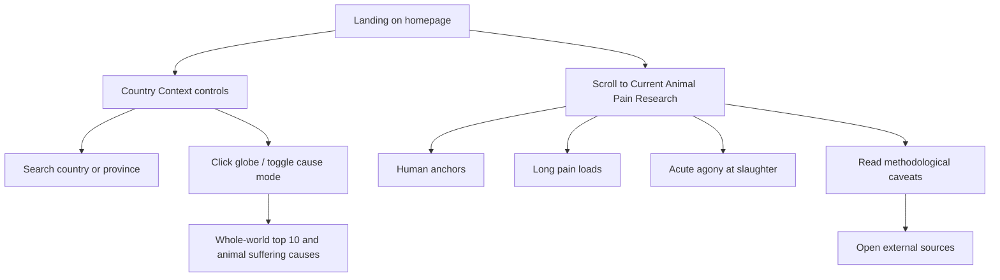
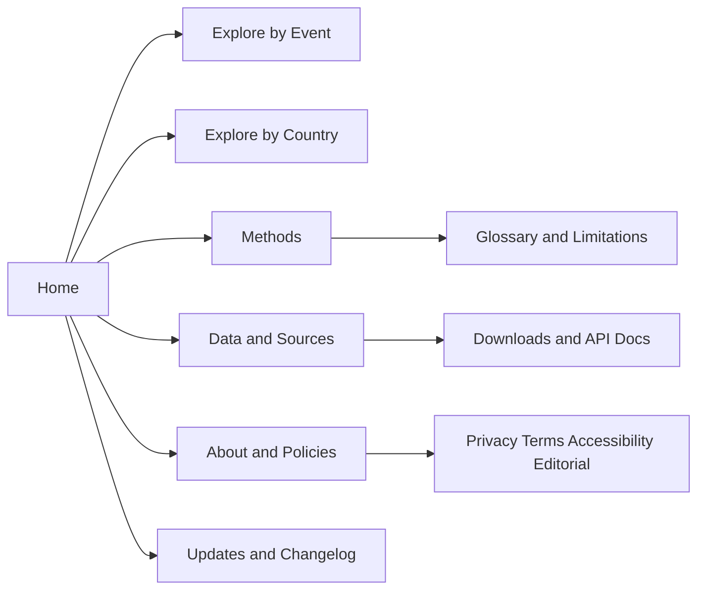

# painmaps.org improvement plan for Codex GPT-5.5 xhigh reasoning

## Executive summary

**Audience:** Codex GPT-5.5 xhigh reasoning  
**Assumption:** this review had no access to private analytics, source repository internals, deployment settings, or backend/database credentials. Findings are based on a public crawl, rendered-page inspection, public SSL/hosting evidence, and primary standards/guidelines.

painmaps.org is currently a **single, highly ambitious, data-dense public page** whose stated purpose is to visualize current research on **animal pain**, especially Welfare Footprint estimates for birds, while using a **secondary country-context globe** for broader suffering/death burden context. The public crawl surfaced one main first-party page, a long sequence of interactive controls and explanatory sections, and a very large source list, but **no visible privacy policy, terms, cookie notice, or explicit persona-based navigation** in the rendered experience. Public SSL/hosting evidence indicates the domain resolves to GitHub CDN hostnames/IPs consistent with **GitHub Pages custom-domain hosting**. citeturn49view0turn49view3turn49view5turn9view6turn9view7turn15search0turn18search2turn18search3

The site’s main strategic problem is **not lack of substance**. It is that the substance is presented in a structure that is too dense for broad comprehension, too visually dependent for strong accessibility, too under-governed for a health/research-adjacent public resource, and too lightly scaffolded for trust, discoverability, and long-term maintainability. The highest-confidence priorities are therefore: **rebuild the information architecture**, **add accessibility-equivalent non-visual pathways for every interactive map/chart**, **separate methods/data/policies from the storytelling layer**, **establish content governance and legal transparency**, and **instrument privacy-first performance and analytics**. citeturn49view0turn49view3turn49view5turn46view0turn46view1turn46view2turn29search8turn35search0

A second major conclusion is strategic: **do not bolt patient-data collection onto the current GitHub Pages public site**. If painmaps.org later expands from public research visualization into patient-, clinician-, or researcher-account workflows with identifiable health or symptom data, that should become a **separate product boundary** with a HIPAA-capable architecture, explicit data governance, consent flows, and business-associate/cloud controls. HHS states that the HIPAA Security Rule applies to electronic protected health information and that cloud use by regulated entities requires compliant safeguards and responsibilities; this is a materially different operating model from a static public website. citeturn35search0turn35search1turn35search9

## Current site crawl and technical profile

The public crawl found **one main first-party experience**: the homepage titled “Who Can Feel Pain,” with the primary heading “How much pain do animals feel?” The page explicitly says its main purpose is visualizing current animal-pain research and its globe is a **secondary context layer**. The crawl shows an experience organized around interactive country controls, a world/context panel, an animal-pain research section, explanatory methodological caveats, and a long bibliography/source list. citeturn49view0turn49view3turn49view4turn49view5

### Public crawl summary

| Surface | Current state | Evidence | Implication |
|---|---|---|---|
| Root page | Single public page titled “Who Can Feel Pain” with H1 “How much pain do animals feel?” | citeturn49view0 | This is currently a one-page information product rather than a multi-page knowledge system. |
| Primary intent | Visualize current research on animal pain, especially Welfare Footprint estimates for birds in farming/slaughter systems | citeturn49view0turn49view3 | The site is research/advocacy-oriented, not a consumer pain-management site. |
| Interactive controls | Country search, Find action, zoom/reset globe, globe mode toggles, cause-ordering controls | citeturn49view0turn49view2 | Important content is mediated through interactive controls that must have keyboard/screen-reader equivalents. |
| Content modules | Country-level context, whole-world top 10, animal suffering causes, event-level pain visualization, human anchors, long pain loads, slaughter agony, caveats, methodology notes | citeturn49view2turn49view3turn49view4 | The page is doing too many jobs at once. |
| Source layer | Extensive external source list including Natural Earth, geoBoundaries API, World Bank docs, WorldPop, UNICEF, WHO, OWID, Fishcount, Welfare Footprint, Rethink Priorities | citeturn49view5 | Strong source transparency intent, but poor discoverability and scannability in current form. |
| Policies | No visible “privacy” or “terms” text found in rendered crawl | citeturn9view6turn9view7 | Trust/compliance scaffolding is currently missing or at least not visible. |
| Analytics disclosure | No obvious “analytics” text found in rendered crawl | citeturn9view1 | Analytics setup is not publicly disclosed; privacy posture is unclear. |

### Current information architecture and user flows

The current IA is effectively a **single-scroll narrative application**. The fastest path is: landing page → interact with country context → inspect world rankings/proxies → scroll into event-level animal pain comparisons → read explanatory caveats → optionally click source links. That can work for expert users, but it creates high cognitive load for everyone else because the page introduces abbreviations and methodology terms early, including **ADM1**, **WDI + OWID + RP + WAI proxies**, **DALY-equivalent calculations**, and discussions of sentience/welfare range before it offers a dedicated glossary, methodology page, or definitions hub. citeturn49view0turn49view3turn49view4



From a persona perspective, the current page best fits **researchers, policy/advocacy readers, and EA-adjacent audiences**. It does **not** currently expose explicit journeys for the user groups you asked me to assess—patients, clinicians, and researchers. By contrast, comparable pain-oriented sites often surface clearer segmentation: **paindata.org** visibly splits “Patients” and “Clinicians,” **PainSpot** presents a simple three-step assessment journey plus “For Healthcare Providers,” and Stanford’s **CHOIR body map** explicitly frames value for patients, clinicians, and scientists. citeturn37view0turn37view1turn37view2

### Technical profile

The strongest public technical signal is hosting. A public SSL Labs lookup for painmaps.org resolved the domain to four CDN IPs with hostnames like `cdn-185-199-110-153.github.com`, which, together with GitHub’s own documentation on custom domains for GitHub Pages, strongly indicates **GitHub Pages + GitHub CDN/Fastly-style edge delivery** under a custom domain. I could not, from this environment, independently enumerate the final live response headers or obtain a completed SSL grade artifact. citeturn15search0turn18search2turn18search3turn48search0

| Technical facet | High-confidence assessment | Confidence |
|---|---|---|
| Hosting | GitHub Pages custom-domain hosting is very likely | High citeturn15search0turn18search3 |
| Runtime model | Public-facing experience behaves like a static or mostly static site with client-side interactivity | Medium citeturn49view4 |
| Data inputs | The page references multiple third-party public data/documentation sources, including geoBoundaries API, World Bank, WorldPop, UNICEF, WHO, OWID, Fishcount, Welfare Footprint | High citeturn49view5 |
| CMS | No CMS could be confirmed from public crawl | Medium |
| Front-end framework | No framework could be confirmed from public crawl | Medium |
| Analytics stack | Not confirmable from public crawl | Low |
| Security headers | Not confirmable from public crawl | Low |

## Prioritized improvement plan

What follows is the actionable backlog I would hand to Codex. Priorities are **P0 critical**, **P1 high**, **P2 medium**, **P3 nice-to-have**. Effort ranges assume a modern front-end stack and one engineer/designer pair unless noted.

### High-priority backlog

| Area | Current problem | Priority | Remediation task | Effort | Impact | Testing criteria | Rollout |
|---|---|---:|---|---:|---|---|---|
| UX and IA | Single long page does too many jobs: discovery, methodology, exploration, bibliography, caveats | P0 | Split into: Home, Explore by Event, Explore by Country, Methods, Data/Sources, About/Policies, Updates/Changelog | 30–50 h | Very high | Tree tests, task-completion tests, reduced bounce on source-heavy sections | Phase one |
| UX and IA | No explicit persona paths for patients/clinicians/researchers | P0 | Add entry cards and landing routes tailored to “General readers,” “Clinicians & educators,” and “Researchers” | 12–20 h | High | First-click test ≥80% route success | Phase one |
| Accessibility | Map/globe and chart-heavy interface likely lacks full non-visual parity | P0 | Add equivalent list/table views for every interactive graphic; keyboard-operable controls; `aria-live` updates; descriptive labels | 40–70 h | Very high | Full keyboard traversal, NVDA/VoiceOver task passes, axe clean on critical paths | Phase one |
| Accessibility | Dense, color-dependent comparative visuals risk WCAG failures | P0 | Add legends, patterns/text labels, contrast-safe palettes, downloadable CSV and HTML tables | 24–40 h | Very high | WCAG review for 1.1.1, 1.3.1, 1.4.1, 1.4.3 | Phase one |
| Legal and privacy | No visible privacy/terms/policy links in rendered crawl | P0 | Add footer with Privacy Policy, Terms, Accessibility Statement, Editorial Policy, Methodology, Cookie Notice if needed, Contact, Vulnerability Disclosure | 12–24 h | Very high | All routes expose policy footer; links included in sitemap/footer | Phase one |
| Content strategy | Jargon appears early and often | P1 | Introduce glossary, progressive disclosure, definition tooltips, “Start here” explainer, “What this is / is not” summary | 16–30 h | High | Readability review; comprehension tests; CDC index scoring | Phase one |
| SEO | Generic title (“Who Can Feel Pain”) undersells topic relevance | P1 | Rewrite title architecture, per-page meta descriptions, internal linking, JSON-LD for Organization/WebSite/Dataset/ScholarlyArticle where appropriate | 16–28 h | High | Search Console indexing + rich result validation | Phase one |
| Performance | Exact current metrics unavailable; interactive visual layers pose CWV risk | P1 | Add performance budgets, route-level code splitting, lazy-load non-critical assets, preload critical assets, compress JSON/SVG | 24–40 h | High | Good CWV status in PSI/Search Console; Lighthouse perf >90 on key pages | Phase two |
| Security | Publicly visible header posture not verified; static site still needs hardening | P1 | Configure CSP, HSTS, Referrer-Policy, frame protections, MIME sniff protections; dependency and link-check CI | 10–18 h | High | Security header verification + regression CI | Phase two |
| Technical architecture | Source list visible, but data provenance/versioning is not operationalized | P1 | Build versioned data pipeline and schema docs for country/event datasets; publish update dates and changelog | 30–60 h | High | Deterministic build artifacts; source-diff and broken-source checks | Phase two |
| Analytics | No public measurement layer visible | P2 | Add privacy-first analytics and event taxonomy focused on comprehension, task success, and source use | 16–24 h | Medium-high | Event completeness, dashboard reviews, consent compliance | Phase two |
| Scalability | Current public site should remain static if read-only; future regulated workflows require separation | P2 | Keep public explorer static; create separate service boundary for any future accounts/PHI workflows | 20–40 h planning | Very high strategic | Architecture review sign-off | Phase two |
| Research UX | Research citations are visible but overwhelming | P2 | Move source dump into a searchable methods/data page with grouped citations, provenance cards, and per-chart citations | 20–35 h | High | Users can identify source of a number in <30 sec | Phase two |
| Trust and governance | No clear editorial/update process visible | P2 | Add content governance page, freshness stamps, maintainer names, review cadence, change history | 12–24 h | High | Pages display reviewed date and owner | Phase two |

### UX and information architecture

The most important UX change is to stop treating the homepage as a container for the entire product. HHS’ **Health Literacy Online** emphasizes simple homepages, user-centered labeling, simple search, clear navigation, and content governance; the NHS digital service manual similarly emphasizes building consistent, usable services that put people first. painmaps.org currently violates those principles by forcing primary narrative, controls, caveats, and bibliography into one dense scroll. citeturn46view0turn46view2turn46view4

The current interface also lacks explicit onboarding. Comparable products show what “good” can look like at very different levels of sophistication: **PainSpot** uses a clear three-step path and a provider-specific route; **Pain-QuILT** was easier to use than comparison instruments, could be completed in under five minutes, and was preferred by a majority of adult chronic-pain participants; **CHOIR** explicitly balanced body-map precision against user burden through interviews and validation. Those are all strong signals that pain-related visualization products benefit from **guided entry**, **bounded task flows**, and **progressive disclosure** rather than “everything everywhere on one page.” citeturn37view1turn42view2turn37view2turn42view0

**Recommended target IA**



### Accessibility

WCAG 2.1 requires text alternatives for non-text content, programmatically determinable structure, keyboard operation, descriptive headings/labels, and non-color-only encoding. Those requirements are especially relevant here because the site is dominated by a globe, rankings, and comparative visualizations. The rendered crawl shows heavy reliance on interactive map controls and visual comparison sections; W3C also specifically recommends redundant text links for image maps on mobile and long descriptions or adjacent text for complex images. citeturn29search0turn29search1turn29search3turn30search0turn30search2turn30search3turn31search0turn31search2

The highest-confidence accessibility risk is **non-visual parity**. Every action currently supported by globe clicks or chart scanning should also work through a keyboard/tabbed control set and a structured HTML table/list. W3C’s own accessibility tutorials and WCAG requirements make this a foundational expectation, not a bonus. citeturn29search1turn30search1turn31search2

**WCAG-focused checklist for painmaps.org**

| Criterion | Likely status | Why it is at risk on the current site | Remediation |
|---|---|---|---|
| 1.1.1 Non-text Content | Failing/high-risk | Globe and charts appear central to meaning | Provide alt summaries, adjacent long descriptions, per-visual data table, downloadable CSV. citeturn29search0turn31search0 |
| 1.3.1 Info and Relationships | Failing/high-risk | Long page sections and rankings likely rely on visual grouping more than semantic grouping | Use landmarks, proper heading tiers, lists/tables with headers, fieldsets/legends. citeturn30search2turn30search20 |
| 1.4.1 Use of Color | Failing/high-risk | Comparative cues likely encoded with color/intensity | Add patterns, labels, icons, direct value text. citeturn30search0turn30search8 |
| 1.4.3 Contrast Minimum | Unknown/high-risk | Public crawl did not expose styles, but dense data UI often misses contrast | Audit with tooling and fix palette/tokens. citeturn30search14 |
| 2.1.1 Keyboard | Failing/high-risk | Globe interactions and dense controls are classically mouse-biased | Convert all custom controls to native buttons/radios or fully ARIA-compliant composites. citeturn29search1 |
| 2.4.1 Bypass Blocks | High-risk | One long application without visible skip patterns | Add skip to main content, skip to explore controls, skip to sources. citeturn30search1 |
| 2.4.6 Headings and Labels | Mixed | Section labels exist, but task labels are still dense/jargony | Rewrite labels in user language; separate expert jargon from labels. citeturn30search3 |
| 3.3.2 Labels or Instructions | High-risk | Search and control clusters need explicit guidance | Add help text and examples for country search, mode toggles, ordering controls. citeturn29search2 |
| 4.1.2 Name, Role, Value | High-risk | Custom interactive elements may not expose semantics | Validate all widget semantics and state changes with screen readers. citeturn29search3 |

### Performance

I could not responsibly publish exact current live Lighthouse numbers from this environment. What I can say with confidence is that the site combines a **world/context visualization**, **multiple comparative graphics**, and a **source-heavy narrative**, which creates obvious risk around the critical rendering path, interactivity, and script/data payloads. Google and web.dev emphasize Core Web Vitals as user-centric measures of loading, responsiveness, and stability, and both Lighthouse and Search Console are the correct operational instruments for this work. citeturn34search0turn34search1turn34search2turn34search8turn34search12

For this site, the performance plan should be pragmatic: keep the public product **static-first**, ship **precomputed JSON slices**, lazy-load non-critical globe/chart bundles, preload only genuinely critical assets, and avoid turning the homepage into a monolithic hydration event. Because the site is already likely Pages-hosted and public-read-only, performance wins should come mostly from **front-end architecture discipline**, not backend optimization. citeturn15search0turn18search3turn34search11turn34search19

**Recommended performance targets**

| Metric family | Current public state | Recommended target state |
|---|---|---|
| Core Web Vitals | Not independently measured in this review | “Good” status in Search Console for key routes and templates. citeturn34search8turn34search12 |
| Initial render | High-risk due to mixed narrative + interactive modules | Reduce critical-path resources; defer non-essential globe/chart bundles. citeturn34search1turn34search5 |
| Interactivity | High-risk for globe/filter controls | Optimize INP by reducing main-thread blocking and chunking interaction work. citeturn34search2turn34search21 |
| Asset loading | Unknown | Preload only critical assets, compress SVG/JSON, cache immutable assets aggressively. citeturn34search3turn34search11turn34search18 |

### Security, privacy, and legal compliance

The most urgent trust/compliance issue is straightforward: the public crawl did **not** reveal visible privacy or terms links. For a public site that mixes health-adjacent language, methodological interpretation, and links to organizations/charities, that is below the bar for maturity. HHS, NHS, and other public-sector models consistently surface accessibility, privacy, disclaimer, and editorial/governance links prominently. citeturn9view6turn9view7turn46view3turn47search4

Because painmaps.org appears to be a public informational/research site today, HIPAA likely does **not** apply to the current public content layer unless the site is collecting identifiable health data elsewhere. But if it ever starts creating, receiving, maintaining, or transmitting ePHI on behalf of a covered entity or business associate, HHS states the HIPAA Security Rule’s administrative, physical, and technical safeguards apply, including in cloud contexts. That is why my recommended architecture keeps the current public explorer separate from any future regulated workflow. citeturn35search0turn35search1turn35search9

For baseline web hardening, OWASP recommends secure response headers as a first-line defense. I could not enumerate the live header set from this environment, so this should be treated as a required verification task at the start of implementation. If any non-essential analytics or similar technologies are introduced, UK/EU-style cookie law guidance from the ICO requires clear explanation and active consent; essential-only/cookieless analytics is therefore the safer default for a public educational site. citeturn35search2turn35search6turn17search9turn36search0turn36search3

### SEO and content strategy

The current title surfaced publicly as **“Who Can Feel Pain”**. That is elegant, but it is weak as a search asset because it does not tell searchers or crawlers enough about the site’s core topics: animal pain, welfare footprint, poultry pain, country context, or comparative suffering research. Google recommends clear title links, helpful meta descriptions, and appropriately deployed structured data. citeturn0search0turn33search1turn33search0turn33search2turn33search7

The content-governance side is equally important. HHS’ Health Literacy Online and the CDC Clear Communication Index both emphasize clarity, scannability, and audience comprehension; the NHS health content standard and content policy emphasize transparent processes, quality standards, and trustworthy editorial handling. painmaps.org clearly cares about evidence, but it does not yet package that evidence in a way that is easy to scan, understand, and find. citeturn46view0turn46view1turn47search0turn47search4

**Current vs recommended key pages**

| Page or route | Current state | Recommended state |
|---|---|---|
| Homepage | Long mixed-purpose scroll with controls, charts, caveats, and source dump | Short “start here” page: what the site does, key claims, three entry paths, latest update, and trust footer |
| Explore by Event | Embedded in homepage | Dedicated route with species/event filters, compare mode, chart-table toggle, per-chart citations |
| Explore by Country | Embedded in homepage as secondary globe | Dedicated route with map/list toggle, country cards, explainers for proxies, downloadable data |
| Methods | Distributed across caveats and source list | Dedicated methods page: assumptions, models, glossary, uncertainty, limitations |
| Data and Sources | Large bottom-of-page external link dump | Searchable source catalog with grouped provenance, last checked date, dataset versions |
| About and policies | Not visible in rendered crawl | About, editor/maintainer, privacy, terms, accessibility statement, editorial policy, contact |

### Technical architecture, scalability, and analytics

GitHub Pages is a perfectly reasonable place to serve a **public, read-only, static-first knowledge product**. GitHub’s documentation also supports custom workflows and GitHub Actions-based deployment. That means you can keep painmaps.org inexpensive and robust **if** you discipline the product boundary: static site for public exploration, generated artifacts for dataset pages, and optional edge/serverless read APIs only if the UX truly demands them. citeturn48search1turn48search8turn48search18

For long-term scalability, I recommend a **content/data pipeline** that emits versioned JSON and Markdown/MDX at build time. That gives you transparent provenance, immutable historical builds, and reproducible visualization state. The 2025 scoping review on digital pain manikin analysis found substantial methodological variation and called for **standardized methods**; that is a strong signal that painmaps.org should treat data schemas, provenance, and versioning as first-class product features rather than background plumbing. citeturn39view6turn40view2turn44view0turn45view1

On measurement, the right KPI set is not vanity traffic. It is **comprehension** and **task completion**. Suggested event taxonomy:

- `route_view`
- `persona_entry_click`
- `country_search_submit`
- `country_selected`
- `globe_mode_changed`
- `cause_order_changed`
- `event_filter_changed`
- `chart_table_toggle_used`
- `methodology_opened`
- `source_click`
- `download_csv`
- `glossary_term_opened`
- `accessibility_toggle_used`
- `feedback_submitted`

Those should be aggregated into dashboards oriented around: *Can users find the right view? Can they understand a chart? Can they trace a claim to a source?* That measurement philosophy aligns much better with HHS/NHS usability goals than generic pageview obsession. citeturn46view0turn46view2turn32search16

## Implementation patterns for Codex

### Example front-end pattern for accessible chart and table parity

```tsx
type DataPoint = {
  label: string;
  value: number;
  unit: string;
  citationIds: string[];
};

export function AccessibleBarChart({
  id,
  title,
  description,
  data,
}: {
  id: string;
  title: string;
  description: string;
  data: DataPoint[];
}) {
  return (
    <section aria-labelledby={`${id}-title`} className="chart-block">
      <h2 id={`${id}-title`}>{title}</h2>
      <p id={`${id}-desc`}>{description}</p>

      {/* Visual chart */}
      <figure aria-describedby={`${id}-desc`}>
        <svg
          role="img"
          aria-labelledby={`${id}-title`}
          aria-describedby={`${id}-desc ${id}-table-caption`}
          viewBox="0 0 800 400"
        >
          {/* render bars with visible value labels, not color alone */}
          {data.map((d, i) => (
            <g key={d.label} transform={`translate(${40 + i * 120}, 0)`}>
              <rect x={0} y={400 - d.value} width={64} height={d.value} />
              <text x={32} y={390 - d.value} textAnchor="middle">
                {d.value} {d.unit}
              </text>
              <text x={32} y={395} textAnchor="middle">
                {d.label}
              </text>
            </g>
          ))}
        </svg>
        <figcaption id={`${id}-table-caption`}>
          Visual comparison with labeled values. Full data table follows.
        </figcaption>
      </figure>

      {/* Non-visual / copy-paste / screen-reader friendly equivalent */}
      <table>
        <caption>{title} data table</caption>
        <thead>
          <tr>
            <th scope="col">Label</th>
            <th scope="col">Value</th>
            <th scope="col">Unit</th>
            <th scope="col">Sources</th>
          </tr>
        </thead>
        <tbody>
          {data.map((d) => (
            <tr key={d.label}>
              <th scope="row">{d.label}</th>
              <td>{d.value}</td>
              <td>{d.unit}</td>
              <td>{d.citationIds.join(", ")}</td>
            </tr>
          ))}
        </tbody>
      </table>
    </section>
  );
}
```

This pattern matters because W3C requires text alternatives and programmatically determinable structure, and the current site’s meaning lives heavily inside visuals. citeturn29search0turn30search2turn31search0

### Example front-end pattern for globe mode controls

```tsx
export function GlobeModeSelector({
  value,
  onChange,
}: {
  value: "suffering" | "death";
  onChange: (v: "suffering" | "death") => void;
}) {
  return (
    <fieldset>
      <legend>Country context mode</legend>
      <div role="radiogroup" aria-describedby="globe-mode-help">
        <label>
          <input
            type="radio"
            name="globe-mode"
            checked={value === "suffering"}
            onChange={() => onChange("suffering")}
          />
          Top causes of suffering by country
        </label>
        <label>
          <input
            type="radio"
            name="globe-mode"
            checked={value === "death"}
            onChange={() => onChange("death")}
          />
          Top causes of death by country
        </label>
      </div>
      <p id="globe-mode-help">
        Changing this updates both the map and the ranked country list below.
      </p>
      <div aria-live="polite" className="sr-only">
        Current mode: {value === "suffering" ? "suffering" : "death"}
      </div>
    </fieldset>
  );
}
```

Use native controls where possible. That is the easiest way to satisfy keyboard and name/role/value requirements. citeturn29search1turn29search3

### Example backend and header hardening pattern

```ts
import express from "express";
import helmet from "helmet";

const app = express();

app.use(
  helmet({
    contentSecurityPolicy: {
      useDefaults: true,
      directives: {
        "default-src": ["'self'"],
        "img-src": ["'self'", "data:"],
        "script-src": ["'self'"],
        "style-src": ["'self'", "'unsafe-inline'"],
        "connect-src": ["'self'", "https://api.painmaps.org"],
        "frame-ancestors": ["'none'"],
      },
    },
    referrerPolicy: { policy: "strict-origin-when-cross-origin" },
    xDnsPrefetchControl: { allow: false },
    frameguard: { action: "deny" },
    noSniff: true,
    hsts: {
      maxAge: 31536000,
      includeSubDomains: true,
      preload: true,
    },
  })
);

app.get("/healthz", (_req, res) => {
  res.json({ ok: true });
});

app.listen(3000);
```

Recommended header posture is based on OWASP secure-header guidance and HSTS guidance. Verify the final set in deployment, not just locally. citeturn35search2turn35search6turn17search9

### Example public data API contracts

**Keep these public APIs read-only and non-personal.**

```json
GET /api/v1/events?species=broiler
{
  "version": "2026-05-28",
  "generated_at": "2026-05-28T12:00:00Z",
  "items": [
    {
      "event_id": "broiler-slaughter-cas",
      "species": "broiler",
      "category": "slaughter",
      "label": "Controlled atmosphere stunning",
      "time_unit": "seconds",
      "pain_dimensions": {
        "annoying": 12,
        "hurtful": 8,
        "disabling": 2,
        "excruciating": 0
      },
      "uncertainty_note": "Derived from current Welfare Footprint source set",
      "sources": [
        {
          "id": "wfi-poultry-slaughter-2026",
          "label": "Welfare Footprint: poultry slaughter"
        }
      ]
    }
  ]
}
```

```json
GET /api/v1/country-context/USA
{
  "country_code": "USA",
  "country_name": "United States",
  "updated_at": "2026-05-28",
  "mode": "suffering",
  "cause_ordering": "per-being",
  "cards": [
    {
      "bucket": "factory-farmed animals",
      "rank": 1,
      "proxy_value": 0.92,
      "proxy_explanation": "Composite burden proxy, not DALY-equivalent"
    }
  ],
  "sources": [
    { "id": "ourworldindata-land-animals", "label": "OWID: land animals slaughtered for meat" },
    { "id": "worldbank-land-area", "label": "World Bank: land area" }
  ]
}
```

If Codex is asked to implement **patient or clinician accounts**, do **not** extend this public API namespace to hold symptom data. Create a separate service with regulated controls instead. citeturn35search0turn35search1

### Suggested CI/CD pipeline

Because GitHub Pages appears likely and GitHub supports Actions-based Pages deployment, the most maintainable path is:

1. Validate content and data schemas.
2. Run unit, integration, accessibility, and link tests.
3. Build static assets.
4. Upload Pages artifact.
5. Deploy via `actions/deploy-pages`.
6. Smoke-test production routes and structured data. citeturn48search1turn48search8turn48search18

```yaml
name: build-and-deploy

on:
  push:
    branches: [main]

jobs:
  test-build:
    runs-on: ubuntu-latest
    steps:
      - uses: actions/checkout@v4
      - uses: actions/setup-node@v4
        with:
          node-version: 22
      - run: npm ci
      - run: npm run lint
      - run: npm run test
      - run: npm run test:a11y
      - run: npm run test:links
      - run: npm run build
      - uses: actions/upload-pages-artifact@v3
        with:
          path: ./dist

  deploy:
    needs: test-build
    permissions:
      pages: write
      id-token: write
    runs-on: ubuntu-latest
    environment:
      name: github-pages
    steps:
      - uses: actions/deploy-pages@v4
```

## Wireframes, roadmap, and migration checklist

### Simple wireframes

**Recommended homepage**

```text
+----------------------------------------------------------------------------------+
| PainMap logo | Explore by Event | Explore by Country | Methods | Data | About    |
|----------------------------------------------------------------------------------|
| H1: Animal pain research, made understandable                                    |
| Short subhead: Compare event-level pain estimates and country context proxies    |
| [Start with event explorer] [Start with country explorer] [Read methodology]     |
|----------------------------------------------------------------------------------|
| Who is this for?                                                                 |
| [General readers] [Clinicians & educators] [Researchers]                         |
|----------------------------------------------------------------------------------|
| Latest update | Data version | Key limitations | How to cite                     |
|----------------------------------------------------------------------------------|
| Featured visual with chart/table toggle                                          |
|----------------------------------------------------------------------------------|
| Footer: Privacy | Terms | Accessibility | Editorial policy | Contact | Changelog |
+----------------------------------------------------------------------------------+
```

**Recommended event explorer**

```text
+----------------------------------------------------------------------------------+
| Filters: Species | System | Event | Time window | Sort                           |
|----------------------------------------------------------------------------------|
| [Visual comparison] [Table view] [Download CSV]                                  |
|----------------------------------------------------------------------------------|
| One chart card                                                                    |
| Title | What this means | Key takeaway | Source(s) | Assumptions | Last updated  |
|----------------------------------------------------------------------------------|
| Glossary drawer | Methodology link | Compare another event                       |
+----------------------------------------------------------------------------------+
```

### Phased roadmap

| Timeframe | Milestones | Outcome |
|---|---|---|
| 0–3 months | Rebuild IA; add Home / Event / Country / Methods / Policies; add trust footer; implement table parity for main visuals; add glossary; rewrite titles/descriptions; establish content governance owner | Site becomes understandable, crawlable, and legally defensible |
| 3–6 months | Add versioned data pipeline; add changelog and dataset docs; implement performance budgets and CWV monitoring; ship privacy-first analytics; complete WCAG remediation pass | Site becomes measurable, maintainable, and accessible |
| 6–12 months | Add public API/downloads; user feedback loop; advanced compare views; multilingual strategy if needed; only if strategically justified, scope separate regulated product for clinician/patient workflows | Site becomes a platform rather than a page |

### Migration checklist

| Task | Done when |
|---|---|
| Inventory every current chart, ranking, source, and explanatory paragraph | Nothing on the current page is orphaned |
| Define canonical content model for events, countries, sources, caveats, glossary terms | Data can build pages deterministically |
| Split content into routes and URL structure | Every major user task has its own route |
| Add legal/footer policy set | Privacy, terms, accessibility, editorial, contact are live |
| Add accessibility parity for every visual | Every chart/map has a table/list equivalent |
| Add per-page metadata and JSON-LD | Search validation passes |
| Add CI for lint, test, a11y, links, schema | Broken builds cannot deploy |
| Add CWV and product analytics dashboards | Team can monitor performance and comprehension |
| Add content freshness and changelog | Users can see what changed and when |
| Freeze public site boundary | No personal health data enters the public stack accidentally |

## Sources and limitations

### Primary sources used

The current-site findings are grounded in the public crawl of painmaps.org itself, including the homepage structure, controls, methodological caveats, and source list. Public hosting signals came from SSL Labs, GitHub Pages documentation, and GitHub-associated IP information. citeturn49view0turn49view3turn49view5turn15search0turn18search2turn18search3

Accessibility guidance came from W3C/WAI WCAG 2.1/2.2 understanding docs and tutorials on non-text content, keyboard access, headings/labels, complex images, and image maps. citeturn29search0turn29search1turn29search3turn30search0turn30search1turn30search2turn30search3turn31search0turn31search2

Health UX and content-governance guidance came from HHS **Health Literacy Online**, the CDC **Clear Communication Index**, the NHS digital service manual, the NHS health-content standard, and NHS content policy. citeturn46view0turn46view1turn46view2turn47search0turn47search4

SEO and discoverability guidance came from Google Search Central documentation on title links, meta descriptions, structured data, SEO fundamentals, and Search Console. citeturn33search0turn33search1turn33search2turn33search5turn33search7turn33search13

Performance guidance came from web.dev, Google Search, MDN, and Search Console documentation on Core Web Vitals, the critical rendering path, and INP. citeturn34search0turn34search1turn34search2turn34search8turn34search12turn34search21

Security/privacy guidance came from HHS HIPAA guidance, OWASP secure-header guidance, MDN HSTS reference, and the ICO’s cookie guidance. citeturn35search0turn35search1turn35search2turn35search6turn17search9turn36search0

Comparable-platform and domain-specific design evidence came from PainSpot, paindata.org, Stanford CHOIR, Pain-QuILT, and peer-reviewed digital pain-drawing/manikin literature including Shaballout et al., Neubert et al., Corrêa et al., and Murphy et al. citeturn37view0turn37view1turn37view2turn42view0turn42view2turn39view1turn39view6turn43view0turn44view0turn45view1turn45view2

### Open questions and limitations

Some requested details could not be fully verified from the public environment alone: **finished Lighthouse/PSI metrics, exact live server headers, raw DOM/framework fingerprints, analytics stack, CMS, client-side bundle composition, and any non-public backend/data-store design**. I therefore treated those items conservatively and avoided pretending certainty where there was none. The resulting plan is strongest on **IA, accessibility, governance, privacy/legal scaffolding, public-data architecture, and product strategy**, and intentionally more cautious on **exact current implementation internals**.