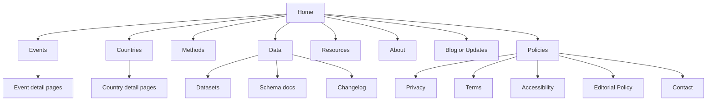
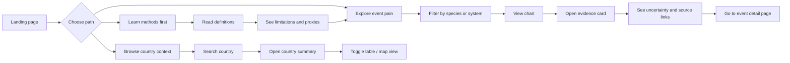
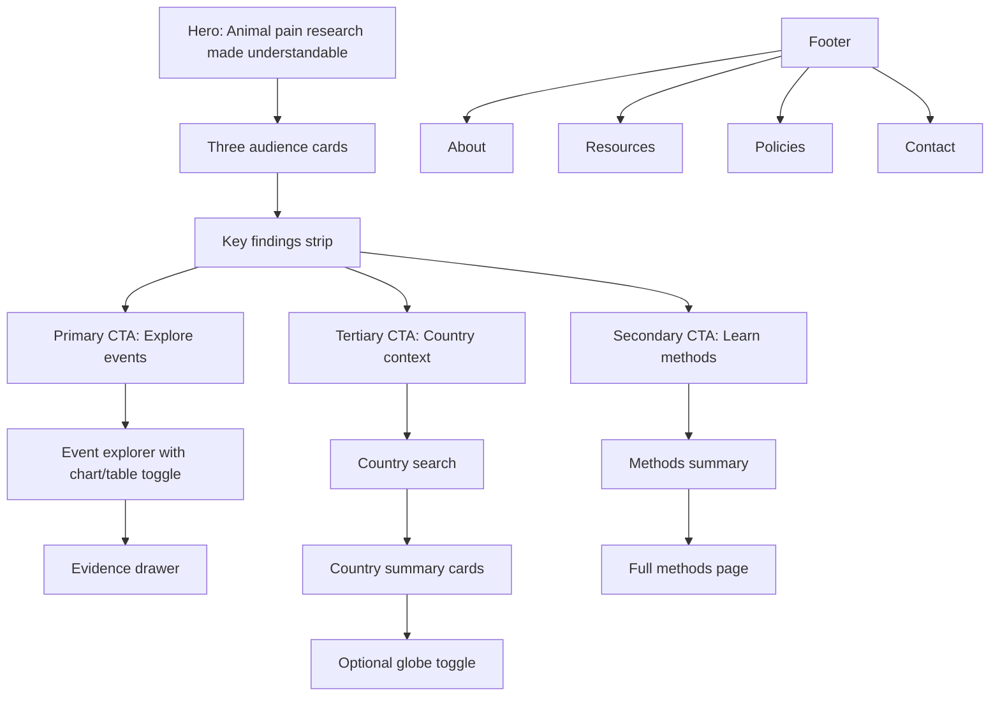
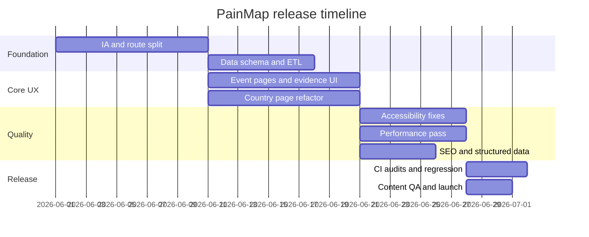

# PainMap.org improvement report for Codex GPT-5.5

## Executive summary

Primary site inspected first, as requested: **painmaps.org**. In its current public form, PainMap is a **static, single-page research visualization** about animal pain, with top-level in-page sections for **Events, Countries, Methods, Data, and Policies**, plus inline policy subsections for **Privacy, Terms, Accessibility, Editorial policy, Contact, and Changelog**. The site already does several things right: it explicitly says the **event-level animal pain visualization is the primary purpose**, treats the **country globe as secondary context**, discloses that it is **not medical or veterinary advice**, and states that it **does not collect personal data**. It also includes a skip link, grouped source lists, and a changelog claiming an update on **May 31, 2026**. citeturn1view0turn31view3turn31view4turn6search0

The biggest weakness is not the core concept; it is the **information architecture**. Right now, the homepage is doing the work of a landing page, tool hub, methods paper, source directory, policy center, and contact page all at once. That makes the product harder to understand, harder to crawl, harder to cite, harder to test for mobile reflow, and harder to expand. Search inspection surfaced the homepage as the public URL discovered in this review, while on-page text searches found **no “Blog,” no “Resources,” and no “Consent”** section labels. citeturn6search0turn31view0turn31view1turn31view5

The highest-value plan is therefore: **keep the scientific intent, but turn the site into a small, route-based knowledge product**. That means separating event pain from country context, promoting evidence metadata to first-class UI, making the globe a progressive enhancement rather than the center of the experience, tightening accessibility patterns for search/map/chart behaviors, and putting SEO, performance, and release checks into CI. This direction is strongly supported by W3C accessibility guidance, Google Search documentation, web.dev performance guidance, and the site’s own current claim that any future personal-data workflow should live behind a **separate compliant service boundary**. citeturn14search0turn14search2turn26search0turn9search3turn15search2turn34search0turn1view0

| Priority | Recommendation | Why it matters | Effort | Confidence |
|---|---|---|---|---|
| Critical | Split the single page into dedicated routes | Improves comprehension, crawlability, testing, and maintainability | Medium | High |
| Critical | Separate **event pain evidence** from **country proxy context** in the UX and data model | Prevents false precision and reduces conceptual confusion | Medium | High |
| Critical | Add claim-level evidence cards with uncertainty, source type, and update metadata | The current science framing is careful, but the UI still hides too much methodology behind prose | Medium | High |
| High | Make the country globe progressive enhancement with a fully equivalent table/search flow | Required for accessibility, mobile usability, and performance | Medium | High |
| High | Add CI for Lighthouse, accessibility, and link/schema checks | Prevents regressions and gives Codex a guardrail-driven workflow | Low to Medium | High |
| High | Keep root site no-personal-data; separate any future input/account workflow onto another boundary | Aligns with the site’s own privacy stance and HIPAA/HHS risk logic | Medium | High |

## Current crawl and page audit

The current public footprint appears to be a **single indexable page** with in-page navigation. The site header exposes **PainMap / Events / Countries / Methods / Data / Policies**. The homepage then continues with country context, event pain visualization, methods/glossary, source groups, and policy text in one document. Footer text exposes links for **Privacy, Terms, Accessibility, Editorial policy, Contact, and Changelog**, but in the inspected rendering those are still part of the same page structure rather than clearly separate public documents. Search inspection also found no separate blog or resources page labels in the live page text. citeturn1view0turn2view0turn31view0turn31view1turn31view3turn31view4

That matters because Google’s crawl/index guidance still depends on **discoverable URLs, crawlable links, indexable content, and sensible URL structure**. A single-page application can be indexed, but route-level pages are usually much easier to interpret, test, canonicalize, and enrich with structured data. Google’s documentation also explicitly notes that JavaScript-heavy sites need to account for crawl/render limitations and that lazy-loaded content must still be made visible when it enters the viewport. citeturn15search4turn34search0turn34search2turn34search9

The audit below is based on the inspected live homepage and search/find results, with requested areas mapped to what is actually present today. citeturn1view0turn31view0turn31view1turn31view5

| Requested area | Current observed state | Main gap | Recommendation | Priority |
|---|---|---|---|---|
| Home | Exists and is content-rich | Too much mixed purpose in one page | Keep home short; push deep content to child pages | Critical |
| About | Present only as part of “About and Policies” | No standalone mission/governance/maintainer page | Create `/about` with project purpose, maintainer, governance, and editorial process | High |
| Tools | Present as “Explore by Event” and “Explore by Country” on same page | The primary research tool and secondary context tool are mixed together | Split into `/events` and `/countries` with different framing | Critical |
| Methods | Inline section | Buried; hard to share or cite | Create `/methods` plus event-level methodology sidebars | High |
| Data | Inline source list | Not yet a proper data catalog | Create `/data` and `/resources` with downloadable files and schema docs | High |
| Consent / Privacy | Privacy exists inline; no consent flow text found | Fine for current no-data site, but not ready for future analytics/forms | Create standalone `/policies/privacy`; only add consent where legally needed if data collection changes | High |
| Contact | Inline “send corrections” text, but no clear visible contact endpoint in the inspected text | Weak trust and correction workflow | Provide contact email or form, response policy, and issue-report path | High |
| Blog | No “Blog” text found | No update narrative or publication cadence | Create `/blog` or `/updates` only if real editorial capacity exists | Medium |
| Resources | No “Resources” text found; closest analog is source list | Sources are present but not organized for reuse | Create `/resources` for datasets, FAQs, glossary, downloads, and external reading | High |

A better public crawl map should look like this:



## UX and information architecture

PainMap already contains the seeds of a good onboarding model. The homepage offers three “start paths” aimed at **general readers**, **clinicians & educators**, and **researchers**, and it explicitly tells users that country context is secondary while event pain research is primary. That is good product thinking. The problem is that those onboarding cues are immediately followed by a very long document that asks the user to deal with the globe, the event explorer, methods, glossary, data provenance, policy text, and a long source list in one session. Nielsen Norman Group’s guidance on **progressive disclosure** is directly relevant here: advanced or infrequently needed detail should move to secondary screens so the core experience is easier to learn. citeturn1view0turn30search0turn30search13

The top-level IA should therefore become task-based, not section-based. Most visitors will have one of three intents: **understand the evidence**, **compare events**, or **inspect a country context layer**. The current page asks them to scan past too much unrelated material before they can stabilize on a path. NN/g’s IA guidance remains applicable here: a good IA improves whether users can find what they need and complete tasks successfully, and search does not eliminate the need for strong structure and metadata. citeturn30search1turn30search6turn30search8

A better user flow is below. The key move is that the **country globe should not be allowed to crowd out the event explorer**. On the current site, the country section appears before the event section, even though the site text repeatedly says the country layer is secondary. The product should mirror the site’s stated hierarchy. citeturn1view0



For mobile and responsive behavior, the rewrite should prioritize **stacked reading**, not desktop-parity visuals. The globe, ranked cards, and dense tables are high-risk elements for reflow and scrolling costs. The mobile pattern should be: **summary paragraph → key takeaway card → table/chart toggle → optional map**. The map should become optional, collapsible, and off by default on small screens. This is consistent with WCAG reflow expectations and with progressive disclosure principles for complex interfaces. citeturn14search12turn30search0turn30search9

A useful “annotated mockup” target for Codex is this:



## Evidence and measurement validity

Scientifically, the current site is more careful than many early-stage data sites. It says the event visualizations foreground **Welfare Footprint Institute** research, that the numbers use the Institute’s human-facing pain definitions as anchors, and that the site **does not claim a perfect human-animal conversion**. It also states that the strongest event-level layer is still **poultry-heavy**, and that the country cards are **suffering-pressure proxies** rather than full moral-weight or DALY-equivalent outputs. Those are important guardrails, and they should be preserved. citeturn1view0

That framing is consistent with the source literature. Welfare Footprint defines “Pain” in its framework as a technical shorthand for negative affective states of physical or psychological origin, and its **Pain-Track** work is explicitly about capturing pain burden over time rather than relying only on scalar intensity snapshots. Welfare Footprint’s broiler and poultry slaughter materials also include sensitivity analysis and uncertainty language, while Rethink Priorities’ Moral Weight Project explicitly discusses welfare ranges as uncertain comparative constructs rather than settled facts. citeturn11search0turn11search4turn32search5turn32search11turn11search1turn11search2turn12search0turn12search2turn12search11

The site should now upgrade from **careful prose** to **careful interface**. Right now, many users will absorb headline visual conclusions without clicking through enough surrounding explanation. The event-level visualizations need inline metadata for: **species**, **production system**, **time window**, **pain category**, **whether the estimate is direct/modelled/proxy**, **uncertainty range**, **source year**, and **last review date**. The editorial policy section already says method notes should identify source, assumptions, update date, and whether a value is measured or inferred; the UI should enforce that policy rather than leaving it at the prose level. citeturn31view3

WOAH’s animal welfare standards are useful here as an external rigor check. WOAH says broiler welfare should be assessed using **outcome-based measurables**, and its slaughter chapter emphasizes hazards, welfare indicators, and corrective actions around handling, restraint, stunning, and bleeding. PainMap is not a standards site, but event pages should link their quantitative claims back to recognized welfare domains and indicators so readers can place the numbers in a broader animal welfare context. citeturn25search0turn25search1turn25search24

The other major evidence problem is **category mixing**. Event pain estimates and country “burden proxy” context are not the same kind of thing. The code and UX should treat them as different epistemic objects. Event pain belongs in an evidence model like this:

- **Direct welfare estimate**
- **Model-based estimate**
- **Proxy aggregate**
- **Normative interpretation**

Country cards should always wear a visible **proxy badge** and should never appear in the same visual grammar as event pain estimates. That will reduce the risk that a user reads a country ranking as if it were comparable to the event-duration numbers. The site’s own text already warns against that conflation; the interface should do the same. citeturn1view0

Adjacent tools underline what good evidence packaging looks like. The **PhenX** pain body-map protocol exposes downloadable worksheets and data dictionaries; the **MAPP DataView Dashboard** gives users a dedicated dashboard context; **Vetpain** surfaces validated species-specific scales, instructional videos, and automatic scoring; and Welfare Footprint’s own broader Pain Atlas project presents the work as a systematic multi-species mapping effort with reusable outputs. PainMap does not need to become those products, but it should borrow their strengths: explicit protocol boundaries, downloadable data, training/help surfaces, and clearer evidence affordances. citeturn20view3turn20view4turn21search0turn21search2turn20view1

## Accessibility and performance

Accessibility should be treated as a product feature, not a compliance afterthought. The current site already has some encouraging signs: a **skip link** appears at the top of the page, the country search is described as the **keyboard and screen-reader equivalent for the globe**, and the accessibility statement says the site includes **table equivalents**, **native controls**, **visible labels**, **keyboard search paths**, and **status updates**. Those are solid intentions. citeturn1view0turn31view3

The next step is to make those intentions testable against WCAG 2.1 AA plus a handful of high-value AAA-style improvements. W3C guidance is especially relevant for this site because it uses **charts, maps, and tables**. WAI’s image tutorials explicitly call graphs, charts, and maps “complex images” that need appropriate alternatives, and its table guidance supports using proper data tables as real alternatives to visualizations. WAI’s APG also provides a concrete combobox pattern for search/autocomplete behaviors, while WCAG 2.1 added **Status Messages** so dynamic updates can be announced programmatically. citeturn14search0turn26search0turn14search1turn14search2turn35search0turn35search1

The practical accessibility backlog for PainMap should be:

| Area | Current evidence | Required fix | Standard anchor | Priority |
|---|---|---|---|---|
| Country search | Search exists and is described as keyboard equivalent | Implement full accessible combobox semantics and keyboard support | APG Combobox | Critical |
| Globe interaction | Globe is an interactive secondary layer | Make map optional; provide complete equivalent table/search workflow | WCAG 1.1.1, WAI complex images/tables | Critical |
| Dynamic updates | Site claims status updates | Use `role="status"` / live regions for loading, selection, and filter changes | WCAG 4.1.3 | High |
| Data visuals | Charts and map likely rely on color | Add text labels, patterns, and non-color cues; maintain non-text contrast | WCAG 1.4.1, 1.4.11 | High |
| Dense layouts | Globe, tables, rankings on one page | Verify 320px reflow and create mobile-specific table/card toggles | WCAG 1.4.10 | High |
| Motion | Orthographic globe implies motion risk | Respect `prefers-reduced-motion`; disable non-essential spin/animation | MDN reduced motion, WCAG-friendly practice | Medium |
| Focus and landmarks | Skip link exists, but page is very long | Add route-level landmarks, local nav, visible focus, and heading consistency | WCAG 2.x, WAI basics | High |

On performance, the current architecture likely creates avoidable startup cost because the same page contains the hero, country search, boundary-loading globe, ranked issue cards, event visualizations, methods, policies, and long source lists. The page text specifically references real boundaries, **Natural Earth**, **geoBoundaries ADM1**, and multiple country-level data sources. Even without independently verified Lighthouse scores in this review, that is enough to identify the most plausible bottlenecks: **large JS**, **geodata payloads**, **layout complexity**, and **offscreen content loaded too early**. citeturn1view0turn31view2

Google’s performance guidance is straightforward: measure with PageSpeed Insights and Lighthouse; optimize **LCP**, **INP**, and **CLS**; use browser-level lazy loading for offscreen images and iframes; preload only critical assets; reduce JavaScript payloads; use caching well; and use a CDN effectively. Google’s Search docs add an important caveat: lazy-loaded content is fine, but it must still load when visible so search engines can index it correctly. citeturn9search3turn8search0turn16search0turn16search1turn16search7turn16search8turn16search9turn34search9

For PainMap specifically, Codex should implement these performance rules:

- **Route-split the app** so `/events` and `/countries` do not share initial JS unless needed.
- **Lazy-load the globe bundle** only when the user enters the country route or explicitly opens the globe.
- **Precompute country summaries at build time** into small JSON files instead of computing or fetching large aggregates in the client.
- **Simplify and compress boundaries** aggressively, ideally with TopoJSON or equivalent reduced geometry for the public map.
- **Use immutable hashed asset caching** and Brotli/Gzip on JS/JSON.
- **Keep the homepage hero mostly HTML/CSS**, not JS-dependent.
- **Promote the table-first experience on mobile** and defer the map entirely below the fold.

A minimal reduced-motion rule should be part of the redesign, especially if the globe rotates or transitions between regions. MDN documents `prefers-reduced-motion` specifically for reducing or replacing non-essential motion-based animation. citeturn36search1turn36search5

## SEO, security, analytics, and technical stack

### SEO and metadata

The current search listing is not bad. Search results already show a descriptive title around **“PainMap | Animal pain research and country context”** and a snippet explaining the site’s purpose. That is a good baseline, and it suggests that the homepage title/description are at least coherent enough to be surfaced by search. The problem is scope: one page can only rank, preview, and earn links for so many intents at once. citeturn6search0turn0search0

Google Search documentation supports a richer route-level strategy: use crawlable links, an XML sitemap, canonical URLs where needed, structured data where appropriate, and JS patterns that remain crawl-friendly. For PainMap, the most useful schema types are likely:

- **Organization** for project identity and contact context.
- **FAQPage** for methods caveats and “how to read this chart”.
- **Dataset** on dataset pages, mainly for **Dataset Search** rather than normal Google rich results.
- **Article** or **Report** on event-methodology pages or blog/update posts. citeturn15search1turn15search3turn15search5turn15search19turn33search0turn33search1turn33search6turn33search7turn33search8turn33search10turn27search1turn27search19

A practical SEO rewrite should therefore create these public landing targets:

- `/events`
- `/events/[slug]`
- `/countries`
- `/countries/[iso3]`
- `/methods`
- `/data`
- `/resources`
- `/about`
- `/policies/privacy`
- `/policies/accessibility`
- `/updates` or `/blog`

Each route should have unique title tags, meta descriptions, canonical tags, Open Graph/Twitter metadata, and structured data that matches visible page content. Google specifically warns not to use structured data that is invisible or misleading. citeturn33search5turn34search11

### Security and privacy

The current privacy posture is intentionally narrow, which is good. The site says it is a **public, static research visualization**, that it does **not ask for names, emails, health symptoms, accounts, or payment information**, and that any future workflow of that kind should live behind a **separate compliant service boundary**. From the TLS side, SSL Labs reported **A+** grades on the domain’s resolved GitHub CDN endpoints and observed **HSTS**. citeturn31view3turn0search8turn5search0

That existing stance should become an architectural rule:

- **Do not add symptom entry, user accounts, clinician workflows, or patient uploads to the current root site.**
- If such features are ever added, place them on a different subdomain or service boundary, with separate privacy, security, and compliance controls.
- Keep the public research site as static and anonymous as possible.

That is not overkill. HHS guidance says HIPAA obligations depend on whether the operator is a **covered entity or business associate**, and it gives detailed warnings about tracking technologies on authenticated pages and even some unauthenticated health-related pages. HHS also states that privacy policies or banners alone are **not enough** to authorize PHI disclosures; if PHI is involved, permissions, minimum necessary disclosures, safeguards, and BAAs may be required. citeturn10search0turn23view0

Because current PainMap collects no personal data, the safest move is to keep it that way. If future analytics are added, use either **no analytics** or a cookieless, aggregate setup. Plausible’s docs describe a lightweight, privacy-friendly approach with no cookies or personal data collection, while Matomo documents cookieless/privacy-first configurations as well. For engineering telemetry rather than marketing analytics, OpenTelemetry provides browser instrumentation for traces/metrics without dictating a specific analytics vendor. citeturn18search1turn18search8turn17search5turn17search14turn17search0turn17search7turn17search13

### Technical stack and deployment

The exact framework backing PainMap is **unknown** from public inspection. What is known is that the site describes itself as static, and SSL Labs shows the domain resolving to GitHub CDN endpoints associated with GitHub-hosted infrastructure. That strongly suggests a **static hosting pattern**, even if the internal build system is not visible here. citeturn31view3turn0search8turn5search0

For the next version, the best-fit architecture is a **static-first, typed-content stack** with client-hydrated islands for visualizations. In practice, that means:

- **Astro or equivalent static site framework** for content pages and route generation.
- **React + TypeScript** islands for event charts, search, and map.
- **Build-time ETL** scripts for data snapshots and derived JSON.
- **CI/CD with preview deploys**, Lighthouse CI, accessibility checks, schema checks, and link validation.
- **Public CDN hosting** with custom headers and immutable asset caching.

This architecture matches the product’s current public identity: research-heavy, mostly static, with a limited number of rich interactive views.

## Prioritized Codex implementation plan

Below is the brief Codex should follow.

> **Objective:** transform painmaps.org from a dense single-page static visualization into a route-based, evidence-first, accessible, high-performance research site.  
> **Non-negotiables:** preserve scientific caveats; keep root site no-personal-data; treat country context as secondary to event pain; make all interactive views keyboard-accessible; do not ship changes without automated audits.  
> **Primary outcomes:** better comprehension, better source transparency, better crawlability, better accessibility, simpler maintenance.

### Recommended delivery sequence



### Delivery backlog

| Phase | What Codex should ship | Why | Effort |
|---|---|---|---|
| Immediate | Route split, new page templates, event/country separation, visible contact endpoint, standalone policy pages | This removes the largest structural bottleneck first | Medium |
| Immediate | Evidence drawer/cards with uncertainty, source type, last updated, measured vs inferred | This is the highest scientific-credibility upgrade | Medium |
| Immediate | Keyboard-safe search, table-first alternatives, live-region messages, reduced-motion support | This is the highest accessibility risk reduction | Medium |
| Near-term | Lazy-loaded globe, precomputed country JSON, hashing and caching, Lighthouse CI budgets | Biggest likely performance gains | Medium |
| Near-term | Structured data, sitemap, canonical tags, route-specific metadata, FAQ page | Highest SEO leverage after IA split | Low to Medium |
| Later | Blog/updates workflow, data catalog downloads, methodology changelog automation | Converts site into a durable research property | Medium |
| Future only | Any user input, saved views, submissions, or symptom-style tooling on separate app boundary | Needs separate governance and privacy model | High |

### Recommended repo structure

```text
src/
  pages/
    index.astro
    about.astro
    events/
      index.astro
      [slug].astro
    countries/
      index.astro
      [iso3].astro
    methods.astro
    data.astro
    resources.astro
    updates/
      index.astro
      [slug].astro
    policies/
      privacy.astro
      terms.astro
      accessibility.astro
      editorial-policy.astro
      contact.astro
  components/
    Hero.astro
    AudienceCards.astro
    EventExplorer.tsx
    EventChart.tsx
    EventTable.tsx
    CountrySearch.tsx
    CountrySummary.tsx
    CountryGlobe.tsx
    EvidenceDrawer.tsx
    CitationList.astro
    PolicyLayout.astro
  lib/
    schemas/
      pain-event.ts
      country-context.ts
      source.ts
    seo/
      jsonld.ts
      meta.ts
  data/
    build/
      events.json
      countries/
        USA.json
        BRA.json
      sources.json
  scripts/
    etl/
      build-events.ts
      build-countries.ts
      validate-data.ts
tests/
  e2e/
  a11y/
  unit/
```

### Typed data contracts

The current site already distinguishes between event estimates and country proxies in prose; the code should enforce that distinction in types. citeturn1view0

```ts
export type EstimateKind = "direct" | "modeled" | "proxy";
export type PainCategory = "annoying" | "hurtful" | "disabling" | "excruciating";
export type ConfidenceBand = "high" | "moderate" | "low" | "very-low";

export interface SourceRef {
  id: string;
  title: string;
  url: string;
  publisher: string;
  year?: number;
  doi?: string;
  type: "guideline" | "primary-study" | "institutional-method" | "dataset" | "commentary";
}

export interface PainEventRecord {
  slug: string;
  species: string;
  system: string;
  windowLabel: string;        // e.g. "per broiler lifetime"
  painCategory: PainCategory;
  estimateKind: EstimateKind; // direct | modeled
  unit: "seconds" | "minutes" | "hours" | "days";
  point: number;
  low?: number;
  high?: number;
  assumptions: string[];
  confidence: ConfidenceBand;
  sourceIds: string[];
  lastReviewedAt: string;     // ISO date
}

export interface CountryContextRecord {
  iso3: string;
  country: string;
  proxyBucket: "factory-farmed" | "wild-non-insect" | "insects" | "human-context";
  estimateKind: "proxy";
  metricLabel: string;
  value: number;
  units: string;
  sourceIds: string[];
  caveats: string[];
  lastReviewedAt: string;
}
```

### Accessible country search pattern

The site already frames the search field as the keyboard and screen-reader equivalent to the globe; Codex should make that literally true by implementing the APG combobox pattern and announcing search/selection status changes with a live region. citeturn1view0turn14search2turn35search1

```tsx
import { useId, useMemo, useState } from "react";

type Option = { id: string; label: string };

export function CountrySearch({
  options,
  onSelect,
}: {
  options: Option[];
  onSelect: (option: Option) => void;
}) {
  const listboxId = useId();
  const statusId = useId();
  const [query, setQuery] = useState("");
  const [open, setOpen] = useState(false);
  const [activeIndex, setActiveIndex] = useState<number>(-1);

  const filtered = useMemo(
    () =>
      options.filter((o) =>
        o.label.toLowerCase().includes(query.trim().toLowerCase())
      ),
    [options, query]
  );

  const active = activeIndex >= 0 ? filtered[activeIndex] : undefined;

  function commit(option: Option) {
    setQuery(option.label);
    setOpen(false);
    setActiveIndex(-1);
    onSelect(option);
  }

  return (
    <div>
      <label htmlFor="country-search">Search country or province</label>
      <div
        role="combobox"
        aria-haspopup="listbox"
        aria-expanded={open}
        aria-controls={listboxId}
        aria-owns={listboxId}
      >
        <input
          id="country-search"
          type="text"
          autoComplete="off"
          aria-autocomplete="list"
          aria-activedescendant={active ? active.id : undefined}
          value={query}
          onFocus={() => setOpen(true)}
          onChange={(e) => {
            setQuery(e.target.value);
            setOpen(true);
            setActiveIndex(0);
          }}
          onKeyDown={(e) => {
            if (!open && e.key === "ArrowDown") {
              setOpen(true);
              setActiveIndex(0);
              return;
            }
            if (e.key === "ArrowDown") {
              e.preventDefault();
              setActiveIndex((i) => Math.min(i + 1, filtered.length - 1));
            }
            if (e.key === "ArrowUp") {
              e.preventDefault();
              setActiveIndex((i) => Math.max(i - 1, 0));
            }
            if (e.key === "Enter" && active) {
              e.preventDefault();
              commit(active);
            }
            if (e.key === "Escape") {
              setOpen(false);
              setActiveIndex(-1);
            }
          }}
        />
      </div>

      {open && filtered.length > 0 && (
        <ul id={listboxId} role="listbox" aria-label="Country search results">
          {filtered.map((item, index) => (
            <li
              id={item.id}
              key={item.id}
              role="option"
              aria-selected={index === activeIndex}
              onMouseDown={(e) => {
                e.preventDefault();
                commit(item);
              }}
            >
              {item.label}
            </li>
          ))}
        </ul>
      )}

      <p id={statusId} role="status" aria-live="polite">
        {open ? `${filtered.length} results available.` : ""}
      </p>
    </div>
  );
}
```

### Evidence drawer requirements

Each chart/table row should open an evidence drawer with:

- plain-language interpretation
- exact estimate + uncertainty
- source type badge
- “direct / modeled / proxy” badge
- species/system/window metadata
- assumptions list
- last reviewed date
- source links
- copyable citation string

That pattern is the single most important credibility upgrade after the route split.

### Search and schema metadata

Google recommends visible, page-matching structured data and route-level metadata. PainMap should use JSON-LD for `Organization`, `FAQPage`, and event/article pages, and use `Dataset` on downloadable data pages with the understanding that Dataset markup now mainly helps **Dataset Search**, not ordinary Google Search rich results. citeturn33search1turn33search5turn33search6turn33search7turn33search10

```ts
export function buildOrganizationJsonLd() {
  return {
    "@context": "https://schema.org",
    "@type": "Organization",
    name: "PainMap",
    url: "https://painmaps.org",
    description: "Public research visualization about animal pain and country context",
    sameAs: [],
    contactPoint: [{
      "@type": "ContactPoint",
      contactType: "corrections and source questions",
      email: "REPLACE_WITH_REAL_CONTACT"
    }]
  };
}
```

### Test gates Codex must add before merging

The engineering workflow should enforce the same standards the site claims publicly: visible labels, keyboard paths, table equivalents, source discipline, and update discipline. Lighthouse CI, Playwright accessibility testing, axe-core, and Pa11y all support that kind of guardrail-driven release flow. citeturn28search0turn28search1turn28search2turn28search3

```ts
// tests/e2e/country-search.spec.ts
import { test, expect } from "@playwright/test";

test("country search works by keyboard", async ({ page }) => {
  await page.goto("/countries");
  await page.getByLabel("Search country or province").click();
  await page.keyboard.type("brazil");
  await page.keyboard.press("ArrowDown");
  await page.keyboard.press("Enter");
  await expect(page.getByRole("heading", { name: /Brazil/i })).toBeVisible();
});
```

```ts
// tests/a11y/home.axe.spec.ts
import { test, expect } from "@playwright/test";
import AxeBuilder from "@axe-core/playwright";

test("home has no serious axe violations", async ({ page }) => {
  await page.goto("/");
  const results = await new AxeBuilder({ page }).analyze();
  const seriousOrWorse = results.violations.filter(v =>
    ["serious", "critical"].includes(v.impact ?? "")
  );
  expect(seriousOrWorse).toEqual([]);
});
```

## Appendix and open questions

### Suggested Lighthouse and auditing commands

Google recommends PageSpeed Insights and Lighthouse for measurement, and Lighthouse CI exists specifically for continuous auditing in CI. citeturn8search0turn9search8turn28search2turn28search6

```bash
# Local Lighthouse
npx lighthouse https://painmaps.org \
  --only-categories=performance,accessibility,best-practices,seo \
  --view

# Mobile preset
npx lighthouse https://painmaps.org \
  --preset=desktop

# Lighthouse CI
npx @lhci/cli autorun
```

A minimal `lighthouserc.json`:

```json
{
  "ci": {
    "collect": {
      "url": [
        "https://painmaps.org/",
        "https://painmaps.org/events",
        "https://painmaps.org/countries"
      ],
      "numberOfRuns": 3
    },
    "assert": {
      "assertions": {
        "categories:performance": ["warn", { "minScore": 0.9 }],
        "categories:accessibility": ["error", { "minScore": 0.95 }],
        "categories:seo": ["warn", { "minScore": 0.95 }]
      }
    }
  }
}
```

### Accessibility testing toolchain

W3C recommends both automated and manual accessibility review; Playwright, axe-core, and Pa11y make that practical in CI. citeturn26search21turn28search0turn28search1turn28search3turn28search15

Recommended stack:

- **axe-core** for page-level automated violations
- **Playwright** for keyboard and screen-state testing
- **Pa11y CI** for route sweeps
- **Manual screen-reader checks** on search, chart/table toggles, and live status updates
- **Keyboard-only walkthroughs** for all interactive routes
- **320px reflow checks** and reduced-motion checks

### Visual deliverables Codex should produce

To satisfy the visual-aid requirement during implementation, Codex should generate and store:

- before/after **desktop screenshots** of the homepage
- before/after **mobile screenshots** of `/events` and `/countries`
- annotated mockups for the route split
- screenshots of **focus order** and visible focus states
- screenshots comparing **chart view vs table view**
- screenshots showing **reduced-motion mode**
- screenshots of the **evidence drawer** opened on an event detail page

### Open questions and limitations

A few items remain uncertain from public inspection and should be explicitly verified in implementation:

- The **exact frontend framework/build system** is not observable from the public rendering inspected here.
- The existence and content of **robots.txt** and **sitemap.xml** were not independently verified in this review.
- Exact live **Lighthouse scores** and network waterfall metrics were not independently measured here; the performance plan above is based on the site’s visible architecture and current best practice rather than a reproduced PSI run.
- Whether the current site exposes a hidden or JS-inserted **contact endpoint** beyond the visible inspected text is unknown.
- The exact runtime distinction between **build-time data snapshots** and **live client-side fetches** is not publicly obvious from the inspected rendering.

Those unknowns do not change the main conclusion: **PainMap’s next leap is structural, not cosmetic**. Split the site into clear routes, elevate the evidence model into the UI, make accessibility and performance first-class in code, and keep any future personal-data workflow off the public research site boundary. citeturn1view0turn23view0turn28search2