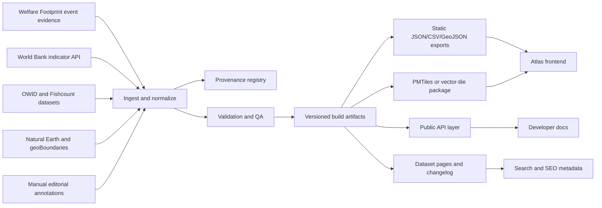
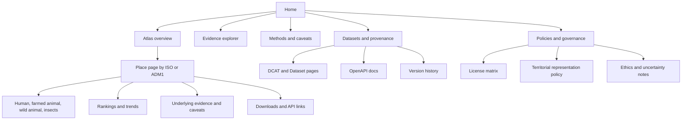

# PainMap.org deep research audit and improvement report

## Executive summary

**User-specified site inspected first**

```text
https://painmaps.org
```

The current site is **not yet a place-first global pain atlas**. It is a **static animal-pain research visualization** whose primary layer is event-level animal pain evidence, while the globe is explicitly framed as a **secondary country-context tool**. The homepage, events route, methods route, and countries route all repeat that hierarchy: event pain comes first; country context is proxy context, not a direct pain map or final moral ranking. citeturn48search0turn50view0turn50view1turn50view2

That said, the site already has several unusually strong foundations for a research product. It has a clear route structure, a sitemap and robots file, policy surfaces, a public issue tracker for corrections, JSON-LD dataset markup, visible caveats, accessible search and table fallbacks for the map, and route-level pages for events, countries, methods, data, resources, and about. The events route also says each row carries estimate type, confidence, assumptions, last review date, and source links, which is a strong provenance pattern. citeturn18view0turn30view0turn30view1turn10view0turn50view0turn50view3turn50view5

The main weaknesses are structural rather than cosmetic. The product promise implied by the name “PainMap” and by the user intent behind a domain like this is broader and more place-first than the current implementation. The map is optional and secondary; the data model mixes **direct institutional estimates**, **modeled estimates**, and **country-level proxies**; source freshness is mixed between manually curated event evidence and live runtime pulls from World Bank and OWID; machine-readable exports and a public API are absent; structured metadata is minimal; and security hardening for third-party assets is not visibly complete because the site imports JavaScript from jsDelivr without visible SRI and no visible CSP appears in the crawled HTML. citeturn50view2turn21view1turn27view1turn35view0turn10view0turn34view0turn34view1turn34view2turn38search0turn38search3

My highest-confidence conclusion is this: **PainMap should decide whether it wants to remain an evidence explainer with a supporting globe, or become a true place-first atlas.** If the goal is the latter, the product should be reorganized around **“What drives pain here?”** pages, with event studies demoted from homepage hero status into evidence layers attached to places. The most valuable roadmap is therefore: clarify product identity, publish a machine-readable data/provenance layer, make uncertainty first-class, move the default geographic view from an orthographic globe to a standard thematic world map while keeping the globe as an exploratory mode, and add an export/API/developer surface. Those changes align with WCAG 2.2, ARIA combobox guidance, Dataset structured data guidance, DCAT 3, GeoJSON, and OpenAPI 3.1. citeturn37search0turn37search1turn37search2turn40search0turn40search2turn40search3turn47search18turn47search2

**Overall confidence:** high for the crawl, inventory, IA, and provenance findings; medium for runtime performance and security details because I inspected public pages and source views but did not run a full browser waterfall or Lighthouse audit.

## Current site assessment

### Site crawl and content inventory

The current repository-level checker enumerates **13 expected route files**: the homepage, events, countries, methods, data, resources, about, updates, and five policy/contact pages. The sitemap published by the site also lists those public URLs. The primary navigation visible in the homepage HTML exposes the top-level information architecture as **Events, Countries, Methods, Data, Resources, About**. citeturn18view0turn30view1turn10view4

The route-level content is coherent and internally consistent. The **events** page presents “Animal pain evidence by event,” explicitly says the primary layer is event-level animal pain, and lists currently exposed event rows such as conventional cages, broiler-breeder feed restriction, fast-growing broilers, and poultry slaughter systems. It also says each row carries **estimate type, confidence, assumptions, last review date, and source links**. The **countries** page says country cards are **proxy context**, not direct moral rankings, and that homepage search and data tables are the complete non-map workflow. The **methods** page distinguishes direct welfare estimates, model-based estimates, and country proxy aggregates. The **data** page groups sources into Welfare Footprint, Moral Weight Project, World Bank/OWID/Fishcount/WAI, and Natural Earth/geoBoundaries. The **resources** page reframes the site around reader journeys. The **about** page describes the product as a static research visualization and repeats that it is not a personal-health product. citeturn50view0turn50view1turn50view2turn50view3turn50view4turn50view5

This is a **good research IA**, but it is **not yet the IA of a place-first atlas**. The homepage still centers “Animal pain research, made understandable,” the event explorer, and poultry-heavy evidence. The search result surfaced by the web search tool also still shows the homepage as **“Who Can Feel Pain”** rather than the current on-page title, which suggests that the site’s identity and discoverability are not yet cleanly settled in search. citeturn48search0turn10view0

### Data model and provenance

The current data model has **three distinct epistemic layers**:

1. **Direct / model-based event estimates** for animal pain events, centered on Welfare Footprint research.  
2. **Country-level proxy aggregates** for suffering or death.  
3. **Geographic boundary layers** for country and ADM1 browsing.  

That distinction is described plainly on the methods and countries pages, which is a strength because many data products bury these differences. citeturn50view1turn50view2

The most important operational fact is that the site is only partly “static” in a reproducibility sense. A repo-side report dated **April 23, 2026** says the country and world cards are **live model outputs**, not frozen tables, and that they pull the latest available country rows from **Our World in Data and World Bank** at runtime. That same report says the site now ranks animal suffering in three country/world buckets — **factory-farmed animals, non-insect wild animals, and insects** — across three ranking modes: total suffering caused, per-animal suffering, and suffering decreased per dollar. citeturn21view1

The source code view supports that description. The frontend imports D3 and topojson from jsDelivr, points country boundaries to **Natural Earth Admin 0 GeoJSON**, points ADM1 support to a local JSON file, defines World Bank indicator API URLs for country data, and lists animal datasets from OWID graphers such as land animals slaughtered for meat, farmed fish killed, wild-caught fish, and crustaceans, alongside wild-animal proxy models based on land area, wild birds, and terrestrial arthropods. citeturn35view0turn27view1turn28view1turn28view2turn26view7

That means the current provenance model is understandable by a careful human reader, but it is still **weakly machine-readable**. The page includes JSON-LD for `Organization`, `WebSite`, and `Dataset`, but the `Dataset` object is minimal: it includes a name, description, creator, and a license pointer to a local terms anchor. It does **not** visibly include richer dataset fields such as distributions, download URLs, spatial coverage, temporal coverage, variable lists, update cadence, or machine-readable provenance by layer. Google’s Dataset guidance specifically recommends supporting information such as creator and **distribution formats**, while DCAT 3 exists precisely to improve catalog interoperability. citeturn10view0turn37search2turn40search0turn40search1

The practical consequence is that PainMap currently behaves more like a **carefully written synthesis site** than like a **true atlas platform**. If that is intentional, the current structure is defensible. If the goal is a global pain atlas, it needs a stronger typed data model at minimum:

- **place_id** and geometry scope  
- **layer_type** such as direct estimate, model, proxy, or boundary  
- **source dataset** and version/vintage  
- **measurement type** and units  
- **confidence / uncertainty / caveat fields**  
- **license / attribution / reuse terms**  
- **update frequency** and last-refresh timestamp  
- **download/API distribution**.  

Those expectations are well aligned with Schema.org `Dataset`, DCAT 3, GeoJSON, World Bank’s structured indicator metadata, and OpenAPI 3.1 for any future public API. citeturn40search0turn40search1turn40search2turn40search3turn42search2turn42search14

### Visualization design, UX, and information architecture

The current site makes one very important design choice explicit: the **orthographic globe is progressive enhancement**, not the only workflow. The homepage says the search field is the keyboard and screen-reader equivalent for the globe; the countries page says the **table-first** workflow is complete without the map; and the map description says selecting a place updates ranked issue cards and a data table beside the map. That is good product thinking. citeturn10view1turn36search0turn50view1

The globe itself is visually distinctive, but it is not the best default visualization for a thematic atlas. Orthographic globes are excellent for exploration and narrative context, yet they hide half the world, make side-by-side comparison harder, and are weaker than a standard equal-area thematic world map for systematic country comparison. ArcGIS’s Equal Earth documentation explicitly describes equal-area world projections as appropriate for thematic world maps requiring accurate areas, and ColorBrewer remains a standard reference for safer cartographic color scheme selection. citeturn36search0turn47search18turn47search2

The stronger design pattern for PainMap is therefore **dual mode**:

- **Default:** equal-area 2D atlas view optimized for comparison and filtering.  
- **Optional:** orthographic globe kept as an exploratory, narrative, “planet view” mode.  

That recommendation is especially important because the site’s current copy repeatedly says the product is about **place context**, while the current first impression still feels more like an evidence essay with a globe enhancement. The name, map affordance, and likely user expectation all push toward a place-first atlas, but the current IA still pushes users into event evidence first. citeturn48search0turn50view0turn50view1

The event visualization layer is better aligned with its purpose. It clearly distinguishes long pain loads, acute slaughter pain, human anchors, and explanatory callouts, and the site provides table equivalents for the principal chart regions. The weak point here is not chart structure; it is **scope**. The homepage itself says the strongest event-level visualization is still **poultry-heavy rather than a full cross-species atlas**. So the product currently has a tension between a broad atlas-like name and a relatively narrow evidence base. citeturn29view6turn48search0

### Accessibility, performance, security, privacy, SEO, and governance

Accessibility is one of the site’s strongest visible areas. The homepage source includes a skip link, keyboard-search parity, a live status region for country search, visible labels and native controls, and table equivalents for the main visualizations and rankings. The accessibility statement says the core charts and ranking views include table equivalents, native controls, visible labels, keyboard search paths, status updates, and source text. The countries page also explicitly states the map is secondary to the search and table flow. These are all aligned with WCAG 2.2’s broad requirements and with WAI’s combobox guidance. citeturn10view0turn10view1turn10view5turn50view1turn37search0turn37search1

Still, a full WCAG claim would be premature. The country chooser is a custom autocomplete/listbox pattern, which should be tested against the ARIA combobox pattern in real screen readers, not just inspected in markup. The site also uses wide data tables; the stylesheet shows `overflow-x: auto` and a `min-width: 920px` table, which is a reasonable fallback, but on small screens it can still create heavy horizontal scrolling and comprehension problems. This is a good starting point, not the end state. citeturn10view1turn45view2turn32view3turn37search1

On performance and scalability, the current architecture is acceptable for a modest static research site, but not yet for a large atlas. The frontend pulls critical dependencies from jsDelivr and external data from Natural Earth, World Bank, and OWID-linked sources. The homepage itself visibly waits for country boundaries to load. There is no visible service worker or manifest in the crawled source. That means startup latency, external dependency fragility, and inconsistent refresh behavior are all real risks, especially on mobile or constrained networks. MapLibre’s own guidance for large geospatial datasets stresses data-loading and rendering optimizations, and PMTiles exists precisely to support low-maintenance tiled map delivery from static storage when scale grows. citeturn35view0turn27view1turn36search0turn46view0turn46view1turn46view2turn38search1turn38search2turn38search13

Security and privacy are mixed. On the positive side, the privacy copy is clear that the site is a public static research product, collects no personal health data, and should disclose any future analytics before launch. SSL Labs reported an **A+** configuration with TLS 1.3 support and long-duration HSTS on GitHub edge infrastructure as of **May 30, 2026**. On the negative side, I found **no visible CSP**, **no visible `integrity` attributes**, **no visible `crossorigin` attributes for SRI**, and no visible `referrerpolicy` in the crawled homepage source. Given that the site imports third-party JavaScript, MDN’s guidance on CSP and Subresource Integrity is directly relevant. citeturn36search0turn48search2turn34view0turn34view1turn34view2turn34view4turn38search0turn38search3turn49search2

On SEO, the fundamentals are present. The site publishes robots and sitemap files, the checker enforces title/description/canonical tags on expected routes, and the homepage includes dataset JSON-LD. Google’s documentation treats sitemaps, canonicals, and robots as core crawling/indexing signals, and Dataset structured data can improve discoverability in dataset search contexts. But the current public discoverability still looks underpowered: the search tool surfaced only the homepage for several route-sensitive queries, and the homepage search result title looked inconsistent with the current site title. That suggests PainMap needs more robust search console hygiene, richer dataset metadata, and more route-specific landing pages designed for distinct queries. citeturn30view0turn30view1turn18view0turn10view0turn41search0turn41search1turn41search2turn37search2turn48search0

Governance is promising but incomplete. The site already has privacy, terms, accessibility, editorial policy, contact, and correction-first issue routing. The editorial policy says method notes should identify source, model assumption, last meaningful update, and whether a value is measured directly or inferred from a proxy. That is good governance language. But licensing and political-boundary governance need sharper treatment. Natural Earth says its map data are public domain; geoBoundaries uses **CC BY 4.0** and explicitly notes that its open-license country dataset seeks to represent each nation “as they would represent themselves,” while Natural Earth’s Admin 0 page notes de facto boundary handling and disputed-area themes. OWID says its charts, articles, and data are CC BY unless otherwise noted, and Welfare Footprint says its data, reports, and charts are CC BY. A product that mixes these inputs should publish an explicit **license matrix** and a **territorial representation policy** before offering bulk export or an API. citeturn10view5turn50view5turn42search8turn42search1turn42search12turn42search13turn44search0turn44search6

## Priority recommendations

The recommendations below assume PainMap’s strategic goal is to become a **true place-first atlas of the most significant sources of pain by place**, because that is the product direction most consistent with the name, the map affordance, and likely user intent. If the team instead wants to remain an animal-pain evidence explainer, many recommendations still apply — but the central IA shift would be smaller. citeturn48search0turn50view0turn50view1

### Prioritized actions

| Horizon | Recommendation | Why this matters | Effort | Risk | Evidence |
|---|---|---|---|---|---|
| Short | **Make the product promise explicit**: either rename/reposition around animal-pain research, or reorganize the site around “What drives pain here?” place pages. | The current site is internally consistent, but the name and map affordance overpromise a place-first atlas while the product currently privileges poultry event evidence. | M | M | citeturn48search0turn50view0turn50view1 |
| Short | **Add dataset-level provenance cards and download links** for every visible layer. | The site already has good human-readable caveats, but machine-readable distributions, vintages, update cadence, and licenses are thin. | M | L | citeturn10view0turn50view3turn37search2turn40search0turn40search1 |
| Short | **Surface uncertainty everywhere**: direct/model/proxy badge, confidence level, last-reviewed date, and “measured vs inferred” status on every country row and map tooltip. | The events route already sets a strong standard for estimate metadata; the country layer should adopt the same discipline. | S | L | citeturn50view0turn50view2turn10view5 |
| Short | **Keep the globe, but remove it as the default thematic view**. Make an equal-area 2D atlas the default. | Equal-area thematic maps are better for comparison; the current orthographic globe is better as exploration than as the main comparison tool. | M | M | citeturn36search0turn47search18turn47search2 |
| Short | **Harden security for third-party assets** with CSP, SRI, explicit referrer policy, and a documented security baseline. | The site visibly uses third-party JS and external data while showing no visible CSP or SRI in crawled HTML. | S | L | citeturn34view0turn34view1turn34view4turn38search0turn38search3turn49search7 |
| Medium | **Precompute normalized place bundles** instead of relying on many runtime fetches. | Runtime OWID/World Bank pulls improve freshness but weaken reproducibility, caching control, and performance. | M | M | citeturn21view1turn27view1turn35view0 |
| Medium | **Publish a read-only public API and bulk export layer** in JSON/CSV/GeoJSON, documented with OpenAPI 3.1. | This is the clearest path from “research website” to “atlas platform.” | M | M | citeturn40search2turn40search3turn50view3 |
| Medium | **Adopt a privacy-preserving analytics stack** and synthetic monitoring. | The privacy policy leaves room for future analytics; adding privacy-friendly analytics and routine Lighthouse monitoring would improve product management without undermining trust. | S | L | citeturn36search0turn39search1turn39search7turn43search2 |
| Long | **Move geospatial delivery to vector tiles or PMTiles** if the site expands beyond country/ADM1 or adds more layers. | The current architecture is workable now, but not ideal for a dense, layered global atlas. | L | M | citeturn38search1turn38search2turn38search13 |
| Long | **Publish a formal territorial-dispute and ethics policy** for rankings by place. | Natural Earth and geoBoundaries use different political assumptions; an atlas of “pain” also creates reputational and interpretive risks if rankings are overread. | M | M | citeturn42search12turn42search13turn10view5 |

### Current features vs recommended features

| Area | Current site | Recommended state |
|---|---|---|
| Public routes | 13 public routes across core pages, updates, and policy/contact pages. citeturn18view0turn30view1 | Add dedicated **atlas landing pages**, **place pages**, **dataset pages**, and **developer/API docs**. |
| Product hierarchy | Event-level animal pain is primary; globe is explicitly secondary. citeturn48search0turn50view1 | Make **place-first exploration** primary, with event evidence attached as drill-down evidence. |
| Event metadata | Events page says rows have estimate type, confidence, assumptions, last review date, and sources. citeturn50view0 | Apply the same metadata standard to **every country row, tooltip, download, and API object**. |
| Country data model | Country results are directional proxies using public burden indicators, animal-count datasets, land-area proxies, and cautious welfare assumptions. citeturn50view1turn50view2 | Add a typed model with **measurement class, uncertainty, source vintage, license, and update cadence**. |
| Provenance metadata | JSON-LD includes a minimal `Dataset` object; data page groups sources by role. citeturn10view0turn50view3 | Publish **DCAT 3 + richer Schema.org Dataset** metadata with distributions and machine-readable provenance. |
| Map design | Orthographic globe with optional ADM1, search fallback, and table equivalents. citeturn36search0turn50view1 | Default to **equal-area 2D thematic atlas**, keep globe as optional exploratory mode, add uncertainty legends and filters. |
| Accessibility | Skip link, labeled search, live region, table equivalents, non-map workflow, focus styles. citeturn10view0turn10view1turn10view5turn45view2 | Run a full **WCAG 2.2 audit**, tighten ARIA combobox behavior, shorten mobile tables, and add long descriptions. |
| Performance | Static-site feel, but runtime dependencies include jsDelivr, Natural Earth, World Bank, and OWID-linked datasets. citeturn35view0turn27view1 | Precompute bundles, cache aggressively, and move high-volume geodata to **vector tiles/PMTiles**. |
| Security | No personal-data workflow; privacy policy exists; TLS/HSTS look strong; no visible CSP/SRI in crawled source. citeturn36search0turn48search2turn34view0turn34view1 | Add **strict CSP**, **SRI**, explicit referrer/permissions/security headers, and a public security baseline. |
| SEO | Sitemap, robots, canonical checks, and Dataset JSON-LD exist. citeturn30view0turn30view1turn18view0turn10view0 | Add richer structured data, Search Console workflows, route-specific query landing pages, and bulk data pages. |
| Governance | Policies and issue tracker exist; editorial policy mentions source/model/update discipline. citeturn10view5turn50view5 | Add a **license matrix**, **territorial-representation policy**, **data ethics rubric**, and versioned changelogs by dataset. |

## Technical implementation plan

### Target architecture

The right target is a **static-first atlas platform with precomputed data artifacts**. Keep the operating model simple: authoritative inputs are pulled into a build pipeline, normalized into typed datasets, validated, exported as web-friendly files, and then served through a static frontend plus a very thin API layer. This fits GeoJSON’s standard interchange model, DCAT 3 cataloging, Schema.org Dataset pages, OpenAPI-described APIs, and future geospatial scale through MapLibre and PMTiles. citeturn40search0turn40search1turn40search2turn40search3turn38search1turn38search2turn38search13





### Delivery plan

| Workstream | Concrete tasks | Recommended technologies / standards | Outputs |
|---|---|---|---|
| Product and IA | Redesign homepage around atlas entry points; create `/atlas`, `/place/{iso3}`, `/dataset/{id}`, `/api`, `/developers`; demote event evidence into evidence drawers or side panels. | Static-first framework such as Astro or a statically rendered Next.js build; content collections; route-level metadata. | Place-first IA and route map. |
| Data modeling | Create canonical entities for `place`, `layer`, `measurement`, `dataset`, `source`, `license`, `geometry`, `uncertainty`, `update`. | JSON Schema, DCAT 3, Schema.org Dataset, GeoJSON RFC 7946. | Typed internal model and public metadata contracts. |
| Data ingestion | Pull World Bank indicators, OWID chart data, geography layers, and curated event evidence into a repeatable build. Freeze each build with source vintages. | Scheduled ETL, checksum/versioning, provenance logs. | Reproducible build snapshots. |
| Storage and delivery | Precompute country and ADM1 aggregates; export compact JSON/CSV for tables; use PMTiles or vector tiles if map complexity grows. | PMTiles, MapLibre GL JS, object storage/CDN. | Faster initial render and lower dependency fan-out. |
| Visualization | Build default equal-area 2D map, optional globe, filter chips, uncertainty legend, metadata drawers, and cross-highlighting between map and tables. | MapLibre GL JS, D3 for charts, ColorBrewer-safe palettes. | Atlas UI that supports both exploration and comparison. |
| Accessibility | Replace or tighten the custom combobox against WAI APG behavior; add long descriptions; create small-screen table summaries. | WCAG 2.2, WAI APG combobox pattern, manual SR testing. | Auditable accessibility baseline. |
| SEO and discoverability | Add dataset landing pages, richer JSON-LD, DCAT, XML sitemap versioning, and Search Console workflows. | Google Dataset structured data, sitemaps, canonicalization rules. | Better indexing, better dataset discoverability. |
| Security and privacy | Add CSP, SRI, security headers, telemetry disclosure, and a public `security.txt`-style process. | CSP, SRI, OWASP secure headers guidance. | Safer third-party asset posture and clearer operational trust. |
| API and developer docs | Expose read-only query endpoints for places, layers, vintages, and caveats; publish bulk exports and examples. | OpenAPI 3.1, JSON, CSV, GeoJSON. | Developer-ready surface. |

### Data pipeline specification

The pipeline should treat **event evidence** and **place aggregates** differently.

**Event evidence table**

- `event_id`
- `species_or_system`
- `window`
- `estimate_type`
- `confidence`
- `assumptions`
- `last_review_date`
- `primary_source_url`
- `derived_from`
- `units`
- `narrative_caveat`

**Place-measurement table**

- `place_id`
- `place_name`
- `geometry_level` such as world, country, ADM1
- `layer_id`
- `layer_type` such as direct / modeled / proxy
- `value`
- `units`
- `ranking_mode`
- `source_dataset_id`
- `source_vintage`
- `method_note`
- `uncertainty_class`
- `license_id`
- `build_version`
- `build_timestamp`

This separation is important because PainMap already distinguishes direct estimates, modeled estimates, and proxies in prose; the implementation should now codify that distinction so that UI, exports, SEO, and API responses all remain consistent. citeturn50view2

### Testing checklist

Use WCAG 2.2, the WAI APG combobox pattern, Lighthouse, Google’s sitemap/canonical guidance, and OpenAPI contract validation as the reference standards. citeturn37search0turn37search1turn43search2turn41search0turn41search1turn40search2

A practical release checklist should include:

- route integrity, metadata, canonical, and sitemap checks  
- source freshness checks and broken-link detection  
- provenance completeness checks for every visible row  
- visual-regression tests for maps, tables, legends, and small screens  
- keyboard-only and screen-reader tests for search, map updates, and drill-down flows  
- Lighthouse performance, accessibility, and SEO budgets  
- schema validation for JSON-LD, DCAT, GeoJSON, and OpenAPI  
- CSP/SRI/security-header verification  
- territorial-label and attribution verification for every boundary layer  
- changelog generation for every data refresh.

### Suggested handoff brief for Codex GPT-5.5

```text
You are improving painmaps.org into a place-first atlas.

Primary goal:
Turn the current research-explainer site into a place-first atlas where the default user question is:
“What are the most significant sources of pain here?”

Non-goals:
- Do not remove the event evidence layer.
- Do not degrade accessibility.
- Do not add user accounts, forms, or personal-data workflows.

Ship in phases:

Phase A
- Rework homepage IA to prioritize atlas entry points.
- Add route skeletons for /atlas, /place/[iso3], /dataset/[id], /api, /developers.
- Keep /events, /methods, /data, /resources, /about.

Phase B
- Build typed data model for place, layer, source, uncertainty, license, vintage.
- Normalize current event, country, and geography inputs into one provenance registry.
- Generate static JSON/CSV/GeoJSON exports.

Phase C
- Replace default orthographic globe with an equal-area 2D thematic view.
- Keep globe as optional exploratory mode.
- Add metadata drawers, uncertainty badges, and table synchronization.

Phase D
- Add read-only public API documented with OpenAPI 3.1.
- Add dataset pages with Schema.org Dataset and DCAT metadata.
- Add CSP, SRI, and security header configuration.

Acceptance criteria
- Every visible value has source, vintage, method class, and uncertainty.
- Every map interaction has a non-map accessible path.
- Every public dataset has export links.
- Lighthouse scores and WCAG checks do not regress.
```

## Suggested wireframes and diagrams

### Low-fidelity homepage wireframe

```text
┌──────────────────────────────────────────────────────────────────────┐
│ PainMap                                                              │
│ [Atlas] [Events] [Methods] [Data] [Resources] [About]               │
├──────────────────────────────────────────────────────────────────────┤
│ H1: Global atlas of pain sources by place                            │
│ Subcopy: Explore the most significant pain drivers in each place.    │
│ [Start with a place]  [Browse atlas]  [Read methods]                │
├──────────────────────────────────────────────────────────────────────┤
│ Search box: country / province / ADM1                                │
│ Filters: [Humans] [Farmed animals] [Wild animals] [Insects]          │
│ Ranking mode: [Total] [Per being] [Per dollar]                       │
├───────────────────────┬──────────────────────────────────────────────┤
│ Default 2D map        │ Right rail                                   │
│ Equal-area thematic   │ - Selected place summary                     │
│ world view            │ - Top sources of pain here                   │
│                       │ - Uncertainty badges                         │
│ Optional: switch      │ - Source vintage + methodology               │
│ to Globe mode         │ - Link to full place page                    │
├───────────────────────┴──────────────────────────────────────────────┤
│ Below the fold:                                                        │
│ - Why this is a proxy / what is direct evidence                        │
│ - Featured place pages                                                  │
│ - Latest data updates                                                   │
│ - Download data / API / developer docs                                 │
└──────────────────────────────────────────────────────────────────────┘
```

### Low-fidelity place page wireframe

```text
┌──────────────────────────────────────────────────────────────────────┐
│ Place: Brazil                                                         │
│ Geometry: Country  | Vintage: 2026-05 build | Boundary: Admin 0      │
├──────────────────────────────────────────────────────────────────────┤
│ Summary cards                                                         │
│ [Top pain source] [Highest uncertainty] [Most scalable intervention]  │
├──────────────────────────────────────────────────────────────────────┤
│ Tabs: [Overview] [Layers] [Evidence] [Methods] [Downloads]            │
├──────────────────────────────────────────────────────────────────────┤
│ Overview tab                                                          │
│ - Ranked list of pain drivers                                          │
│ - Mini trendlines where available                                      │
│ - Distribution across ADM1 where available                             │
│ - Caveat box: direct vs modeled vs proxy                               │
├──────────────────────────────────────────────────────────────────────┤
│ Evidence tab                                                          │
│ - Event studies and source notes tied to the selected place/layer      │
│ - Confidence / assumptions / last review                               │
├──────────────────────────────────────────────────────────────────────┤
│ Downloads tab                                                         │
│ - CSV / JSON / GeoJSON / API endpoint                                  │
│ - License / attribution matrix                                         │
└──────────────────────────────────────────────────────────────────────┘
```

These wireframes reflect the biggest strategic shift the site needs: the user should arrive at a **place page** or atlas view first, then drill into event evidence, rather than discovering place context only after entering an evidence-first product. That is the cleanest way to reconcile the current research strengths with the more atlas-like promise of the product name. citeturn48search0turn50view0turn50view1

## Open questions and limitations

Some important details remain only partly verified. I did **not** run a full real-device audit, Lighthouse report, or browser network waterfall, so the performance and accessibility sections are based on public page/source inspection rather than full interaction testing. I also did not inspect the contents of the local ADM1 JSON directly, and I could not fully verify all response headers beyond what third-party TLS tooling reported. Those limitations mainly affect the precision of the performance/security diagnosis, not the higher-level product, IA, provenance, and governance conclusions. citeturn35view0turn48search2

The largest unresolved product question is strategic, not technical: **Should PainMap remain an animal-pain evidence explainer with a supporting map, or become a true place-first global atlas of pain sources?** The current site is competent at the former and only partially structured for the latter. Nearly every major recommendation above depends on answering that one question clearly. citeturn48search0turn50view0turn50view1