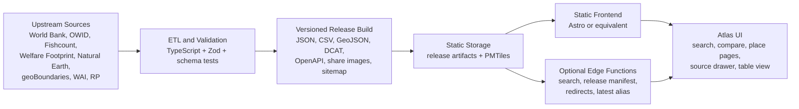
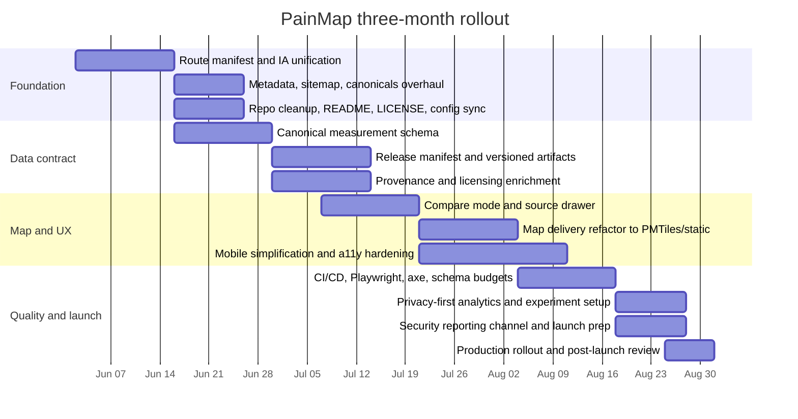

# PainMap Audit and Improvement Brief for Codex GPT-5.5 xhigh reasoning

## Executive summary

PainMap’s current live site has a strong strategic direction: it now presents itself as a **place-first atlas** with an explicit non-map workflow, a read-only public data contract, visible provenance fields, and policy pages that clearly separate research visualization from medical or personal-data use. The live homepage says it is a “Global atlas of pain sources by place,” the atlas page emphasizes source, vintage, method class, and uncertainty labels on every visible value, and the API/privacy/security pages reinforce that the public surface is static and read-only. Those are all good product instincts for a research atlas. citeturn10search0turn48view0turn49view0turn50view2turn49view2

The main problem is that the **product promise is now broader than the evidence architecture**. The live site promises a global atlas of pain sources by place, but the strongest empirical layer remains a small event-level animal evidence catalog centered on poultry-related Welfare Footprint research, while place-level outputs are explicitly described as directional proxy aggregates built from public burden indicators, animal-count datasets, land-area proxies, and welfare assumptions. That is not fatal, but it means the site is currently closer to a **pain-source prioritization atlas with mixed evidence classes** than to a comprehensive empirical map of “the most significant sources of pain in each and every place on Earth.” citeturn46view0turn46view1turn46view2turn46view4turn48view0

A second major issue is **deployment and governance drift**. The linked public GitHub repository appears to lag the live deployment: the live site now exposes routes such as `/atlas/`, `/api/`, `/developers/`, `/security/`, `/dataset/provenance-registry/`, and `/place/BRA/`, while the public repo snapshot’s sitemap and static-route check enumerate only an older route set, and the older HTML snapshot still frames the product as “Animal pain research and country context.” That mismatch is a concrete risk for SEO, reproducibility, contributor onboarding, and trust. citeturn48view0turn49view0turn49view1turn49view2turn49view3turn49view4turn24view1turn23view0turn28view0turn30view7

The highest-priority fixes are therefore not cosmetic. They are: **unify the information architecture and route manifest**, **promote the data model from “representative exports” to a versioned place-layer contract that contains actual typed measurements**, **separate direct estimates from model/proxy/value-laden prioritization outputs more aggressively in the UI**, **eliminate fragile third-party runtime dependencies**, and **make accessibility, licensing, and deployment checks enforce the new route set rather than the old one**. If Codex executes those five things well, PainMap will move from an interesting prototype to a credible atlas platform. citeturn46view1turn46view2turn48view1turn49view1turn49view2turn23view0turn19view0

My confidence is **high** on route inventory, content, policy, API-surface, and repo-drift findings because those came from direct inspection of the live site and the linked public repository. My confidence is **medium** on runtime performance and mobile behavior because I could inspect the public code snapshot and page structure, but I could not run a full browser Lighthouse/PageSpeed audit, capture live response headers end-to-end, or directly fetch the live `robots.txt`/`sitemap.xml` outside the linked repo snapshot. citeturn49view0turn49view1turn49view2turn24view0turn24view1turn13view4turn13view5

## Current site inventory

The live site itself says the current release added a route split, sitemap/robots metadata, event-evidence details, accessible place-search listbox behavior, an equal-area atlas framing, optional globe mode, and static audit checks on **May 31, 2026**. That date is important because it anchors which live claims look current versus which public repo artifacts appear older. citeturn48view3turn10search0

### Live human-facing routes audited

| Route | Current role | Key observation |
|---|---|---|
| `/` | Homepage and product framing | Live homepage positions PainMap as a “Global atlas of pain sources by place,” with place-first entry, equal-area atlas default, optional globe mode, and explicit non-map workflows. citeturn10search0 |
| `/atlas/` | Atlas landing page | Explains the atlas as the place-first entry point; exposes exports, example place page, and layer taxonomy with vintage and uncertainty labels. citeturn48view0 |
| `/countries/` | Places entry | Frames place rows as proxy context, not direct pain measurements; says search and tables are the complete path and map is progressive enhancement. citeturn46view4 |
| `/events/` | Event evidence catalog | Currently exposes a narrow catalog centered on poultry-related pain events and Welfare Footprint sources. citeturn46view0 |
| `/methods/` | Methods glossary | Separates direct, modeled, and proxy evidence classes and explicitly warns that place context is directional proxy context. citeturn46view1 |
| `/data/` | Data overview | Groups sources into Welfare Footprint, Moral Weight, place-atlas data, and boundaries; links to datasets and OpenAPI contract. citeturn46view2 |
| `/api/` | Public API docs | Defines the current public API as static, cacheable, read-only files. citeturn49view0 |
| `/about/` | Mission and governance | Defines the site as a static research visualization, not a clinical/veterinary/personal-health product. citeturn46view3 |
| `/developers/` | Developer notes | Tells users to treat the build id as the stable contract version; states provenance fields must travel with reused values. citeturn49view1 |
| `/security/` | Security baseline | Claims static-site CSP/header baseline, pinned jsDelivr imports, read-only exports, and public issue-tracker reporting. citeturn49view2 |
| `/updates/` | Changelog | Confirms the May 31 route split and mention of static audit checks. citeturn48view3 |
| `/policies/privacy/` | Privacy | States no names, emails, uploads, accounts, payment info, or clinician/patient records are collected. citeturn50view2 |
| `/policies/terms/` | Terms | States the site is for research/education/advocacy analysis, not medical, veterinary, legal, investment, or policy advice. citeturn50view0 |
| `/policies/accessibility/` | Accessibility | Commits to table equivalents, search paths for maps, programmatic status messages, and reduced-motion respect. citeturn50view1 |
| `/policies/editorial-policy/` | Editorial policy | Requires visible boundaries between direct, modeled, and proxy claims and changelogging of major source/model changes. citeturn48view1 |
| `/policies/contact/` | Corrections/contact | Routes corrections and accessibility/governance questions to the public issue tracker. citeturn48view2 |
| `/dataset/provenance-registry/` | Dataset explainer | Defines the registry as the index for method classes, uncertainty classes, licenses, dataset IDs, and distributions. citeturn49view3 |
| `/place/BRA/` | Example place profile | Shows the “stable place-page contract,” while the homepage can refresh country rankings from public APIs. citeturn49view4 |

### Public machine-readable and repo-linked surfaces audited

| Surface | What is exposed now | What matters |
|---|---|---|
| `/data/openapi.json` | OpenAPI 3.1 contract with static routes | Good start for machine discoverability, but current schema is too thin for a serious atlas client. citeturn49view0turn8view0 |
| `/data/provenance-registry.json` | Sources, method classes, uncertainty classes, license IDs, distributions | Useful governance layer; still too coarse for full per-row lineage. citeturn49view0turn8view1 |
| `/data/place-measurements.json` | Representative place-layer measurements/metadata | Labeled “representative,” which is weaker than a real canonical measurement API. citeturn49view0turn8view2 |
| `/data/place-measurements.csv` | Spreadsheet export | Good for auditability; insufficient alone for typed client consumption. citeturn49view0 |
| `/data/places.geojson` | Representative GeoJSON features | Aligned with geospatial interoperability norms, but apparently representative rather than exhaustive. citeturn49view0turn41view1 |
| `/data/dcat.json` | DCAT catalog metadata | Good discovery gesture, but should be enriched with checksums, versioning, and distribution-level metadata. citeturn49view0turn8view3turn41view0 |
| `robots.txt` in public repo snapshot | `User-agent: *`, `Allow: /`, sitemap reference | Fine baseline, but I only verified it in the linked public repo snapshot, not via a fresh direct live fetch. citeturn24view0 |
| `sitemap.xml` in public repo snapshot | Lists older routes only | Appears to lag the live route set and should be treated as a high-priority SEO/governance defect until proven otherwise. citeturn24view1turn23view0turn48view0turn49view1turn49view2turn49view3turn49view4 |

### Public repository snapshot linked from the site

The public issue tracker points to a public GitHub repo with **44 commits**, **0 open issues at inspection time**, and a root containing `index.html`, `script.js`, `styles.css`, `robots.txt`, `sitemap.xml`, `package.json`, content folders, and a static-site check script. I did **not** see an obvious `LICENSE` file, `README`, `_headers`, or `vercel.json` in the anonymous root listing, even though the live Developers/Security pages say header configs exist. That inconsistency is small operationally, but large reputationally: contributors cannot reliably tell what is source-of-truth. citeturn12view0turn47view1turn49view1turn49view2

## Site audit

### What is already good

PainMap is unusually explicit about **epistemic boundaries** for a public atlas. The live Methods, Terms, Editorial Policy, and About pages repeatedly distinguish direct welfare estimates, modeled estimates, and proxy aggregates; the atlas and API pages insist that visible rows carry source, vintage, method class, uncertainty, and license pointers; and the accessibility/privacy pages make clear that the public surface is static, no-account, and non-clinical. Those are serious strengths, not window dressing. citeturn46view1turn50view0turn48view1turn46view3turn48view0turn49view0turn50view1turn50view2

The **search-first, non-map path** is also directionally correct. The atlas page, places page, homepage, and accessibility statement all say the search field and tables are the complete keyboard/screen-reader path; the older public HTML snapshot shows a combobox/listbox implementation with ARIA wiring, a status region, a skip link, and zoom controls with labels. That is exactly the kind of progressive-enhancement pattern a research map should have. citeturn48view0turn46view4turn10search0turn50view1turn28view2turn28view3turn45view3turn38view5

### Where the product currently breaks

The largest product issue is **narrative overreach**. The site now brands itself as a global atlas of pain sources by place, but its strongest empirical content is still a four-row animal event catalog, while place outputs are proxy aggregates and prioritization layers influenced by World Bank indicators, OWID/Fishcount counts, Wild Animal Initiative benchmarks, and welfare-range assumptions. The site itself is honest about that, but the home-page claim is broader and stronger than the data model really supports. citeturn10search0turn46view0turn46view1turn46view4turn36view0

The second issue is **live-site / repo drift**. The live site has a new atlas-first route architecture and policy/API surfaces, while the linked public repo snapshot still contains an older IA, older sitemap/static-route checks, and older metadata framing around “Animal pain research and country context.” This creates four concrete problems at once: stale SEO hints, broken contributor mental models, incomplete CI guardrails, and uncertainty about whether the repo can reproduce production. citeturn48view0turn49view0turn49view1turn49view2turn24view1turn23view0turn28view0turn30view7

The third issue is **machine-readable contract weakness**. The API page promises static exports that are cacheable and inspectable, which is good, but the exported place measurements are described as *representative* and the OpenAPI schema centers on metadata fields rather than a full typed measurement record with raw numeric value, normalized display value, denominator, confidence interval or band, provenance references, and geography hierarchy. A human can understand the live site better than a downstream client can. That is backwards for a site that wants to be reused. citeturn49view0turn8view0turn8view2turn49view4

### UX, UI, accessibility, and mobile

The current accessibility posture is **better than average**, but not fully closed. The live site explicitly commits to table equivalents, live status regions, and reduced-motion respect, while the public code snapshot shows a skip link, ARIA combobox/listbox roles, and an `aria-live="polite"` status element. Those are strong signals. However, the public CSS snapshot does **not** surface a `prefers-reduced-motion` rule, which means either the repo snapshot is outdated or the accessibility statement is ahead of the code. That discrepancy should be fixed immediately because it is testable and trust-affecting. citeturn50view1turn28view2turn28view3turn45view3turn26view2turn38view11

The responsive layout strategy in the public snapshot is partly sound: it uses `clamp()`, `min()`, flexible widths, grid `minmax()`, and at least one `@media (max-width …)` rule. But it also relies on a prominent two-column layout with a 320px secondary column and fairly dense control/card regions. That may be acceptable on tablets and large phones, yet it still deserves dedicated narrow-screen refactoring because the atlas is control-heavy and the most important user journey is search, compare, and inspect. Our World in Data’s newer map work explicitly notes a simplified mobile mode for selection and zooming, which is the right benchmark for PainMap as well. citeturn27view4turn26view8turn26view1turn40view1turn40view2

For visualization accessibility, PainMap’s next step should be richer **semantic descriptions**, not just table fallbacks. Datawrapper’s accessibility work emphasizes alternative descriptions and sensible screen-reader fallbacks, and Observable Plot documents `aria-label` and `aria-description` on SVG roots. PainMap should adopt those patterns for ranked cards, spark bars, compare charts, and uncertainty legends so that the “table equivalent” is a floor, not the whole solution. citeturn40view5turn40view7turn38view4turn40view8

### SEO, metadata, discoverability, and performance

The public repo snapshot has the basics of page metadata: title, description, canonical URL, Open Graph title/description/type/url, and JSON-LD for `Organization`, `WebSite`, and `Dataset`. It even has a static-site check that validates title, description, canonical tags, and sitemap membership for older expected routes. That is better discipline than many static sites have. citeturn28view0turn28view1turn45view3turn23view0

But the SEO layer is still incomplete. In the inspected public HTML snapshot, I found **no `og:image` and no `twitter:*` tags**, which weakens social sharing quality. More importantly, the repo snapshot’s sitemap and route checks still reflect an older route set, while the live site now exposes atlas/API/developer/security/dataset/place-profile pages. If those newer pages are not generated from a single manifest, discoverability will remain inconsistent and fragile. citeturn45view0turn45view1turn24view1turn23view0turn48view0turn49view1turn49view2turn49view3turn49view4

On performance, the most defensible observation is structural rather than synthetic-benchmark based. The public repo snapshot shows a **32.3 KB** `index.html`, a **189 KB** `script.js`, and a **19.8 KB** `styles.css`; `package.json` defines only a static check and a local Python server, with no bundling, minification, or build pipeline in that snapshot. That is not disastrous for a static site, but it does suggest untapped wins from code splitting, asset fingerprinting, vendoring dependencies, and generating release artifacts instead of shipping one large hand-managed script. citeturn13view3turn13view4turn13view5turn24view2

### Data model, API design, scalability, security, and privacy

PainMap’s **data-model idea** is strong but under-realized. The site wants every visible value to carry source, source vintage, method class, uncertainty class, and license information; the OpenAPI contract and provenance registry mirror that intent. The missing piece is a fully normalized measurement schema and a stronger release system. The current Brazil page explicitly says the homepage can refresh rankings from public APIs while the place page records the stable contract; the repo’s animal-suffering report also says world and country cards pull latest OWID and World Bank rows at runtime. That means PainMap currently mixes static reproducibility with runtime freshness in a way that is useful for demos but awkward for citation-grade reuse. citeturn49view1turn49view4turn8view0turn8view1turn36view0

Scalability is the next likely pain point. The public JS snapshot imports D3 and TopoJSON from jsDelivr and pulls country geometry from a raw GitHub Natural Earth URL. That is workable for a prototype, but it is not the long-term posture for a durable atlas. If the route set expands to more layers, smaller geographies, historical views, or compare modes, PainMap should move to **static vector-tile delivery** with PMTiles or a similar serverless tile archive, and use MapLibre or deck.gl only where the interaction model truly needs it. PMTiles is specifically designed for low-cost, zero-maintenance map delivery over HTTP range requests, MapLibre is designed for interactive WebGL maps, and deck.gl documents fluid pan/zoom around 1M items for basic layers on older hardware. citeturn19view0turn38view7turn31search0turn38view9

The privacy posture is currently a strength. The live Privacy, API, and Security pages all say the public surface has no accounts, uploads, write endpoints, or health/patient/clinician records, and I found no discoverable `gtag`, `googletagmanager`, or `plausible` references in the inspected public HTML snapshot. That means PainMap can still choose a privacy-first analytics solution later without undoing an entrenched tracking stack. citeturn50view2turn49view0turn49view2turn30view0turn30view1turn30view3

Security is solid **for a static public atlas**, but weak **for confidential reporting and supply-chain hardening**. The live site states that CSP restricts scripts to self plus pinned jsDelivr imports and that `_headers` / `vercel.json` provide `nosniff`, permissions policy, frame restrictions, and referrer policy. However, the public issue tracker is still the security-reporting channel, which is not appropriate for non-public vulnerability reports, and the anonymous repo root did not visibly expose the header config files the live docs reference. That needs to be cleaned up. citeturn49view2turn49view1turn12view0

## Prioritized improvement program

Tell Codex to treat this as a **product-definition, contract-hardening, and deployment-governance refactor**, not as a theme refresh. The site already has a coherent philosophy; it needs a tighter system.

| Priority | Instruction for Codex GPT-5.5 xhigh reasoning | Why this comes first | Effort | Acceptance test |
|---|---|---|---|---|
| Critical | **Unify the product around one IA and one route manifest.** Make `/`, `/atlas/`, `/countries/`, `/events/`, `/methods/`, `/data/`, `/api/`, `/about/`, policy routes, dataset routes, and place-profile routes all generated from one source-of-truth manifest. | Live site and linked repo snapshot do not describe the same architecture; sitemap/static checks appear stale relative to current routes. citeturn48view0turn49view0turn49view1turn49view2turn24view1turn23view0 | Medium | A generated `routes.json` produces navigation, sitemap, breadcrumbs, canonicals, JSON-LD, and smoke tests; no live route is missing from sitemap or CI. |
| Critical | **Reframe the product promise so it matches the evidence base.** Keep the atlas framing, but explicitly separate “direct evidence,” “modeled estimate,” “proxy aggregate,” and “priority overlay” in hero copy, legends, filters, and cards. | Right now the branding is broader than the evidence stack, even though the methods pages are honest. citeturn10search0turn46view0turn46view1turn46view4turn48view1 | Low | On every atlas and place page, each layer shows an evidence-kind badge and a short explainer; screenshots of cards cannot be mistaken for direct empirical pain measurements. |
| Critical | **Upgrade the place-measurement contract from “representative export” to canonical release artifact.** Add typed numeric fields, display fields, units, ranking mode, geography hierarchy, source IDs, confidence band/interval, and release version. | The current API is reusable only at a metadata level, not as a full atlas client contract. citeturn49view0turn8view0turn8view2turn49view4 | High | A client can render a place page from `/v1/places/{id}` or a versioned static equivalent without scraping HTML; every value resolves to a provenance row. |
| High | **Make releases reproducible.** Replace runtime-only freshness with versioned snapshots plus optional “latest” overlays. Publish immutable releases and a release manifest. | Brazil page and repo report both describe runtime refreshes from public APIs, which is useful but hard to cite and audit. citeturn49view4turn36view0 | High | `/releases/2026-08-31/manifest.json` fully reproduces a deployment; `/latest/` is explicitly marked as mutable. |
| High | **Self-host or vendor critical dependencies and geodata.** Remove runtime dependence on raw GitHub and CDN module imports in production where possible. | Current public JS snapshot depends on jsDelivr and a raw GitHub Natural Earth URL. citeturn19view0 | Medium | Production build uses local hashed assets or approved vendored packages; CSP no longer needs broad CDN allowances for core app code. |
| High | **Harden accessibility beyond table fallbacks.** Add reduced-motion enforcement, robust focus states, route-level a11y tests, and descriptive `aria-label` / `aria-description` on charts/maps. | Site claims accessibility strongly; the public CSS snapshot does not obviously prove reduced-motion support, and map/chart semantics can regress easily. citeturn50view1turn26view2turn38view11turn38view4 | Medium | Axe-core, keyboard-only, and screen-reader acceptance tests pass on home, atlas, place profile, dataset pages, and changelog pages. |
| High | **Introduce a compare mode with explicit uncertainty handling.** Let users compare two places and two releases side by side, with uncertainty badges and source drawers. | OWID’s newer maps show the usability value of selection, mobile simplification, and multiple synchronized views; uncertainty should be visual, not buried. citeturn40view1turn40view2turn40view4turn38view13turn38view14 | Medium | User can compare BRA vs IND or BRA 2026-05-31 vs 2026-08-31 without leaving the atlas, and each difference links to methods/sources. |
| Medium | **Fix metadata/social previews comprehensively.** Add `og:image`, Twitter metadata, route-specific titles/descriptions, and route-specific JSON-LD. | Public repo snapshot has baseline metadata but lacks important social-preview tags. citeturn28view0turn28view1turn45view0turn45view1 | Low | Every route has unique `<title>`, `<meta name="description">`, canonical, OG image, and share-card screenshot in CI snapshots. |
| Medium | **Formalize licensing and attribution.** Add a site code license, per-distribution checksums, source-level license URIs, and exact attribution strings. | Provenance exists, but code-license visibility and per-row attribution depth are still weak. citeturn49view3turn8view1turn12view0turn41view0 | Medium | Repo root contains `LICENSE` and `README`; every dataset distribution has checksum, license URI, access date, source organization, and attribution text. |
| Medium | **Add privacy-preserving analytics and structured experiments.** Use disclosure-first analytics plus event taxonomy tied to real navigation tasks. | No discoverable analytics currently exist; privacy policy already reserves space for future disclosure. citeturn50view2turn30view0turn30view1turn30view3 | Low | Dashboard shows search success, filter use, compare use, and dataset-download funnels without cookies or personal identifiers. |
| Medium | **Add a confidential security-reporting channel.** Keep public issue tracker for data corrections, but create `security@...` or equivalent and a real `security.txt`. | Public issues are not the right channel for sensitive reports. citeturn49view2 | Low | `/.well-known/security.txt` resolves and includes a confidential contact method, disclosure policy, and response expectations. |

## Developer-ready implementation blueprint

### Recommended technical direction

The best fit is a **static-first, versioned-atlas architecture**: keep the site mostly static for privacy and operational safety, but generate richer release artifacts and use modern geospatial delivery where it materially improves UX. PainMap does **not** need a heavy app framework everywhere; it needs one reliable content/data build system, one reusable route manifest, and one scalable map-delivery layer. This fits the site’s own static/read-only design goals while aligning with modern geospatial standards. citeturn49view0turn49view1turn48view0turn38view6turn41view0turn41view1

### Alternative approaches

| Approach | Best when | Strengths | Weaknesses | Recommendation |
|---|---|---|---|---|
| **Keep current static HTML + custom JS/D3** | Small route count, low dataset complexity | Lowest migration risk; preserves current static/privacy posture. | Hand-managed drift, weaker build discipline, fragile scaling, messy client contract. | Good only as a short stabilization phase. |
| **Static site generator + typed build pipeline + PMTiles/MapLibre** | Atlas is mostly read-only, but needs durable routing and better map UX | Strong fit for PainMap: static, deployable anywhere, versioned builds, better SEO and map scalability. PMTiles is explicitly designed for low-cost, zero-maintenance tiled data delivery. MapLibre is designed for interactive WebGL maps. citeturn38view7turn31search0 | Requires migration of route generation and data build. | **Recommended target** |
| **Edge/API layer + PostGIS + MapLibre/deck.gl** | Need arbitrary spatial queries, user-generated states, or very large future atlas | PostGIS adds proper spatial storage/indexing/querying; deck.gl is strong for large-scale interactive layers. citeturn38view8turn38view9 | More infrastructure and governance overhead than PainMap currently needs. | Reserve for phase two, not first refactor. |

### Recommended architecture



This architecture keeps PainMap aligned with its static/read-only promises while making releases truly reproducible and map delivery more robust. OGC API Features, DCAT, GeoJSON, and OpenAPI are the right standards to align around for discoverable geospatial and dataset interfaces. citeturn38view6turn41view0turn41view1turn41view2

### Suggested libraries and frameworks

Use **Astro** or another static-site generator for route generation and metadata, **TypeScript** + **Zod** for schema validation, **MapLibre GL JS** only for the atlas view if richer pan/zoom/filter behavior is desired, **PMTiles** for serverless tiled boundary/layer delivery, and **Observable Plot** or lightweight D3 wrappers for simpler comparison charts that need explicit ARIA labels/descriptions. If a future dynamic query layer becomes necessary, add **Cloudflare Pages Functions** or a small edge layer first, and only graduate to **PostGIS** if the atlas genuinely needs ad hoc spatial queries or server-side feature slicing. citeturn31search0turn38view7turn34search2turn38view8turn38view4

### Recommended database schema

If PainMap stays fully static, you can generate all artifacts from flat files. But for maintainability, I would still model the build pipeline around a relational schema like this:

```sql
create table release (
  release_id text primary key,          -- e.g. 2026-08-31.atlas.1
  published_at timestamptz not null,
  is_latest boolean not null default false,
  changelog_url text not null,
  manifest_sha256 text not null
);

create table source (
  source_id text primary key,
  title text not null,
  organization text,
  source_url text not null,
  license_id text,
  license_url text,
  source_kind text not null,            -- direct | modeled | proxy | boundary | editorial
  accessed_at date,
  vintage_label text,
  notes text
);

create table place (
  place_id text primary key,            -- BRA, BRA-SP, etc.
  place_name text not null,
  geometry_level text not null,         -- country | adm1
  parent_place_id text references place(place_id),
  iso3 text,
  geom geometry(MultiPolygon, 4326)
);

create table layer (
  layer_id text primary key,
  layer_name text not null,
  evidence_kind text not null,          -- direct | modeled | proxy | priority-overlay | boundary
  unit_label text,
  value_type text not null,             -- scalar | rank | category | geometry
  default_sort_mode text
);

create table measurement (
  release_id text references release(release_id),
  place_id text references place(place_id),
  layer_id text references layer(layer_id),
  source_id text references source(source_id),
  raw_value double precision,
  display_value text,
  unit_label text,
  rank_value integer,
  ranking_mode text,                    -- total | per-being | improvement
  uncertainty_class text,
  uncertainty_low double precision,
  uncertainty_high double precision,
  method_note text,
  source_vintage text,
  primary key (release_id, place_id, layer_id, ranking_mode, source_id)
);

create index measurement_place_idx on measurement(place_id);
create index measurement_layer_idx on measurement(layer_id);
```

This schema lets you emit static artifacts, typed API docs, CSV exports, and compare views from one normalized model instead of hand-curated representative files.

### Recommended public endpoints

Keep the public surface read-only, but make it **canonical**:

| Endpoint | Purpose |
|---|---|
| `/v1/releases.json` | Index of releases, latest alias, changelog pointers |
| `/v1/releases/{release_id}/manifest.json` | Immutable release manifest with checksums |
| `/v1/places/{place_id}.json` | Canonical place profile |
| `/v1/places/{place_id}/measurements.json` | All layers/values for a place |
| `/v1/layers.json` | Layer definitions and evidence-kind vocabulary |
| `/v1/sources.json` | Full source registry |
| `/v1/compare.json?left=BRA&right=IND&release=...` | Serverless compare artifact or generated static response |
| `/tiles/boundaries.pmtiles` | Boundary tiles |
| `/tiles/layers/{layer_id}.pmtiles` | Optional thematic vector/raster tiles |
| `/catalog/dcat.jsonld` | DCAT 3 catalog |
| `/openapi.json` | Public API description |

That endpoint design follows the spirit of OpenAPI, DCAT, GeoJSON, and OGC’s feature-oriented web API model more closely than today’s small handful of representative files. citeturn41view2turn41view0turn41view1turn38view6

### Example implementation tasks for Codex

#### Route manifest as source of truth

```ts
// src/config/routes.ts
export const routes = [
  { path: "/", key: "home", title: "PainMap | Global atlas of pain sources by place" },
  { path: "/atlas/", key: "atlas", title: "Atlas | PainMap" },
  { path: "/countries/", key: "places", title: "Places | PainMap" },
  { path: "/events/", key: "events", title: "Animal pain evidence by event | PainMap" },
  { path: "/methods/", key: "methods", title: "Methods | PainMap" },
  { path: "/data/", key: "data", title: "Data | PainMap" },
  { path: "/api/", key: "api", title: "API | PainMap" },
  { path: "/about/", key: "about", title: "About | PainMap" },
  { path: "/developers/", key: "developers", title: "Developers | PainMap" },
  { path: "/security/", key: "security", title: "Security | PainMap" },
  { path: "/updates/", key: "updates", title: "Updates | PainMap" },
  { path: "/policies/privacy/", key: "privacy", title: "Privacy policy | PainMap" },
  { path: "/policies/terms/", key: "terms", title: "Terms | PainMap" },
  { path: "/policies/accessibility/", key: "accessibility", title: "Accessibility statement | PainMap" },
  { path: "/policies/editorial-policy/", key: "editorial", title: "Editorial policy | PainMap" },
  { path: "/policies/contact/", key: "contact", title: "Contact and corrections | PainMap" }
] as const;
```

Generate sitemap, breadcrumbs, nav, canonicals, and smoke tests from this one file.

#### Release manifest generation

```ts
type ReleaseManifest = {
  releaseId: string;
  publishedAt: string;
  routes: { path: string; sha256: string }[];
  datasets: { path: string; sha256: string; bytes: number; licenseUrl?: string }[];
  tilesets: { path: string; sha256: string; format: "pmtiles" | "geojson" }[];
};

export function buildManifest(input: BuildArtifacts): ReleaseManifest {
  return {
    releaseId: input.releaseId,
    publishedAt: new Date().toISOString(),
    routes: input.routes.map(fileHash),
    datasets: input.datasets.map(fileHashWithMeta),
    tilesets: input.tilesets.map(fileHashWithFormat)
  };
}
```

#### CI/CD and testing strategy

Use a branch-preview workflow and fail the build on route drift, schema drift, a11y regressions, or perf-budget regressions.

```yaml
name: painmap-ci
on: [push, pull_request]
jobs:
  validate:
    runs-on: ubuntu-latest
    steps:
      - uses: actions/checkout@v4
      - uses: actions/setup-node@v4
        with: { node-version: 22 }
      - run: npm ci
      - run: npm run lint
      - run: npm run typecheck
      - run: npm run test
      - run: npm run build
      - run: npm run test:links
      - run: npm run test:schema
      - run: npm run test:a11y
      - run: npm run test:smoke
      - run: npm run test:perf-budgets
```

Use Playwright for route smoke tests, `axe-core` for accessibility scans, OpenAPI/JSON Schema validation for artifacts, and a generated sitemap diff to ensure no route is published without metadata. The linked public repo already has the beginnings of this mindset with its static-site check; the problem is scope, not direction. citeturn23view0

## Design and interaction recommendations

### Core design direction

PainMap should look like a **research atlas**, not a landing page with a map appended to it. The successful visual pattern is: **place selector → evidence-kind filter → ranked cards → source drawer → synchronized table**. Our World in Data’s redesign is a strong benchmark here: it keeps multiple synchronized views, foregrounds data sources, and supports full-screen exploration rather than hiding documentation behind separate pages. citeturn40view4turn38view0

### Recommended wireframes

#### Homepage and atlas

Use a first screen with a large place selector and a compact explanation of the four evidence kinds: **Direct**, **Modeled**, **Proxy**, **Priority overlay**. Below that, the atlas should default to a split view: left side interactive map or tile view, right side ranked cards. Above the fold, one sentence should explain exactly what the selected view means, for example: “You are viewing proxy layers for BRA, ordered by total estimated burden; these are not direct pain measurements.” That sentence should update on every filter/sort change. This preserves the site’s honesty while making the first interaction clearer. citeturn46view1turn48view1turn49view4

#### Place profile

A place page should open with five compact pieces of metadata before any rankings: **release version**, **boundary source**, **evidence kinds present**, **uncertainty highest/lowest**, and **available downloads**. Below that, show compare buttons and tabs for **Overview**, **Sources**, **Methods**, and **Downloads**. The current static Brazil page already points in this direction, but it needs the actual values and comparisons rather than a skeleton contract description. citeturn49view4

#### Compare view

Add a `/compare/` route or a query-driven compare panel. Left and right columns should show selected places or releases, while the center gutter explains the **difference in evidence class**, **difference in source vintage**, and **difference in uncertainty**. This is especially important because PainMap mixes direct and proxy data; users need structural comparison, not just numeric comparison. MacEachren’s uncertainty work is directly relevant here: uncertainty should be represented as part of the graphic language, not hidden in prose alone. citeturn38view13turn38view14

### Suggested visualizations and assets

Use an **equal-area choropleth or proportional symbol layer** only for place-proxy views, never for direct event estimates. Use **strip bars or lollipop charts** for event evidence. Use **sortable tables** as first-class citizens, not fallback-only. Add simple **uncertainty chips** on every ranked card: “low,” “moderate,” “very low,” with explanatory tooltips. If you add time, use it only where the source actually supports time-series interpretation; OWID’s “choose years and play over time” pattern is excellent, but only when the underlying data are genuinely temporal. citeturn48view0turn46view0turn40view1turn40view2

### Sample CSS pattern

```css
:root {
  --page-max: 88rem;
  --gap: 1rem;
  --focus-ring: 3px solid currentColor;
}

.page-grid {
  display: grid;
  grid-template-columns: minmax(0, 1.4fr) minmax(18rem, 0.9fr);
  gap: var(--gap);
  align-items: start;
}

.panel {
  border: 1px solid var(--line);
  background: var(--panel);
  padding: 1rem;
}

.focusable:focus-visible,
button:focus-visible,
a:focus-visible,
input:focus-visible,
select:focus-visible {
  outline: var(--focus-ring);
  outline-offset: 2px;
}

@media (max-width: 62rem) {
  .page-grid {
    grid-template-columns: 1fr;
  }

  .toolbar {
    display: grid;
    gap: 0.75rem;
  }
}

@media (prefers-reduced-motion: reduce) {
  html:focus-within { scroll-behavior: auto; }
  *, *::before, *::after {
    animation-duration: 0.01ms !important;
    animation-iteration-count: 1 !important;
    transition-duration: 0.01ms !important;
  }
}
```

This directly closes a current gap between the accessibility statement and the public CSS snapshot. citeturn50view1turn26view2turn38view11

### Sample ARIA and interaction pattern

PainMap is already using the right pattern family for its place search. Keep that, but make it stricter and test it against the WAI combobox pattern.

```html
<label for="place-search" class="sr-only">Search place</label>
<div
  id="place-combobox"
  role="combobox"
  aria-haspopup="listbox"
  aria-expanded="false"
  aria-owns="place-results"
  aria-controls="place-results">
  <input
    id="place-search"
    type="text"
    aria-autocomplete="list"
    aria-describedby="place-help place-status" />
  <ul id="place-results" role="listbox" hidden></ul>
</div>
<p id="place-help">Search is the complete keyboard path for the atlas.</p>
<p id="place-status" role="status" aria-live="polite" class="sr-only"></p>
```

```js
function announce(message) {
  const status = document.getElementById("place-status");
  status.textContent = "";
  requestAnimationFrame(() => { status.textContent = message; });
}
```

This aligns with the existing live-site intent and the WAI combobox guidance. citeturn28view2turn28view3turn50view1turn38view5

## Data governance, monitoring, and ethics

### Data governance and sourcing

PainMap’s strongest long-term asset is not the map. It is the **governance model**: method class, uncertainty class, source vintage, and license should travel with every value. That should become a hard build rule. Every measurement should resolve to: **source ID, source URL, source organization, access date, vintage label, evidence kind, uncertainty treatment, transformation notes, and release ID**. DCAT 3 explicitly supports versioning and checksums at the distribution level, and that is exactly the upgrade PainMap needs. citeturn49view1turn49view3turn41view0

PainMap should also tighten its **source hierarchy**. Right now the site mixes official datasets, research organizations, public benchmarks, and interpretive essays. That can be defensible, but only if the UI distinguishes them visually and mechanically. For example: World Bank and Natural Earth are infrastructure datasets; Welfare Footprint is direct/model-based animal welfare research; Rethink Priorities and related posts are interpretive/welfare-assumption layers; OWID/Fishcount are aggregation layers. Those should never appear as equivalent badges in the same class. citeturn46view2turn48view0turn8view1turn36view0

### Licensing

Licensing needs to become more explicit. Upstream geographic and data sources already have clearer terms than PainMap currently exposes in one place: Natural Earth describes itself as public domain, geoBoundaries describes itself as CC BY 4.0, Welfare Footprint says its data/reports/charts are CC BY, and Our World in Data states its charts, articles, and data are CC BY unless stated otherwise. PainMap should encode those exact licenses at the source/distribution level, not only through a site-level terms page or a small internal license registry. citeturn43search0turn43search9turn43search1turn43search2

### Ethical and interpretive risks

The biggest ethical risk is not privacy; it is **false precision and proxy laundering**. The live site already warns that country results are directional proxies and that prioritization controls like “available decrease in suffering per dollar” are not settled moral scoreboards. Keep those warnings, but make them impossible to miss. Uncertainty-visualization research has repeatedly shown that uncertainty should be signified in the representation itself, not relegated only to technical notes. PainMap should therefore add visible evidence-kind tags, uncertainty chips, and “why this is proxy-only” drawers on every place card. citeturn49view1turn48view1turn38view13turn38view14

### Monitoring and analytics plan

Because the current public surface appears to have **no discoverable analytics** and the privacy policy explicitly says any future analytics should be disclosed before launch, PainMap can adopt a clean measurement plan now instead of retrofitting out of a surveillance stack later. A good default would be **Cloudflare Web Analytics** or a similarly privacy-first tool such as Plausible, both of which emphasize low-friction, privacy-conscious analytics. citeturn50view2turn30view0turn30view1turn30view3turn44search0turn44search1turn44search13

Use an event taxonomy focused on actual research behavior:

| Event | Why it matters |
|---|---|
| `place_search_success` | Measures whether users can get into the atlas quickly |
| `place_compare_open` | Validates compare mode demand |
| `source_drawer_open` | Measures provenance engagement |
| `dataset_download` | Measures researcher reuse |
| `ranking_mode_change` | Tests whether the ranking taxonomy is understandable |
| `uncertainty_help_open` | Measures whether users need more epistemic guidance |
| `dead_link_or_source_error` | Monitors trust-critical failures |

Do **not** track person-level identifiers, saved histories, or fine-grained cross-session behavior. The site’s public posture does not need them. citeturn50view2turn49view0turn49view2

### A/B testing plan

Run only a small number of **pre-registered, sequentially analyzed** experiments. GrowthBook’s sequential-testing documentation is a good practical reference for avoiding false-positive “peeking.” Good first experiments would be: **hero copy variant**, **source drawer location**, **evidence-kind chip prominence**, and **compare CTA copy**. Primary outcome should be *successful place selection leading to at least one source inspection or dataset interaction*, not generic “engagement.” citeturn44search2

## Security and deployment readiness

### Security checklist

| Check | Current state | Required action |
|---|---|---|
| Confidential vulnerability reporting | Public issue tracker is the documented channel. citeturn49view2 | Add `security@...` or equivalent plus real `security.txt`. |
| CSP | Live security page claims a CSP baseline limited to self plus pinned jsDelivr imports. citeturn49view2 | Move core dependencies local where possible; generate CSP from build artifacts. |
| Third-party runtime dependencies | Public JS snapshot imports D3/TopoJSON from jsDelivr and fetches Natural Earth from raw GitHub. citeturn19view0 | Vendor or self-host critical libraries and geodata. |
| Header config visibility | Live docs say `_headers` and `vercel.json` exist; anonymous repo root did not visibly expose them. citeturn49view1turn49view2turn12view0 | Put header config in source-of-truth repo and test it in CI. |
| SRI | Live security page says integrity hashes are part of release checks. citeturn49view2 | Make SRI generation automatic and fail build on mismatch. |
| Read-only API surface | Strong: site states no write endpoints, no forms/accounts/uploads/payments. citeturn49view0turn49view2turn50view2 | Preserve this by default. |
| Certificate hygiene | SSL Labs surfaced a valid Let’s Encrypt certificate and CT presence at crawl time. citeturn0search8 | Add certificate monitoring and CAA if not already configured. |

### Deployment checklist

| Deployment gate | What Codex should enforce |
|---|---|
| Route manifest | Every published route is generated from `routes.ts` and appears in nav, sitemap, canonicals, and smoke tests |
| Metadata | Unique title, description, canonical, OG image, JSON-LD on every route |
| Artifact validation | OpenAPI, DCAT, JSON, CSV, GeoJSON, and PMTiles all schema-checked |
| Provenance completeness | No measurement ships without source/vintage/evidence-kind/license/release fields |
| Accessibility | Axe checks, keyboard navigation, focus visibility, `prefers-reduced-motion`, screen-reader smoke tests |
| Link integrity | External source links and internal route links checked in CI |
| Perf budgets | JS, CSS, HTML, and tile/archive budgets enforced in CI |
| Preview deploys | Every PR gets a full preview and smoke-test run |
| Rollback | Immutable release artifacts and one-click rollback to previous release |
| Monitoring | Analytics, error tracking, broken-source alerts, cache hit/miss review |

### Three-month rollout



### Open questions and limitations

A few things remain incomplete from this audit. I could not run a full Lighthouse/PageSpeed audit, directly inspect live response headers/cookies, or directly fetch the live `robots.txt` and `sitemap.xml`; those observations come from the public repo snapshot linked from the site, which itself appears to lag parts of the live deployment. I also could not verify whether legacy routes such as older `/resources/` content remain live but de-emphasized, or whether the live deployment is built from a branch other than the public repo’s visible default branch. Those unknowns do not change the main recommendations, but they do matter for implementation sequencing. citeturn12view0turn24view0turn24view1turn28view0turn48view0turn49view0turn49view1turn49view2