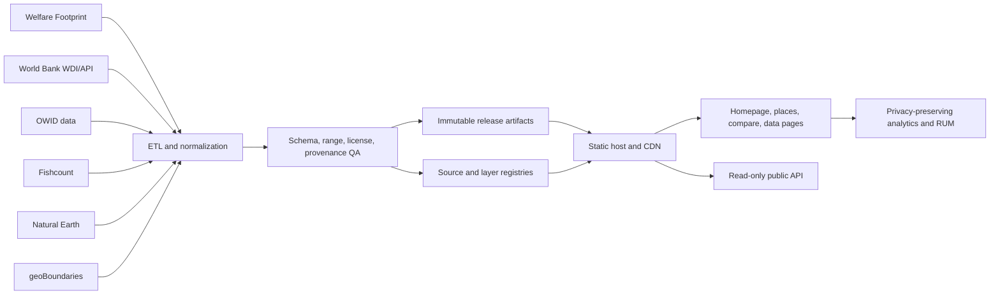
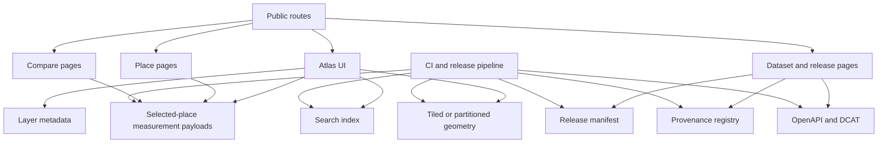

# PainMap Deep Research Review

## Executive summary

PainMap is already unusually strong on **epistemic hygiene**. The live site is explicit that it is a **public static research visualization**, not a clinical or patient tool; it distinguishes **direct evidence, modeled estimates, proxy aggregates, priority overlays, and boundaries**; it keeps **source, vintage, confidence, uncertainty, and license metadata** attached to exported values; and it exposes a **read-only public contract** through static JSON, OpenAPI, DCAT, and immutable release artifacts. That is a much stronger foundation than most public-facing map sites have. citeturn37view0turn38view2turn38view3turn7view1turn7view0turn9view0

The biggest product problem is not credibility but **surface area**. PainMap’s message is “the most significant sources of pain in each place on Earth,” yet the documented public surface still emphasizes **representative place exports**, **Brazil and India as canonical place examples**, and a homepage that repeatedly reminds users that country cards are **directional proxies** rather than direct rankings. In other words, the site’s **methodological caution is excellent**, but its **coverage model and information architecture do not yet fully cash out the planetary ambition in a way that feels complete, discoverable, and scalable**. citeturn37view0turn38view0turn38view3turn7view1turn8view0turn8view1turn2view8

The highest-leverage work is therefore straightforward: **publish a full place index and full release coverage**, **make coverage status visible on the UI**, **keep the equal-area atlas as the default**, **move heavy geography/data delivery toward tiled or partitioned static assets**, **fix the broken `security.txt` path**, and **add privacy-preserving analytics plus field performance instrumentation** so the team can see whether search, compare, and export flows actually work for real users. If those changes are made, PainMap can evolve from an admirably careful research prototype into a durable public atlas product. citeturn37view0turn6view0turn6view1turn7view1turn2view2turn33view1turn33view3

My confidence is **high** for the site-purpose, IA, provenance, security-policy, API-contract, and governance findings, because those are directly stated on the live routes I inspected. My confidence is **moderate** for performance and SEO findings, because I could inspect route content and contract surfaces but did not run a browser devtools/Lighthouse session or directly inspect every response header and `<head>` tag.

## Inspection scope and crawl inventory

I started at the live homepage and inspected PainMap’s primary routes, governance pages, dataset pages, JSON surfaces, canonical place examples, and release artifacts. I also checked a standards-relevant edge case from the security page: the published “Open security.txt” link returned a 404 at `/.well-known/security.txt`, which is the clearest live-site bug found in this pass. citeturn37view0turn38view0turn38view1turn38view2turn38view3turn38view4turn2view0turn6view1turn2view2turn2view3turn2view4turn2view5turn2view6turn2view7turn2view8turn7view1turn7view0turn30view0turn30view1turn10view0turn6view2turn6view3turn9view0turn6view0

| Surface group | Pages and assets crawled | Why it mattered |
|---|---|---|
| Core product routes | `/`, `/countries/`, `/compare/`, `/events/`, `/methods/`, `/data/`, `/api/`, `/about/` | Purpose, IA, UX, accessibility cues, mapping model, and product framing. citeturn37view0turn38view0turn3view3turn38view1turn38view2turn38view3turn7view1turn38view4 |
| Governance and trust routes | `/developers/`, `/security/`, `/policies/privacy/`, `/policies/terms/`, `/policies/accessibility/`, `/policies/editorial-policy/`, `/policies/contact/`, `/updates/` | Deployment posture, security, privacy, accessibility, editorial discipline, and contact/correction workflows. citeturn2view0turn6view1turn2view2turn2view3turn2view4turn2view5turn2view6turn2view7 |
| Dataset pages | `/dataset/place-measurements/`, `/dataset/provenance-registry/` | Data model, documented fields, distribution links, evidence classes, and provenance structure. citeturn2view8turn7view0 |
| Read-only contract and registries | `/data/openapi.json`, `/data/place-measurements.json`, `/data/provenance-registry.json`, `/data/dcat.json`, `/v1/releases.json`, `/v1/layers.json`, `/v1/sources.json` | API design, schema/versioning, release model, layer registry, and source registry. citeturn3view4turn8view2turn7view2turn7view4turn10view0turn30view0turn30view1 |
| Canonical place and release examples | `/place/BRA/`, `/place/IND/`, `/v1/places/BRA.json`, `/v1/places/IND.json`, `/releases/2026-05-31/`, `/releases/2026-05-31/manifest.json` | Coverage, canonical examples, release reproducibility, and place-profile design. citeturn8view0turn8view1turn6view2turn6view3turn9view0turn7view5 |
| Attempted edge endpoints | `/.well-known/security.txt`, `/data/place-measurements.csv`, `/data/places.geojson` | Security disclosure path verification and download-surface inspection. The `security.txt` path returned 404; the CSV/GeoJSON payloads were not parseable in this inspection tool, so I do **not** treat those parse failures as confirmed site breakage. citeturn6view0turn6view7turn6view8 |

## Findings by dimension

For effort sizing below, I am using a practical engineering scale: **low** roughly means 1–3 days, **medium** roughly 1–3 weeks, and **high** roughly 3–8 weeks for one strong engineer, with design/data help where relevant.

### Site purpose

The live site now states its purpose clearly and repeatedly: it is a **mixed-evidence atlas of pain sources by place**, a **public static research visualization**, and **not** a medical, veterinary, or personal-health product. It also states that the site “now begins as an atlas,” while separately saying the **primary layer** is still event-level animal pain evidence and that country cards are **proxy context, not direct moral rankings**. That combination is honest, but it creates a product tension: the site is promising a place-first atlas while still educating the user that the strongest direct evidence is narrower and event-centered. citeturn37view0turn38view1turn38view0turn38view4

A second tension is between ambition and documented surface area. The site speaks globally and supports country/province search, but the public contract and canonical examples still lean on **representative** artifacts and a small set of explicit example place profiles. That is not inherently wrong, but it makes the product feel more like a rigorous atlas prototype than a truly complete “each place on Earth” atlas. citeturn37view0turn2view8turn7view1turn8view0turn8view1

| Priority | Recommendation | Concrete implementation | Effort | Risk |
|---|---|---|---|---|
| High | Make coverage status explicit on the homepage | Add a visible “Coverage today” module: country coverage count, ADM1 coverage count, direct-evidence layer coverage count, last release date, and known sparse areas | Medium | Low |
| High | Align the promise with the public surface | Either publish a full place collection or relabel some routes as “representative release examples” and mark the atlas as beta where appropriate | High | Medium |
| Medium | Put scope boundaries above the fold | Add a one-sentence subtitle: “Global place context, with direct evidence where available and labeled proxies where it is not” | Low | Low |

### Information architecture

PainMap’s current IA is much better than a single-page experiment. The main route set is coherent: **Atlas, Places, Compare, Events, Methods, Data, API, About**, plus policy pages and a changelog. The homepage also now includes explicit start paths for place-first search, atlas browsing, and research/audit workflows. That is a strong base. citeturn37view0turn38view0turn3view3turn38view1turn38view2turn38view3turn7view1turn38view4

The remaining IA issue is semantic consistency. The navigation label is **Places**, but the route is `/countries/`; the content discusses both countries and ADM1; and the homepage offers “Search country or province.” That naming lag is small, but for a product centered on “every place,” route semantics matter. The site also still pushes users across multiple areas to answer one question: atlas to find a place, methods to decode evidence kinds, data to audit provenance, compare to juxtapose places, and API to reuse outputs. A public research tool can tolerate some density, but PainMap would benefit from more **in-context explanation** and less page-hopping. citeturn38view0turn37view0turn38view2turn38view3

| Priority | Recommendation | Concrete implementation | Effort | Risk |
|---|---|---|---|---|
| High | Rename the conceptual route model around “places” | Add `/places/` as the canonical route, maintain redirects from `/countries/`, and update labels, breadcrumbs, and schema metadata accordingly | Low | Low |
| High | Reduce context-switching | Add a persistent right rail or drawer showing layer explanation, uncertainty, vintage, and source count directly in the atlas | Medium | Low |
| Medium | Add breadcrumbed hierarchy | `Home → Place → Layer → Source group → Release` for all place, compare, data, and API pages | Medium | Low |
| Medium | Improve task framing | Reorder the header or homepage sections to match user intent: Explore → Compare → Audit data → Read methods | Low | Low |

### Data model and provenance

This is PainMap’s strongest subsystem. The live public contract separates evidence classes cleanly, exposes **release IDs**, **source IDs**, **license IDs**, **confidence intervals**, **uncertainty classes**, **ranking modes**, **method notes**, **source_vintage**, and **download URLs**, and publishes them through both human-readable pages and machine-readable surfaces. The `provenance-registry`, `layers`, `sources`, `releases`, `OpenAPI`, and `DCAT` surfaces are exactly the kind of infrastructure a research atlas should have. citeturn7view2turn30view0turn30view1turn7view1turn3view4turn31view6turn31view7

The main weakness is not the schema itself but the published coverage and lineage granularity. PainMap documents the classes and examples well, but it does not yet expose an obvious **full place collection index** in the public docs, and some “latest” behavior is still described as homepage runtime refreshes from public APIs. That is useful for freshness, but it blurs the boundary between **reproducible release artifacts** and **live overlays**, which should be made more explicit to users and downstream consumers. citeturn7view1turn10view0turn8view2turn6view2turn6view3turn2view8

| Priority | Recommendation | Concrete implementation | Effort | Risk |
|---|---|---|---|---|
| High | Publish a full place index | Add `/v1/places/index.json` with place ID, name, geometry level, parent ID, latest profile URL, and release coverage metadata | Medium | Low |
| High | Separate immutable release data from live overlays in the UI | Add explicit release-mode tabs: “Snapshot” and “Live overlay,” with different badges, cache rules, and explanatory copy | Medium | Medium |
| Medium | Enrich measurement lineage | Add extraction timestamp, transform version, reviewer status, and source file checksum per measurement row | High | Medium |
| Medium | Publish JSON Schema alongside OpenAPI | Generate JSON Schema for all major payloads and validate releases against it in CI | Medium | Low |

Example target shape for a place index:

```json
{
  "release_id": "2026-05-31.atlas.2",
  "count": 247,
  "items": [
    {
      "place_id": "IND",
      "place_name": "India",
      "geometry_level": "country",
      "parent_place_id": "WLD",
      "profile_url": "/v1/places/IND.json",
      "page_url": "/place/IND/"
    }
  ]
}
```

### Mapping visualization

PainMap’s mapping philosophy is directionally correct. The homepage says the **equal-area atlas view is the default**, the **globe** is optional, and the **non-map search and tables are complete alternatives**. It uses **Natural Earth Admin 0** boundaries and **geoBoundaries ADM1** on demand, and the security page says scripts are self-hosted with **D3 and TopoJSON vendored locally**. For a global burden atlas, this is sensible: equal-area is the right default for thematic comparison, and a globe should be a secondary exploratory mode rather than the primary analytical surface. citeturn37view0turn38view0turn6view1turn11search0turn29search4

The scale risk is clear. If PainMap truly expands to broad country plus ADM1 coverage with richer interactivity, whole-file geometry delivery and runtime upstream boundary pulls will eventually become the bottleneck. The site’s own sources registry already admits a split between vendored country boundaries and **runtime current ADM1 API** usage. That is manageable today, but it will become harder to cache, version, and keep reproducible as the atlas grows. citeturn30view1turn7view2turn34view0turn34view1

| Priority | Recommendation | Concrete implementation | Effort | Risk |
|---|---|---|---|---|
| High | Keep equal-area as default | Preserve the current thematic-equality logic in 2D; do not replace the default with a Web Mercator-first product | Low | Low |
| High | Move geometry delivery to tiled or partitioned assets | Precompute country/ADM1 vectors as static tiles or PMTiles; simplify boundaries by zoom and place type | High | Medium |
| High | Make uncertainty visible on the map itself | Add hatch, opacity, or outline styles for low/very-low-confidence layers instead of encoding uncertainty only in text | Medium | Low |
| Medium | Keep globe mode, but demote it analytically | Use the globe for exploration, not default ranking interpretation; add a help note saying equal-area 2D is the analysis view | Low | Low |
| Medium | Add synchronized legend and provenance tray | Fixed-position layer legend, uncertainty legend, and “why this place ranks here” trace panel | Medium | Low |

### UX and UI

PainMap has several unusually good UX choices already: it offers a **place-first entry**, explicitly says the **search field is the keyboard and screen-reader equivalent for the map**, and repeatedly says the map is secondary to accessible search and table flows. It also distinguishes “what this is” from “what this is not,” which sharply reduces conceptual drift. citeturn37view0turn38view0turn38view4

The UX challenge is cognitive density. The homepage currently carries place search, map mode, globe mode, cause ordering, whole-world top-10 logic, event evidence, methodological glossary, source groups, policy boundaries, and a long source footer. That is intellectually admirable, but the experience is still doing too much at once, especially on smaller screens or for a user who simply wants to answer one question about one place. citeturn37view0

| Priority | Recommendation | Concrete implementation | Effort | Risk |
|---|---|---|---|---|
| High | Convert the homepage into a clearer funnel | Above the fold: search, current layer, top findings, compare CTA. Move most glossary/policy content below the first viewport or into collapsible modules | Medium | Low |
| High | Elevate place summaries | When a place is selected, show a compact summary card with top source of pain, evidence mix, uncertainty badge, and last update before the user sees the full map | Medium | Low |
| Medium | Add one-click compare from every place state | “Compare this place” persistent button with shareable URLs and a saved compare drawer | Medium | Low |
| Medium | Improve mobile reading order | Search → selected place summary → key rankings → map → provenance tabs, rather than map-first or prose-heavy order | Medium | Low |

### Accessibility

PainMap is already thinking about accessibility more seriously than most map products. The site exposes **skip links**, repeatedly documents a complete **non-map path**, says charts and rankings have **table equivalents**, and the accessibility page states that major route changes should preserve keyboard search, readable labels, status text, and reduced-motion behavior. That is a solid accessibility posture. citeturn37view0turn38view0turn2view4

The next step is to move from good intent to **testable WCAG 2.2 AA conformance**. WCAG remains the relevant standard family, W3C recommends using the latest version, and the combobox/search interactions PainMap depends on have an established APG pattern. Dynamic ranking updates also need correctly implemented live regions so assistive technologies announce changes without over-speaking. citeturn31view1turn31view0turn31view2turn31view3turn31view4

| Priority | Recommendation | Concrete implementation | Effort | Risk |
|---|---|---|---|---|
| High | Target WCAG 2.2 AA in practice | Run a formal axe + manual keyboard + NVDA/VoiceOver audit on homepage, place pages, compare, and events | Medium | Low |
| High | Make place search a fully conformant combobox | Implement APG combobox/listbox semantics, active-descendant behavior, clear focus management, and status announcements | Medium | Low |
| High | Guarantee parity between map actions and non-map equivalents | Every hover/select/filter/map-state change must be reachable through input, list, and table controls | Medium | Low |
| Medium | Make uncertainty and layer encoding perceivable without color alone | Add iconography, text labels, and not just color/fill differences | Low | Low |
| Medium | Respect motion preferences everywhere | Disable globe spin/animated transitions when `prefers-reduced-motion` is set | Low | Low |

A minimal accessible status region pattern for selection updates is:

```html
<div id="atlas-status" role="status" aria-live="polite"></div>
```

### Performance

The current architecture has good bones for performance: the public API is a set of **cacheable static files**, release artifacts are **immutable**, manifests include checksums, and the site is designed for static hosts such as **GitHub Pages, Vercel, or Cloudflare Pages**. That is a strong baseline. citeturn7view1turn10view0turn9view0turn2view0

The performance blind spot is observability and data delivery shape. The homepage itself says it mixes **static public data and runtime public APIs**, while the source registry notes runtime/current upstream usage for some surfaces. Without privacy-preserving field telemetry, the team cannot know whether the real bottleneck is atlas JS, geometry weight, upstream fetch latency, or interaction delays. Because the atlas is a map product, the usual advice also applies: reduce layers/sources/vertices, and do not lazy-load the resource that becomes your LCP element. citeturn37view0turn30view1turn32view5turn32view6turn32view0turn32view1turn36search1

| Priority | Recommendation | Concrete implementation | Effort | Risk |
|---|---|---|---|---|
| High | Set explicit field-performance budgets | Target CWV at the 75th percentile: LCP ≤ 2.5s, INP ≤ 200ms, CLS ≤ 0.1; publish budgets in the repo and CI | Low | Low |
| High | Fingerprint and cache versioned assets aggressively | Use `Cache-Control: public, max-age=31536000, immutable` on hashed JS/CSS/data assets and short TTLs on HTML and “latest” aliases | Medium | Low |
| High | Stop doing heavy upstream work in the browser where possible | Materialize the latest public-source overlay into edge-cached release JSON on a schedule instead of pulling upstream APIs on user navigation | High | Medium |
| Medium | Split critical and non-critical bundles | Load search, selected-place summary, and top findings first; defer globe mode, large charts, and rarely used comparison logic | Medium | Low |
| Medium | Simplify geometry and filters | Remove unused features, reduce vertices, and separate fast-changing sources from static shapes | Medium | Low |

### SEO and metadata

PainMap has more SEO potential than most research tools because it already uses clean, content-rich static routes with clear titles such as **Methods**, **Data**, **API**, **Brazil Place Profile**, and release pages. It also exports **DCAT JSON**, has a changelog, and documents dataset downloads and release IDs. Those are excellent ingredients for crawlability and citation. The homepage changelog text also says it added metadata and policy surfaces on May 31, 2026. citeturn37view0turn38view2turn38view3turn7view1turn8view0turn8view1turn9view0

What I could **not** verify directly in this inspection was the full `<head>` implementation for every page, including JSON-LD, canonical tags, Open Graph tags, and sitemap contents. Given that uncertainty, the safest recommendation is to make metadata a first-class product feature rather than an afterthought. Google’s guidance is clear that structured data helps search engines understand pages and can improve rich-result behavior if it is valid and corresponds to visible content. citeturn32view3turn32view4

| Priority | Recommendation | Concrete implementation | Effort | Risk |
|---|---|---|---|---|
| High | Add rich structured data to core route types | `WebSite` for the homepage, `DataCatalog` for `/data/`, `Dataset` for dataset and release pages, `BreadcrumbList` on all secondary routes, `CollectionPage` for place indexes | Medium | Low |
| High | Create indexable static place and layer pages at scale | Pre-render place pages for all ISO3s and the most relevant ADM1s, each with unique titles/descriptions and links to data exports | High | Medium |
| Medium | Strengthen social metadata | Add Open Graph/Twitter images for homepage, place pages, compare pages, and release notes | Low | Low |
| Medium | Give Search Console something meaningful to monitor | Track coverage, CWV, structured-data validation, and top search queries to place pages | Low | Low |

A minimal JSON-LD pattern for a dataset page could look like this:

```html
<script type="application/ld+json">
{
  "@context": "https://schema.org",
  "@type": "Dataset",
  "name": "PainMap Place Measurements",
  "description": "Canonical place-level pain-source proxy measurements for the 2026-05-31.atlas.2 release.",
  "license": "https://creativecommons.org/licenses/by/4.0/",
  "distribution": [
    {"@type": "DataDownload", "encodingFormat": "application/json", "contentUrl": "/data/place-measurements.json"},
    {"@type": "DataDownload", "encodingFormat": "text/csv", "contentUrl": "/data/place-measurements.csv"}
  ]
}
</script>
```

### Privacy and security

PainMap’s public trust posture is very strong. The site says it has **no forms, accounts, payments, health-data submissions, or writable public API**, the security page documents **CSP**, **referrer policy**, **nosniff**, **permissions-related headers**, and **SRI**, and the privacy/about pages are explicit that any future symptom or account workflow should live behind a separate compliant boundary. That is exactly the right stance for a public research atlas. citeturn6view1turn2view2turn38view4

The visible blemish is the live `security.txt` issue. The security page links to it, but the well-known route returned a 404 during inspection. Since RFC 9116 expects a machine-readable file at a known location to support vulnerability disclosure, this should be treated as a real launch-quality bug, not as polish. citeturn6view1turn6view0turn31view8

| Priority | Recommendation | Concrete implementation | Effort | Risk |
|---|---|---|---|---|
| High | Fix `security.txt` immediately | Publish a valid `/.well-known/security.txt`, link it from `/security/`, add expiry and canonical fields, and verify it in CI | Low | Low |
| High | Preserve the “no personal data” boundary | Keep public map/search/download behavior anonymous and isolate any future user-submitted workflows into a separate service and domain boundary | Low | Low |
| Medium | Add security reporting and dependency hygiene in CI | Validate CSP, SRI hashes, dependency advisories, and link integrity on every release | Medium | Low |
| Medium | Document third-party fetch behavior clearly | State which requests are client-side vs release-materialized so privacy-conscious users understand data flows | Low | Low |

A valid starting `security.txt` would be:

```txt
Contact: mailto:security@painmap.org
Expires: 2027-06-01T00:00:00.000Z
Canonical: https://painmap.org/.well-known/security.txt
Policy: https://painmap.org/security/
Preferred-Languages: en
```

### Analytics

PainMap currently has the opposite problem from many sites: it is disciplined enough to publish a privacy policy and even a future event taxonomy, but it has **no analytics tracker currently installed**. That means the team has governance without feedback. It cannot know whether users search successfully, abandon compare flows, bounce from methods pages, or download datasets after finding a place. citeturn2view2

For this product, that is fixable without compromising privacy. Plausible and Cloudflare Web Analytics both emphasize privacy-first, lightweight collection models, and OpenTelemetry can be used for browser performance traces if the team wants deeper technical telemetry without adding a surveillance-style product analytics stack. citeturn33view0turn33view1turn33view2turn33view3

| Priority | Recommendation | Concrete implementation | Effort | Risk |
|---|---|---|---|---|
| High | Add privacy-preserving analytics | Implement first-party analytics with no cookies or user IDs; retain only route and aggregate interaction metrics | Low | Low |
| High | Instrument the core atlas funnel | Measure place search starts, successful selections, zero-result searches, compare opens, data downloads, and release-page visits | Low | Low |
| Medium | Add performance instrumentation | Use browser-side OTel or edge analytics for document-load, dataset fetch timing, and error rates | Medium | Low |
| Medium | Publish an event dictionary | Mirror the privacy policy in a public analytics specification page | Low | Low |

### API design

PainMap’s API design is already more serious than many public-data projects. It uses **OpenAPI 3.1**, exports **DCAT**, treats static files as the public contract, emphasizes **immutable release URLs** over mutable aliases, and publishes `layers`, `sources`, `releases`, and example place profiles. That is excellent API discipline. citeturn7view1turn3view4turn31view6turn31view7turn10view0

The missing piece is discoverability at atlas scale. The current docs are great for examples and reproducibility, but the public contract still needs a first-class **place collection**, more obvious per-place measurement routes, and more geospatially standard geometry access if PainMap wants to become a general-purpose place atlas platform. OGC API - Features is relevant here because it formalizes web-native discovery and access to spatial feature data. citeturn7view1turn8view0turn8view1turn31view5

| Priority | Recommendation | Concrete implementation | Effort | Risk |
|---|---|---|---|---|
| High | Add a collection-level place endpoint | `/v1/places/index.json` with pagination, search tokens, hierarchy, and latest-release links | Medium | Low |
| High | Expand place-specific endpoints | Document and publish `/v1/places/{id}/measurements.json`, `/v1/places/{id}/neighbors.json`, and release-scoped equivalents | Medium | Low |
| Medium | Standardize errors and validators | Use RFC 9457 problem details for errors and publish JSON Schemas for machine validation | Medium | Low |
| Medium | Add geospatial standards compatibility | Offer an OGC API - Features-compatible feature collection for place geometry discovery and filters | High | Medium |

### Scalability

Static hosting is a very good fit for a read-mostly atlas. The site itself says the contract is designed to work on GitHub Pages, Vercel, Cloudflare Pages, or any static host, and the release model already supports immutable artifacts and reproducible downstream citation. That is a strong scalability story for public reads. citeturn7view1turn2view0turn9view0

The scaling problem will arise from **breadth** rather than traffic: more places, more layers, more ADM1 coverage, richer compare states, and heavier geometry. If PainMap expands that coverage while continuing to rely on runtime public APIs and browser-heavy geometry work, the user experience will become uneven across networks and devices. This is where partitioned data, cached release materialization, and tiled geometry become essential. citeturn37view0turn30view1turn32view5turn32view6

| Priority | Recommendation | Concrete implementation | Effort | Risk |
|---|---|---|---|---|
| High | Shard the atlas by release, layer, and geography | Separate country, ADM1, and event data into independently cacheable static surfaces | High | Medium |
| High | Cache freshness server-side, not user-side | Run scheduled ETL refreshes and publish a “latest” snapshot instead of doing many live public-API fetches in the browser | High | Medium |
| Medium | Precompute compare and top-list views | Materialize rank tables and common compare payloads into static JSON for instant reads | Medium | Low |
| Medium | Add graceful degradation for low-end devices | Search/table-only mode with map disabled by preference or device capability | Medium | Low |

### Deployment and CI

PainMap already documents a meaningful deployment story: a **route source of truth**, **static release checks**, **file-size budgets**, **SRI verification**, and multiple static-host targets. Release manifests are positioned as checksum-carrying inventories so downstream users can verify what was deployed. That is unusually mature. citeturn2view0turn9view0

The next maturity step is to connect these pieces into a single visible pipeline that includes data QA, metadata QA, accessibility QA, security QA, and smoke tests for well-known endpoints. The current foundation makes that relatively easy. citeturn2view0turn2view4turn6view1

| Priority | Recommendation | Concrete implementation | Effort | Risk |
|---|---|---|---|---|
| High | Build a release pipeline around the current contract | ETL → schema validation → provenance checks → accessibility smoke tests → visual regression → release manifest generation → preview deploy → promote | Medium | Low |
| High | Add endpoint smoke tests | Verify homepage, top routes, OpenAPI, DCAT, place index, release manifest, and `security.txt` on every deploy | Low | Low |
| Medium | Add scheduled data-refresh workflows | Nightly/weekly freshness checks for upstream sources and automated PRs for release candidates | Medium | Medium |
| Medium | Publish release diffs | Human-readable “what changed” pages between atlas releases, not just manifests | Medium | Low |

### Developer DX

PainMap’s DX is better than it first appears. There is a real **Developers** route, the API is documented as static and cacheable, the release surface is explained, and there are concrete commands for auditing data and artifacts. This is already enough for a technically literate contributor to understand that the site is a proper release artifact, not a one-off frontend. citeturn2view0turn7view1

What is still missing is the layer that makes external contribution and reuse effortless: typed SDKs, canonical JSON Schemas, example notebooks, a place index, migration notes between release/schema versions, and local mock fixtures. Those are the tools that would let PainMap become a platform other people build on, cite, and embed. citeturn31view7turn31view6turn7view1

| Priority | Recommendation | Concrete implementation | Effort | Risk |
|---|---|---|---|---|
| High | Generate typed clients and schemas | Auto-generate TypeScript and Python clients from OpenAPI 3.1 and ship JSON Schemas in-repo | Medium | Low |
| High | Add example notebooks and app recipes | “Load a place profile,” “compare two places,” “join with your own geography,” and “cite a release” examples | Medium | Low |
| Medium | Improve local development ergonomics | Dev container, mock registry, small fixture dataset, and starter scripts for preview releases | Medium | Low |
| Medium | Add migration notes to release pages | Document schema changes, renamed fields, and new layer IDs in every release | Low | Low |

## Mapping stack and data stewardship

### Mapping libraries and services comparison

The most important architectural point is this: **PainMap is not a generic consumer map.** Its value lies in **custom thematic projections, provenance-rich overlays, uncertainty encoding, and research transparency**. That makes some popular mapping products less suitable than they first appear.

| Option | License | Indicative cost at inspection time | Strengths | Weaknesses | Suitability for PainMap |
|---|---|---|---|---|---|
| **Leaflet** | BSD-2-Clause; open-source. citeturn13search0turn25view0 | Library is free; tile/service costs depend on provider. citeturn25view0turn13search1 | Very light, widely understood, mobile-friendly, excellent for basic slippy maps. citeturn25view0 | Better for simpler 2D mapping than heavy global thematic rendering; custom projection/tile workflows are less natural. citeturn29search2turn13search1 | **Moderate**. Good only if PainMap stays lightweight and relatively simple. |
| **OpenLayers** | BSD-2-Clause; free and open-source. citeturn25view1 | Library is free; hosting/tiles extra if used. citeturn25view1 | Strong support for tiles, vector data, Mapbox vector tiles, Canvas/WebGL, and more flexible projection handling than many consumer-map SDKs. citeturn25view1turn29search9 | Heavier API surface; steeper learning curve. | **High**. Best general-purpose candidate if PainMap wants more projection flexibility and scalable vector rendering without proprietary lock-in. |
| **MapLibre GL JS** | BSD-3-Clause ecosystem roots; open-source library using WebGL and vector tiles. citeturn25view2turn14search0 | Library is free; typically paired with a paid or self-hosted tile provider. citeturn25view2turn20view3 | Fast WebGL rendering, vector-tile ecosystem, optional globe-style experiences. citeturn25view2turn29search3 | More natural for vector-tile/slippy-map workflows than custom equal-area thematic projections. | **Moderate to high** if PainMap accepts a more tile-native interaction model, especially for globe mode. |
| **Mapbox GL JS** | Proprietary Mapbox Web SDK terms tied to a Mapbox account; billed by map loads. The repo notes that usage is under Mapbox TOS and that the SDK includes limited de-identified usage/accounting behavior. citeturn25view4 | Up to 50,000 monthly loads free, then about **$5.00 / 1,000** for 50,001–100,000, declining with volume. citeturn23view3 | Highly polished WebGL maps, strong styling ecosystem, commercial support. citeturn22search6 | Proprietary licensing, vendor coupling, recurring cost, and less aligned with PainMap’s privacy/minimal-dependency posture. citeturn25view4 | **Moderate** only if commercial support/studio workflow matters more than openness and independence. |
| **Google Maps Platform** | Commercial terms; pricing by SKU / events. citeturn24view0turn20view1 | Dynamic Maps: 10,000 free monthly events, then **$7.00 / 1,000** for the next tier; subscription options also start at **$100/month**. citeturn24view0turn20view1 | Excellent commodity basemaps, geocoding, and mainstream familiarity. | Limited cartographic personality for a research atlas, recurring cost, and little upside for PainMap’s core value proposition. | **Low**. Do not choose this as the primary atlas engine. |
| **CesiumJS** | Apache 2.0; free/open-source library. Cesium ion is separately priced. citeturn25view3turn20view2 | CesiumJS library is free; Cesium ion starts with a free individual tier and paid plans from **$149/month** for commercial individual use. citeturn20view2 | Best-in-class 3D globe, open formats, massive-dataset streaming, strong for globe exploration. citeturn25view3 | Overkill for PainMap’s primary analytical mode; 3D should remain optional, not default. | **High for optional globe mode**, **low as the core 2D atlas engine**. |

### Recommended mapping direction

For PainMap specifically, I would **not** recommend moving to Google Maps, and I would **not** make Cesium the core renderer. The most credible medium-term target is either:

1. **Keep the current D3/TopoJSON approach** for the equal-area 2D atlas, but harden it with partitioned/tiled geometry and static release materialization; or  
2. **Move to OpenLayers** if interactive complexity, layer count, or coverage breadth outgrow the current custom stack.

If PainMap wants a richer globe mode later, add **CesiumJS** or a **MapLibre globe** as a secondary exploration surface, not as the main analytical view. This recommendation follows directly from PainMap’s current emphasis on **equal-area thematic analysis**, **transparent provenance**, and **non-map accessibility parity**, not from fashionable mapping-stack preferences. citeturn37view0turn38view0turn6view1turn25view1turn25view3

### Primary data sources to prioritize

PainMap’s live registry already points toward the right upstream domains. To make the atlas stronger and easier to defend publicly, I would prioritize sources in this order:

| Priority tier | Source | Why it should be primary |
|---|---|---|
| **Primary** | **Welfare Footprint Institute** | PainMap’s event layer already centers it, and the organization explicitly quantifies welfare impacts using time in affective states of different intensities. That makes it the best direct/modeled anchor for event-level animal pain. citeturn38view1turn34view4turn35view0 |
| **Primary** | **World Bank Indicators / WDI** | Large, documented, programmatic, long-running source for country-level human burden indicators and land/context fields. citeturn30view1turn34view3turn34view8 |
| **Primary** | **Natural Earth + geoBoundaries** | Best current split for country and ADM1 geometry: Natural Earth for generalized country basemaps, geoBoundaries for current administrative boundaries via API. citeturn30view1turn34view0turn34view1 |
| **Primary** | **OWID animal-production surfaces** | Openly licensed, easy to cite/reuse, and already reflected in PainMap’s source registry. citeturn30view1turn34view9 |
| **Secondary but important** | **Fishcount** | Necessary for fish-number estimates and uncertainty ranges where FAO tonnage alone is insufficient for individual-animal counts. citeturn34view6turn28search14 |
| **Secondary and explicitly caveated** | **Rethink Priorities welfare-range work** | Useful for uncertainty framing and welfare-capacity assumptions, but should remain visibly caveated and not be mistaken for settled empirical measurement. citeturn34view5turn38view2 |
| **Exploratory / sparse** | **Wild Animal Initiative and related insect-welfare work** | Important for wild-animal/insect burden framing, but methodologically sparse enough that UI labeling must remain very cautious. citeturn34view7turn28search17 |

### Validation and update method

PainMap should validate pain-source data in **four lanes**, not one:

| Validation lane | What to test | Recommended method |
|---|---|---|
| **Schema validity** | Field presence, types, required relations | JSON Schema + OpenAPI contract validation in CI |
| **Release reproducibility** | Checksums, immutable manifests, source versions | Regenerate manifest on every release; fail if outputs drift unintentionally |
| **Domain sanity** | Bounds, ranking direction, confidence order, missing vintages, impossible units | Custom data tests per layer |
| **Editorial validity** | Are caveats, last reviews, evidence kinds, and uncertainty labels visible on the page? | Human editorial review checklist before publish |

The update cadence should also differ by source: **event evidence** should be updated on publication/review cycles; **country burden proxies** on scheduled data-refresh cycles; **boundaries** on controlled vendoring or explicitly versioned pulls; and **priority overlays** only when the review logic is rerun and documented in a release note. PainMap’s own editorial policy and release model already support this discipline; the main need is automation and public visibility. citeturn2view5turn9view0turn7view2turn7view1

## Target architecture and wireframes

### Recommended data flow

PainMap already has the right conceptual pieces: upstream sources, a provenance registry, immutable releases, and a static public contract. The improvement is to push more work into a **scheduled build pipeline** and less into **runtime browser fetching**.



This architecture follows the current site’s static-hosting and release-artifact model while addressing the performance/reproducibility problems created by too much runtime browser freshness work. citeturn7view1turn9view0turn2view0turn30view1

### Recommended system architecture



### Wireframe sketch for the homepage

```text
┌─────────────────────────────────────────────────────────────────────────────┐
│ PainMap                                                                    │
│ Search a place [____________________]   Compare   Data   Methods           │
├─────────────────────────────────────────────────────────────────────────────┤
│ Selected place: India                     Release: 2026-05-31.atlas.2      │
│ Evidence mix: Proxy / Priority overlay    Uncertainty: Low to Very low     │
├───────────────────────────────┬─────────────────────────────────────────────┤
│ Top findings                  │ Equal-area atlas                            │
│ - Factory-farmed animals      │                                             │
│ - Human burden indicators     │         [selected country highlighted]      │
│ - Animal priority overlay     │                                             │
│                               │                                             │
│ Why here?                     │                                             │
│ Source count: 6               │                                             │
│ Last source vintage: 2026     │                                             │
│ [Compare this place]          │                                             │
├───────────────────────────────┴─────────────────────────────────────────────┤
│ Tabs: Ranked sources | Data table | Provenance | Methods | Downloads        │
└─────────────────────────────────────────────────────────────────────────────┘
```

### Wireframe sketch for mobile

```text
┌───────────────────────────────┐
│ PainMap                       │
│ [Search a place__________]    │
├───────────────────────────────┤
│ India                         │
│ Top source: Factory-farmed    │
│ Evidence: Proxy               │
│ Uncertainty: Low              │
│ [Compare] [Downloads]         │
├───────────────────────────────┤
│ Ranked sources                │
│ 1. Factory-farmed animals     │
│ 2. Human burden indicators    │
│ 3. Animal priority overlay    │
├───────────────────────────────┤
│ Map                           │
│ [equal-area mini map]         │
├───────────────────────────────┤
│ Tabs                          │
│ Table | Provenance | Methods  │
└───────────────────────────────┘
```

### Example implementation snippets

A small but meaningful API/template improvement:

```ts
type PlaceIndexItem = {
  place_id: string;
  place_name: string;
  geometry_level: "world" | "country" | "adm1";
  parent_place_id: string | null;
  profile_url: string;
  page_url: string;
  available_layers: string[];
  latest_release_id: string;
};
```

A lightweight telemetry event model that stays privacy-safe:

```json
{
  "event": "atlas_place_selected",
  "route": "/",
  "place_id": "IND",
  "geometry_level": "country",
  "release_id": "2026-05-31.atlas.2",
  "layer_id": "factory-farmed-animals"
}
```

## Implementation roadmap

### Recommended first wave

The first wave should be narrow and high-confidence: **fix the broken `security.txt`**, **publish a full place index**, **introduce explicit coverage status**, **streamline the homepage funnel**, and **add privacy-preserving analytics plus field performance instrumentation**. These are the changes most likely to improve trust, discoverability, and product feedback immediately. citeturn6view0turn6view1turn2view2turn33view1turn33view3

### Recommended second wave

The second wave should harden the atlas for scale: **release-mode split between snapshot and live**, **partitioned/tiled geometry**, **indexable place pages for broad coverage**, and **formal WCAG 2.2 AA auditing**. This is the stage where PainMap starts looking like a serious data platform rather than a carefully built prototype. citeturn37view0turn38view0turn31view1turn32view5

### Recommended third wave

The third wave should be platformization: **typed SDKs**, **JSON Schema**, **OGC-style geometry access**, **release diffs**, **sample notebooks**, and optional richer globe mode. That work is worth doing only after search, selection, comparison, and release reuse are measurably working. citeturn31view7turn31view6turn31view5turn25view3

A practical rollout plan looks like this:

| Phase | Main deliverables | Expected result |
|---|---|---|
| **Immediate** | `security.txt`, place index, coverage module, analytics, CWV instrumentation | More trust, more observability, stronger public contract |
| **Near-term** | Homepage funnel redesign, release/live split, place-page expansion, WCAG audit | Better UX and clearer epistemic boundaries |
| **Medium-term** | Tiled geometry, cached overlay materialization, broader place coverage, faster compare | Better performance and scalability |
| **Longer-term** | SDKs, schemas, OGC-style geometry access, richer ecosystem docs, optional globe enhancement | Stronger developer adoption and downstream reuse |

## Open questions and limitations

A few things remain incomplete in this report because they were not fully inspectable in this pass.

I did **not** run Lighthouse or browser devtools, so I am **not** claiming measured load times, exact JS bundle sizes, or verified response-header values. My performance recommendations are grounded in PainMap’s published architecture and in established web/mapping guidance, but they are still partly inferential. citeturn7view1turn2view0turn32view5turn32view6turn32view1

I also did **not** directly confirm the full HTML `<head>` metadata implementation on every route, including canonical tags, Open Graph tags, or existing JSON-LD. SEO recommendations therefore assume that some of this may still be incomplete and should be verified in implementation.

Finally, the public contract strongly suggests that some place surfaces are still documented as **representative examples** even while the homepage presents a broader atlas. It is possible that the live homepage has broader runtime place coverage than the formal published examples expose. If so, the right response is still the same: make the full place surface explicit and documented, so the product promise and the public contract finally match.