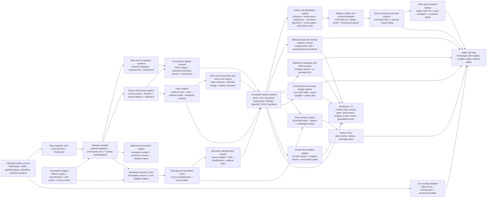

# PainMap Improvement Plan for Codex GPT-5.5-xhigh

## Executive summary

The first source inspected was **painmaps.org** itself: the homepage, route pages such as `/about/`, `/api/`, `/places/`, `/methods/`, `/data/`, `/security/`, `/releases/2026-05-31/`, canonical place pages for Brazil and India, and public machine-readable assets including `v1/coverage.json`, `v1/layers.json`, `v1/sources.json`, `data/openapi.json`, `data/dcat.json`, `data/provenance-registry.json`, `data/source-freshness.json`, `data/ui-smoke.json`, `data/endpoint-smoke.json`, `v1/releases.json`, `data/release-modes.json`, and `ogc/index.json`. I also inspected the linked public GitHub repository that appears to back the site. Publicly, PainMap presents itself as a **place-first public research visualization**, not medical or veterinary advice, with explicit provenance, immutable release snapshots, and labeled live overlays. citeturn0view0turn2view0turn2view1turn3view3turn5view0turn24view0turn25view4turn26view0turn27view0turn29view0turn30view0turn30view1turn31view0turn9view0

PainMap already has several unusually strong foundations for a young public atlas: a release-first model with reproducibility language, OpenAPI 3.1, DCAT cataloging, OGC-style discovery endpoints, a public source-freshness registry, explicit uncertainty cues, privacy limits, `security.txt`, and meaningful accessibility affordances such as skip links, a map-independent search path, live regions, and table equivalents. The homepage also uses canonical tags, Open Graph and Twitter metadata, JSON-LD for `Organization`, `WebSite`, and `Dataset`, plus self-hosted vendor scripts with integrity attributes. citeturn35view0turn3view3turn24view0turn25view4turn26view0turn27view0turn28view0turn17view4turn17view6turn17view7turn23view0

The main strategic problem is **not trust or governance**. It is the gap between the product promise and the current depth of place coverage. PainMap says it is a place-first atlas of pain sources, but the current release indexes **2,114 places** while exposing only **2 canonical country profiles**, **8 canonical place measurements**—two world reference rows plus three rows each for Brazil and India—and **0 direct place-evidence rows**; the coverage JSON also shows **239 country rows**, of which **237 are boundary-only**, plus **1,874 ADM1 poverty-context rows** and **120 pre-rendered high-priority ADM1 pages**. If the world profile is counted, the release has **3 canonical place profiles** total. That means the site already has a sophisticated shell around a still-thin canonical data core. Improving perceived and actual coverage should come before adding more surface complexity. citeturn35view0turn5view0

My highest-confidence recommendation is to **preserve PainMap’s static, immutable, provenance-first philosophy**, while upgrading three layers in order: first, refactor the frontend and data contracts without changing the public concept; second, build a proper release compiler and normalized data model; third, add a scalable geospatial delivery layer for deeper place navigation, using **Equal Earth for the global thematic atlas** and **MapLibre + PMTiles or PostGIS-generated vector tiles** for detailed slippy-map exploration where needed. Equal Earth is appropriate for global thematic maps because it preserves relative area on world maps; vector-tile systems are excellent for interaction and scale, but the mainstream tile ecosystem is usually Web Mercator, so the two-map approach is the right compromise. citeturn42search3turn42search10turn42search21turn41search4turn41search5turn41search10turn41search17

Overall confidence is **high** for the current-state findings taken directly from public pages and assets, **moderate** for implementation inferences, and **limited** for deployment internals that were not observable publicly, such as real traffic, CDN header configuration at the edge, or whether the public GitHub repository is the sole source of truth in production.

## Inspection of the current site

### What PainMap already does well

The current homepage is unusually explicit about evidence posture. It distinguishes a default **snapshot** mode from a **live overlay** mode, stating that snapshot mode reads the frozen `2026-05-31.atlas.2` release and that live overlay mode may query current public rows from **World Bank, OWID, geoBoundaries, and WorldPop** without treating them as immutable release measurements. This is excellent product thinking because it separates reproducible analysis from exploratory freshness. The `release-modes.json` contract and `v1/releases.json` reinforce that architecture and expose a “latest alias” while still telling downstream users to cite immutable release manifests. citeturn35view0turn30view0turn30view1turn16view6

The site also takes provenance seriously. The homepage has a visible “Map provenance” tray, the DCAT catalog enumerates datasets and distributions, and the release surface explicitly advertises checksums, schemas, manifests, and migration artifacts. The public `source-freshness.json` goes further than most small research sites by defining review cadences, source vintages, next-review dates, and update lanes for ten named source groups. That is a strong basis for a credible atlas whose claims are sensitive, contestable, and likely to evolve. citeturn17view2turn24view0turn25view4turn29view0

Accessibility is also better than typical custom-map sites. The inspected homepage has a skip link, a real search form, a combobox input with listbox semantics, status live regions for the search and the map, a tablist for release-mode switching, and explicit copy that the search field and data tables are the “complete non-map path.” The public UI smoke manifest confirms that the site is already checking for ARIA wiring, accessible names, live region IDs, canonical metadata, and route-level visual contracts. That said, a semantic scaffold is not the same thing as fully conformant behavior under keyboard and assistive-technology use, so this foundation should be treated as promising but not yet finished. citeturn18view0turn18view1turn18view2turn18view3turn18view5turn18view7turn26view0turn26view3turn43search0turn43search1

Security and governance are also stronger than expected for a static map project. PainMap exposes a `security/` page, publishes `/.well-known/security.txt`, states that the public surface is read-only with no accounts or payments, and says that CSP, referrer policy, SRI, and static headers are part of its baseline. The homepage HTML includes a CSP meta tag and a strict-origin-when-cross-origin referrer policy, and the stylesheet plus local scripts carry integrity attributes. This is meaningfully better than the default posture of many static research sites. citeturn27view0turn28view0turn23view0turn17view6turn17view7turn44search2turn44search9

### The most important current weaknesses

The biggest weakness is coverage depth. A place atlas that currently surfaces only two canonical country profiles and zero direct place-evidence rows invites a severe expectation mismatch, especially because the interface is polished enough to imply broader maturity. Users can reasonably interpret the site as “global and place-complete,” but the current canonical layer is much closer to “global discovery shell with two deeply authored country profiles and many context placeholders.” PainMap should therefore make coverage status impossible to miss, and should organize the next engineering cycle around increasing canonical place depth and coverage signaling. The next build should treat **validated country-profile expansion** as a data deliverable, not just a UI-honesty task: materialize canonical proxy and priority-overlay rows for every source-complete country, and keep non-source-complete countries boundary-only or no-data with explicit reason codes. citeturn35view0turn5view0

The second major weakness is maintainability risk in the frontend. The public repository shows a mostly static site with a **32.3 KB** `index.html`, a **221 KB** `script.js` spanning **5,003 lines**, and a **28.8 KB** `styles.css` spanning **1,562 lines**. The package manifest is minimal and publicly visible scripts are essentially `check` and `serve`. This architecture can work for a focused static microsite, but it is not the right long-term shape for a place atlas that already has releases, source freshness policies, API contracts, comparison pages, events, and structured datasets. citeturn14view0turn11view0turn15view2turn10view0

The third weakness is that the current mapping stack is likely to strain as place coverage deepens. The live site and public code show that the homepage uses self-hosted **D3** and **TopoJSON**, a local Natural Earth country asset, and an **Equal Earth** default thematic view with a globe alternative. That is a sensible choice for a world-scale thematic atlas, especially because Equal Earth is an equal-area projection designed for world thematic maps. But a custom SVG/D3 renderer is not the best fit once PainMap starts carrying denser ADM1 or finer-grained boundary layers, large comparative overlays, or highly interactive detail views. At that point, GPU-backed vector tiles become the better delivery format. citeturn17view1turn17view6turn15view1turn35view0turn42search3turn42search10turn41search4turn41search12

The fourth weakness is that some performance and motion-hardening basics still look unfinished. PainMap already publishes field and cache budgets, which is good discipline, and the published thresholds match modern Core Web Vitals guidance: LCP around 2.5 seconds, INP around 200 milliseconds, and CLS around 0.1. But I did not find `prefers-reduced-motion` handling in current CSS, did not find a service worker in the public script, and did not find `preconnect` or `modulepreload` hints in the homepage HTML. The site is likely still fast at current scope, but it needs automated performance enforcement before the atlas grows much further. citeturn3view4turn43search3turn19view2turn16view8turn23view4turn23view5

### What this implies for the next build

PainMap should **not** be rewritten as a generic GIS stack, nor as a commercial slippy-map clone. Its differentiator is the combination of place-first inquiry, explicit uncertainty, and reproducible release publishing. The right move is to keep that product philosophy while changing implementation shape: release compilation should be normalized and testable, canonical data should become the real product center, and map rendering should become a two-speed system—**Equal Earth for the global thematic story, vector tiles for detailed boundary interaction**. GeoJSON should remain the human-readable interchange format where practical, but machine-scale distributions should expand toward **GeoParquet**, and the OGC-like feature surfaces should move closer to full standards compliance if dynamic querying is added. citeturn40search0turn40search3turn40search5turn45search0turn45search1turn41search5turn41search17

## Prioritized implementation brief for Codex

### The target architecture

The recommended target state keeps immutable public releases as the center of gravity and adds optional live overlays at the edge rather than in the browser alone.



This architecture matches PainMap’s current release philosophy and public artifacts while splitting concerns much more cleanly. It also keeps the release compiler—not the browser—as the place where rankings, provenance joins, coverage status, source/license attribution contracts, raw source snapshot manifests, provenance registry exports, boundary/geometry metadata, artifact/distribution metadata, layer semantics and rendering contracts, pain-source taxonomy and issue-card semantics, method/transform recipes, welfare/priority assumptions, sensitivity outputs, release citation/archive metadata, stable claim registry, claim-level correction workflow metadata, release-scoped place identity/alias metadata, privacy-preserving telemetry vocabulary, performance/cache budget contracts, release-mode and overlay-isolation rules, public smoke-test manifests, and canonical route/crawlability artifacts are materialized. That is the right choice because current PainMap already distinguishes immutable release artifacts from live exploratory overlays, exposes OpenAPI and DCAT assets, publishes freshness/review rules, and currently depends on visible welfare-range and priority-overlay assumptions for proxy rows. citeturn30view0turn30view1turn24view0turn25view4turn29view0

### Recommended deliverables for Codex

The table below is the implementation order I would give Codex. Estimated hours assume one strong full-stack engineer using Codex heavily, not a large team.

| Priority | Deliverable | Acceptance criteria | Est. hours | Risk |
|---|---|---|---:|---|
| P0 | **Coverage-status model and UI honesty pass** | Every place page and map selection preserves the release `coverage_status` vocabulary from the generated place-index schemas; at minimum support `adm1_context_overlay`, `boundary_only`, the current canonical country-profile status, and `no_data`, with separate human-readable labels if copy changes; place rows are release-scoped because `coverage_status`, `coverage_reason`, `missing_inputs`, parent hierarchy, and boundary-source metadata can change across immutable releases; coverage badges are present in map legend, search results, place pages, and `/places/` listings; the coverage module exposes canonical place profiles, canonical country profiles, release measurements, direct place-evidence rows, ADM1 context rows, pre-rendered ADM1 pages, and known sparse areas | 22 | Low |
| P0 | **Canonical country-profile expansion pipeline** | The release compiler materializes country-level proxy and priority-overlay measurement rows for every ISO3 with sufficient validated World Bank, OWID, Fishcount, land-area, and welfare-assumption inputs; countries failing source, license, or QA thresholds remain `boundary_only` or `no_data` with `coverage_reason` and `missing_inputs`; no generated row is labeled direct evidence | 44 | Medium |
| P0 | **Country-source coverage matrix and promotion gates** | The release compiler emits a static source-completeness matrix for every ISO3, listing required source groups, observed vintages, license status, QA pass/fail state, missing inputs, and final promotion decision; canonical profile generation reads this matrix rather than ad hoc UI logic | 24 | Low |
| P0 | **Source and license registry and attribution contract** | The release compiler emits release-scoped `/v1/sources.json` and license snapshots from typed source and license registries; every source declares evidence kind, publisher, upstream URL, source vintage, license id, attribution text, review cadence, last-review date, next-review-due date, and redistribution note; every scalar `source_id`/`license_id` reference and every JSON-array reference such as `source_ids`, `input_source_ids`, `allowed_upstream_source_ids`, artifact `source_ids`, and assumption `source_ids` resolves inside the same release before any measurement, dataset, OGC, PMTiles, or citation artifact is published | 16 | Low |
| P0 | **Raw source snapshot manifest** | The release compiler emits a release-scoped lockfile for every raw upstream file or API payload used by the release; every snapshot declares source id, snapshot id, upstream URL, retrieval timestamp, source vintage, media type, checksum algorithm, checksum, byte size where available, and raw artifact link where applicable; every measurement-source edge resolves to a same-release snapshot before values, provenance, OpenAPI examples, or checksums are published | 18 | Low |
| P0 | **Provenance registry contract** | The release compiler emits `/data/provenance-registry.json` from typed provenance records; every measurement, source, source snapshot, license, evidence-kind class, uncertainty class, dataset distribution, artifact, and visible provenance ID resolves to a stable release-scoped provenance record with subject, predicate, object, source lineage, license pointer, and generated-at metadata; the provenance registry, source registry, artifact registry, DCAT catalog, OpenAPI examples, and release manifest cannot disagree | 18 | Low |
| P0 | **Boundary and geometry registry** | The release compiler emits a typed boundary/geometry registry for every world, country, and ADM1 feature used by the atlas, place pages, OGC surfaces, GeoJSON, GeoParquet, and PMTiles; each geometry declares stable place ID, admin level, boundary source, source vintage, CRS, geometry artifact, simplification tolerance, topology status, representative point, equal-area area calculation, political/disputed-boundary note where relevant, and map/table eligibility | 22 | Low |
| P0 | **Layer registry and rendering contract** | The release compiler emits `/v1/layers.json` from a typed layer registry; every measurement, table row, map legend item, compare view, and OGC feature references a registered `layer_id`; each layer declares evidence kind, value type, unit label, ranking mode, allowed source groups, assumption requirements where applicable, and map/table rendering semantics so proxy, priority-overlay, modeled, direct, and boundary layers cannot be styled or ranked interchangeably; every JSON-array layer reference such as issue `linked_layer_ids` and method `input_layer_ids` resolves to same-release layer rows | 20 | Low |
| P0 | **Pain-source taxonomy and issue-card registry** | The release compiler emits a typed issue taxonomy for every source-of-pain card or ranking bucket shown in the atlas, compare views, event pages, and place profiles; each issue declares parent category, affected population or species group, harm mechanism, linked layers, supported ranking modes, default display copy, uncertainty/caveat text, and whether it is a country-level, ADM1-context, event-level, or cross-place issue so UI cards cannot drift from the underlying layer and method contracts | 18 | Low |
| P0 | **Method and transform registry** | The release compiler emits versioned method records for every calculation or transform used to turn raw source rows into visible measurement, sensitivity, layer, or coverage outputs; every `(method_id, method_version, transform_version)` triple resolves to a registered recipe with inputs, output fields, assumptions required, reviewer status, and release-diff notes, so method notes cannot drift from executable transforms; method JSON references such as `input_layer_ids` and `required_assumption_ids` resolve to same-release layer and assumption rows | 18 | Low |
| P0 | **Assumption registry and model cards** | The release compiler emits versioned `assumptions.json` and human-readable model cards for welfare ranges, normalization functions, rank modes, and priority-overlay transforms; every proxy or priority-overlay measurement references `assumption_ids`, every scenario or sensitivity-driver assumption reference resolves inside the same release, and every assumption change appears in the release diff | 22 | Low |
| P0 | **Sensitivity and scenario exports** | The release compiler emits named assumption-scenario outputs for every proxy or priority-overlay measurement, including `rank_value` ranges, rank-stability class, and the assumptions driving the largest changes; the UI exposes a concise sensitivity explanation without changing the canonical default ranking silently | 28 | Medium |
| P0 | **Frontend modularization** | Split current monolith into typed modules, route chunks, and testable UI stores without changing public URLs | 45 | Medium |
| P0 | **Release compiler and typed contracts** | One build command produces validated JSON/CSV/GeoJSON/manifest outputs, with JSON Schema checks and checksum generation; `verify-release.ts` runs the full release gate suite and fails if any generated registry, contract, checksum, route, mode, attribution, accessibility-smoke, or coverage invariant is missing | 36 | Medium |
| P0 | **Artifact and distribution registry** | The release compiler emits a typed artifact registry covering JSON, CSV, GeoJSON, GeoParquet, PMTiles, OpenAPI, DCAT, schema, manifest, citation, and smoke-test distributions; every public downloadable artifact declares URL, media type, schema or profile, checksum, checksum algorithm, byte size where available, cache policy, a non-null license id, source lineage, raw-source snapshot lineage where applicable, DCAT distribution id, and OGC collection id where applicable | 18 | Low |
| P0 | **Accessibility hardening** | Keyboard navigation for combobox, tablist, tables, compare flows, and map fallback verified in Playwright; reduced-motion support added | 24 | Medium |
| P0 | **Performance and cache budget contract** | The release compiler emits `/data/performance-budgets.json` from a typed budget registry; route-critical pages, atlas assets, map data, release artifacts, and live-overlay fetch paths declare Core Web Vitals thresholds, asset-size budgets, data-fetch budgets, cache rules, and CI-blocking status; Lighthouse/Playwright checks fail on missing budgets or regressions | 20 | Low |
| P0 | **Public smoke-test manifests and deployment parity gates** | The release compiler emits `/data/ui-smoke.json` and `/data/endpoint-smoke.json` from typed route, endpoint, artifact, and UI contracts; CI and post-deploy checks verify status codes, content types, canonical metadata, structured-data presence, critical selectors, ARIA landmarks, release aliases, required artifact IDs, and downloadable artifact links against the deployed site | 18 | Low |
| P0 | **Release-mode and overlay-isolation contract** | The release compiler emits `/data/release-modes.json` from a typed contract that declares the default snapshot mode, immutable release surfaces, live-overlay surfaces, allowed upstream sources, cache rules, replay rules, UI tab/status IDs, network-boundary rules, and exactly one default snapshot mode; CI fails if snapshot code starts live upstream requests, if live overlay values are written into canonical release artifacts, or if mode labels drift across homepage, API docs, and telemetry | 14 | Low |
| P1 | **Per-place metadata and SEO upgrade** | Every place page gets canonical metadata, richer JSON-LD, Open Graph, and place-specific titles/descriptions | 18 | Low |
| P1 | **Place identity, aliases, and multilingual search** | The release compiler emits a release-scoped place-identity registry with stable IDs, parent hierarchy, ISO/ADM codes, common English names, official/local names where available, alternate spellings, transliterations, source-traced aliases, and ambiguity rules; search and compare flows resolve aliases to the same release-scoped place record and always show coverage status before selection | 18 | Low |
| P1 | **Release citation and archival metadata** | Every immutable release emits `CITATION.cff`, `citation.json`, recommended citation text, schema.org/Dataset JSON-LD, a manifest URL, and a stable archive pointer or DOI when available; the release manifest, DCAT catalog, dataset pages, API docs, and footer citation copy all resolve to the same release identifier, checksum set, manifest URL, and archived artifact inventory | 12 | Low |
| P1 | **Canonical route inventory, sitemap, and crawl policy** | The release compiler emits `routes.json`, `sitemap.xml` or a sitemap index, and `robots.txt` with an explicit sitemap directive and crawler/AI-content-access policy; every public homepage, place, release, dataset, API, OGC, policy, and model-card route is included or intentionally excluded with a reason; canonical URLs and redirects are tested | 14 | Low |
| P1 | **Claim registry and correction workflow** | Every visible claim surface—place card, measurement row, layer legend/definition, pain-source issue card, boundary or disputed-boundary note, source/license note, assumption model card, sensitivity note, method note, release-mode explanation, citation text, release page, and artifact route—has a stable `claim_id` plus a correction link prefilled with `release_id`, route, claim id, subject type, subject id, and provenance id where available; accepted corrections update a public correction registry, release diff, and changelog entry instead of silently changing claims | 20 | Low |
| P1 | **PMTiles detail-map pipeline** | Country and ADM1 layers build into PMTiles; detail map loads lazily; static Equal Earth atlas remains default | 42 | Medium |
| P1 | **Edge live-overlay API** | Overlay endpoints validate country-level place IDs, cache only successful normalized upstream responses, attach provenance labels, and never overwrite release rows | 32 | Medium |
| P1 | **Telemetry vocabulary and privacy-safe analytics** | The release compiler emits `/data/analytics-events.json` and performance-budget metadata from a typed telemetry contract; every route, search, layer-mode, compare, download, place-selection, and performance event used in code is registered with allowed fields, aggregation level, retention window, and a no-persistent-ID assertion; CI blocks unregistered events, free-text payloads, precise coordinates beyond declared granularity, and identifiers not on an allowlist | 22 | Low |
| P2 | **PostGIS authoring/query backend** | Optional backend supports richer filtering, geometry QA, and editorial workflows while keeping releases static | 60 | High |
| P2 | **Realtime adapter framework** | Adapters support scheduled checks, cache invalidation, and release-candidate PR creation for volatile sources | 32 | Medium |


### P0 execution order and merge cutlines

The P0 list above is intentionally comprehensive, but Codex should not implement it as one broad rewrite. Treat P0 as a sequence of mergeable vertical slices with hard parity gates. A pull request that crosses multiple cutlines should be rejected unless it includes an explicit migration plan, rollback path, and release-diff explanation.

| Cutline | Scope | Must pass before moving on | What not to do yet |
|---|---|---|---|
| 0 | **Contract freeze and current-release replay** | Snapshot the current public URLs, route list, release IDs, coverage counts, artifact checksums, and canonical place/profile counts; prove the current `2026-05-31.atlas.2` release can be rebuilt or mirrored without changing public behavior | Do not refactor UI behavior, add PMTiles, or change coverage labels |
| 1 | **Release compiler core and registry generation** | Generate source/license, source-snapshot, provenance, artifact/distribution, boundary/geometry, layer, pain-source issue, method/transform, assumption, performance, release-mode, and smoke-test registries from one compiler command; existing public JSON/CSV/GeoJSON/OpenAPI/DCAT outputs remain byte-identical unless the diff is deliberate | Do not expand coverage or introduce new ranking methods |
| 2 | **Coverage matrix and country-profile promotion** | Add source-completeness gates, `coverage_reason`, `missing_inputs`, and canonical country-profile expansion only for source-complete countries; every new row is proxy or priority-overlay unless direct evidence exists | Do not promote ADM1 context rows to canonical measurements |
| 3 | **Frontend modularization with visual and accessibility parity** | Split the monolithic frontend into typed modules while preserving existing URLs, search behavior, map fallbacks, table equivalents, release-mode switching, and smoke/a11y contracts | Do not change the map stack or introduce new live overlay behavior |
| 4 | **Detail-map and PMTiles layer** | Add lazy MapLibre + PMTiles detail exploration only after compiler, boundary registry, artifact registry, and accessibility parity pass | Do not replace the Equal Earth atlas default |
| 5 | **Edge live overlays and privacy-safe telemetry** | Add edge-normalized overlay adapters and telemetry only after snapshot-mode behavior is stable and the public analytics vocabulary/privacy gates pass | Do not let live overlay values overwrite canonical release rows |

The practical rule for Codex is: first make the current release exactly reproducible and testable; only then expand canonical coverage; only after that improve interaction depth. This prevents the plan from becoming a registry-heavy rewrite that improves architecture while accidentally worsening PainMap’s current public trust guarantees.

### Code-level tasks for Codex

#### Refactor the repository into explicit packages

The public repository looks like a mostly static site today, with large single files and a minimal package manifest. Refactor into a release compiler plus app shell instead of keeping all domain logic inside `script.js`. citeturn10view0turn11view0turn15view2

```text
painmap/
  apps/
    web/
      src/
        routes/
        components/
        maps/
        stores/
        styles/
      public/
  packages/
    schemas/
    atlas-core/
    release-compiler/
    source-adapters/
    source-registry/
    source-snapshots/
    provenance-registry/
    artifact-registry/
    boundary-registry/
    layer-registry/
    pain-source-taxonomy/
    method-registry/
    place-identity/
    search-index/
    analytics-events/
    performance-budgets/
    release-modes/
    smoke-manifests/
    citation-metadata/
    route-manifest/
    claim-registry/
    correction-workflow/
  workers/
    live-overlay/
  data/
    raw/
    compiled/
      releases/
  scripts/
    build-release.ts
    verify-release.ts
    build-sources.ts
    build-source-snapshots.ts
    build-provenance.ts
    build-artifacts.ts
    build-boundaries.ts
    build-layers.ts
    build-issues.ts
    build-methods.ts
    build-pmtiles.ts
    build-place-index.ts
    build-analytics.ts
    build-performance-budgets.ts
    build-release-modes.ts
    build-smoke-manifests.ts
    build-citation.ts
    build-routes.ts
    build-claims.ts
    build-corrections.ts
```

#### Introduce a normalized database schema even if the first release compiler is file-backed

PainMap already thinks in terms of places, sources, releases, and provenance. Make that model explicit instead of burying it inside browser code. Treat the schema below as a logical model with PostgreSQL/PostGIS-oriented types; if the first compiler is SQLite- or DuckDB-backed, keep the same table boundaries but map `jsonb`, generated IDs, and constraint syntax to that engine deliberately. Current PainMap already publishes place indexes, source registries, release manifests, and canonical measurement artifacts, so this schema aligns with the public contract rather than inventing a new concept model. citeturn24view0turn25view4turn29view0turn30view0

```sql
create table release (
  release_id text primary key,
  release_date date not null,
  immutable boolean not null default true,
  notes text,
  manifest_sha256 text not null
);

create table release_citation (
  release_id text primary key references release(release_id),
  citation_title text not null,
  recommended_citation text not null,
  manifest_url text not null,
  citation_file_url text not null,          -- e.g. /releases/2026-05-31/CITATION.cff
  citation_json_url text not null,
  doi text,
  archive_url text,
  archive_checksum text,
  archived_at timestamptz,
  citation_metadata jsonb not null default '{}'::jsonb
);

create table license (
  release_id text not null references release(release_id),
  license_id text not null,
  label text not null,
  license_name text not null,
  license_uri text not null,
  terms_url text,
  attribution_requirement text not null,
  redistribution_note text not null,
  machine_readable boolean not null default true,
  primary key (release_id, license_id)
);

create table source (
  release_id text not null references release(release_id),
  source_id text not null,
  label text not null,
  publisher text not null,
  evidence_kind text not null,
  upstream_url text not null,
  source_vintage text not null,
  license_id text not null,
  attribution text not null,
  redistribution_note text not null,
  cadence text not null,
  cadence_days integer check (cadence_days is null or cadence_days > 0),
  last_review_date date not null,
  next_review_due date not null check (next_review_due >= last_review_date),
  primary key (release_id, source_id),
  foreign key (release_id, license_id) references license(release_id, license_id)
);

create table place (
  release_id text not null references release(release_id),
  place_id text not null,                 -- e.g. WLD, BRA, IND-AN
  parent_place_id text,
  level text not null check (level in ('world', 'country', 'adm1')),
  iso3 text,
  adm1_code text,
  display_name text not null,
  coverage_status text not null,          -- generated from the public place-index schema; do not silently rename existing release values
  coverage_label text not null,           -- human-readable display label, separate from machine status
  coverage_reason text not null,          -- why this place has this release-specific coverage state
  missing_inputs jsonb not null default '[]'::jsonb,
  boundary_source_id text,                -- validator must resolve non-null values to source(release_id, source_id)
  centroid_lon double precision check (centroid_lon is null or (centroid_lon >= -180 and centroid_lon <= 180)),
  centroid_lat double precision check (centroid_lat is null or (centroid_lat >= -90 and centroid_lat <= 90)),
  check (level <> 'world' or parent_place_id is null),
  check (level <> 'country' or iso3 is not null),
  check (level <> 'adm1' or (parent_place_id is not null and adm1_code is not null)),
  primary key (release_id, place_id),
  foreign key (release_id, parent_place_id) references place(release_id, place_id),
  foreign key (release_id, boundary_source_id) references source(release_id, source_id)
);

create table place_alias (
  release_id text not null references release(release_id),
  place_id text not null,
  alias text not null,
  normalized_alias text not null,
  language_tag text,                         -- BCP 47 where known, e.g. en, zh-Hans, hi
  script_code text,                          -- ISO 15924 where useful
  alias_type text not null check (
    alias_type in ('official', 'local_name', 'common_english', 'historical', 'iso_code', 'adm_code', 'transliteration', 'alternate_spelling')
  ),
  source_id text not null,
  ambiguity_group text,
  primary key (release_id, place_id, normalized_alias, alias_type),
  foreign key (release_id, place_id) references place(release_id, place_id),
  foreign key (release_id, source_id) references source(release_id, source_id)
);

create table release_artifact (
  artifact_id text primary key,            -- e.g. artifact.2026-05-31.place-measurements.json; globally unique but also validated with release_id
  release_id text not null references release(release_id),
  artifact_type text not null check (
    artifact_type in ('json', 'csv', 'geojson', 'geoparquet', 'pmtiles', 'openapi', 'dcat', 'schema', 'manifest', 'citation', 'smoke_manifest', 'other')
  ),
  title text not null,
  url text not null,
  media_type text not null,
  schema_url text,
  profile_url text,
  checksum_algorithm text not null default 'sha256',
  checksum text not null,
  byte_size bigint check (byte_size is null or byte_size >= 0),
  cache_policy text not null,
  license_id text not null,
  source_ids jsonb not null default '[]'::jsonb, -- validator must resolve each array item to source(release_id, source_id)
  source_snapshot_ids jsonb not null default '[]'::jsonb, -- validator must resolve each array item to source_snapshot(release_id, snapshot_id) when the artifact derives from raw inputs
  dcat_distribution_id text,
  ogc_collection_id text,
  visible_in_data_catalog boolean not null default true,
  unique (release_id, artifact_id),
  foreign key (release_id, license_id) references license(release_id, license_id)
);

create table source_snapshot (
  release_id text not null references release(release_id),
  source_id text not null,
  snapshot_id text not null,              -- stable release-scoped raw-input snapshot ID
  upstream_url text not null,
  retrieved_at timestamptz not null,
  source_vintage text not null,
  media_type text not null,
  checksum_algorithm text not null default 'sha256',
  checksum text not null,
  byte_size bigint check (byte_size is null or byte_size >= 0),
  raw_artifact_id text,
  retrieval_metadata jsonb not null default '{}'::jsonb,
  primary key (release_id, source_id, snapshot_id),
  unique (release_id, snapshot_id),
  foreign key (release_id, source_id) references source(release_id, source_id),
  foreign key (release_id, raw_artifact_id) references release_artifact(release_id, artifact_id)
);

create table boundary_geometry (
  boundary_id text primary key,            -- e.g. boundary.2026-05-31.BRA.adm0.natural-earth
  release_id text not null references release(release_id),
  place_id text not null,
  geometry_level text not null check (geometry_level in ('world', 'country', 'adm1')),
  boundary_source_id text not null,
  source_vintage text not null,
  geometry_artifact_id text not null,
  crs text not null default 'EPSG:4326',
  render_projection text not null default 'Equal Earth for atlas; Web Mercator for detail tiles',
  simplification_tolerance double precision check (simplification_tolerance is null or simplification_tolerance >= 0),
  topology_status text not null check (
    topology_status in ('valid', 'valid_with_warnings', 'invalid', 'not_checked')
  ),
  representative_lon double precision check (representative_lon is null or (representative_lon >= -180 and representative_lon <= 180)),
  representative_lat double precision check (representative_lat is null or (representative_lat >= -90 and representative_lat <= 90)),
  area_sq_km_equal_area double precision check (area_sq_km_equal_area is null or area_sq_km_equal_area >= 0),
  disputed_boundary_note text,
  political_status_note text,
  visible_in_atlas boolean not null default true,
  unique (release_id, place_id, geometry_level),
  foreign key (release_id, place_id) references place(release_id, place_id),
  foreign key (release_id, boundary_source_id) references source(release_id, source_id),
  foreign key (release_id, geometry_artifact_id) references release_artifact(release_id, artifact_id)
);

create table layer (
  release_id text not null references release(release_id),
  layer_id text not null,                    -- e.g. factory-farmed-animals, human-burden, country-boundaries
  label text not null,
  evidence_kind text not null check (
    evidence_kind in ('direct', 'modeled', 'proxy', 'priority-overlay', 'boundary')
  ),
  value_type text not null,
  unit_label text not null,
  ranking_mode text not null,
  source_ids jsonb not null default '[]'::jsonb, -- validator must resolve each array item to source(release_id, source_id)
  required_assumption_types jsonb not null default '[]'::jsonb,
  render_semantics jsonb not null default '{}'::jsonb,  -- legend class, hatch/outline rules, table formatting, map eligibility
  visible_in_atlas boolean not null default true,
  visible_in_compare boolean not null default true,
  primary key (release_id, layer_id),
  unique (release_id, layer_id, evidence_kind, value_type, unit_label, ranking_mode)
);

create table pain_source_issue (
  release_id text not null references release(release_id),
  issue_id text not null,                    -- e.g. issue.factory-farmed-animals or issue.air-pollution
  parent_issue_id text,
  label text not null,
  issue_domain text not null check (
    issue_domain in ('human', 'animal', 'mixed', 'environmental', 'event', 'methodological')
  ),
  affected_population text not null,          -- e.g. humans, broiler chickens, farmed fish, insects, wild animals
  harm_mechanism text not null,
  linked_layer_ids jsonb not null default '[]'::jsonb, -- validator must resolve each array item to layer(release_id, layer_id)
  supported_ranking_modes jsonb not null default '[]'::jsonb,
  evidence_kind_mix jsonb not null default '[]'::jsonb,
  issue_card_template text not null,
  caution_note text,
  visible_in_atlas boolean not null default true,
  visible_in_compare boolean not null default true,
  visible_in_event_views boolean not null default false,
  primary key (release_id, issue_id),
  foreign key (release_id, parent_issue_id) references pain_source_issue(release_id, issue_id)
);

create table method_transform (
  release_id text not null references release(release_id),
  method_id text not null,                  -- e.g. method.country-proxy-score or method.priority-overlay
  method_version text not null,             -- e.g. method.country-proxy-score.v2
  transform_version text not null,          -- e.g. transform.country-proxy.v2
  label text not null,
  method_type text not null check (
    method_type in ('extraction', 'normalization', 'aggregation', 'ranking', 'sensitivity', 'coverage_promotion', 'rendering', 'other')
  ),
  input_source_ids jsonb not null default '[]'::jsonb, -- validator must resolve each array item to source(release_id, source_id)
  input_layer_ids jsonb not null default '[]'::jsonb, -- validator must resolve each array item to layer(release_id, layer_id)
  required_assumption_ids jsonb not null default '[]'::jsonb, -- validator must resolve each array item to assumption(release_id, assumption_id)
  output_fields jsonb not null default '[]'::jsonb,
  recipe_summary text not null,
  reviewer_status text not null check (reviewer_status in ('draft', 'reviewed', 'accepted', 'deprecated')),
  changelog_note text,
  primary key (release_id, method_id, method_version, transform_version)
);

create table telemetry_event_contract (
  release_id text not null references release(release_id),
  event_id text not null,                 -- e.g. telemetry.place_search_submitted
  event_name text not null,
  surface text not null,                  -- route, search, compare, atlas, data, performance
  allowed_fields jsonb not null default '[]'::jsonb,
  forbidden_fields jsonb not null default '[]'::jsonb,
  aggregation_level text not null check (
    aggregation_level in ('route', 'place', 'layer', 'sessionless_event', 'performance_bucket')
  ),
  retention_days integer not null check (retention_days >= 0),
  public_vocabulary_url text not null,    -- e.g. /data/analytics-events.json
  privacy_note text not null,
  active boolean not null default true,
  primary key (release_id, event_id)
);

create table performance_budget_contract (
  release_id text not null references release(release_id),
  budget_id text not null,                -- e.g. performance.home.lcp or performance.atlas.map_asset_bytes
  route_pattern text not null,             -- e.g. /, /place/{place_id}/, /data/
  surface text not null check (
    surface in ('route', 'atlas', 'place', 'compare', 'data', 'api', 'live_overlay', 'release_artifact')
  ),
  metric_name text not null check (
    metric_name in ('largest_contentful_paint_ms', 'interaction_to_next_paint_ms', 'cumulative_layout_shift', 'js_bytes', 'css_bytes', 'map_asset_bytes', 'data_fetch_ms', 'release_artifact_bytes')
  ),
  threshold_numeric double precision not null check (threshold_numeric >= 0),
  unit text not null,
  cache_policy text not null,
  ci_blocking boolean not null default true,
  public_budget_url text not null,         -- e.g. /data/performance-budgets.json
  primary key (release_id, budget_id)
);

create table release_mode_contract (
  release_id text not null references release(release_id),
  mode_id text not null,                  -- e.g. snapshot or live
  label text not null,
  badge text not null,
  is_default boolean not null default false,
  mode_type text not null check (mode_type in ('snapshot', 'live_overlay')),
  cache_rule text not null,
  replay_rule text not null,
  network_behavior text not null,
  included_surfaces jsonb not null default '[]'::jsonb,
  allowed_upstream_source_ids jsonb not null default '[]'::jsonb, -- validator must resolve each array item to source(release_id, source_id)
  ui_contract jsonb not null default '{}'::jsonb,
  telemetry_event_name text,
  canonical_rows_mutable boolean not null default false check (canonical_rows_mutable = false),
  public_contract_url text not null,        -- e.g. /data/release-modes.json
  check (not is_default or mode_type = 'snapshot'),
  primary key (release_id, mode_id)
);

create unique index release_mode_contract_one_default_per_release
  on release_mode_contract (release_id)
  where is_default;

create table smoke_check_contract (
  release_id text not null references release(release_id),
  check_id text not null,                  -- e.g. smoke.ui.home.hero or smoke.endpoint.openapi
  check_type text not null check (
    check_type in ('endpoint', 'ui_route', 'accessibility_metadata', 'structured_data', 'download_artifact', 'visual_contract')
  ),
  route_or_url text not null,
  expected_status integer not null default 200 check (expected_status >= 100 and expected_status <= 599),
  expected_content_type text,
  required_selectors jsonb not null default '[]'::jsonb,
  required_artifact_ids jsonb not null default '[]'::jsonb, -- validator must resolve each array item to a release_artifact row in the same release
  release_scope text not null check (release_scope in ('current_release', 'latest_alias', 'static_policy', 'global')),
  ci_blocking boolean not null default true,
  public_manifest_url text not null,       -- e.g. /data/ui-smoke.json or /data/endpoint-smoke.json
  primary key (release_id, check_id)
);

create table assumption (
  assumption_id text primary key,          -- e.g. welfare-range.fish.2026-05-31 or normalization.proxy-score.v2
  release_id text not null references release(release_id),
  assumption_type text not null check (
    assumption_type in ('welfare_range', 'sentience', 'normalization', 'ranking_mode', 'priority_overlay', 'cost_effectiveness', 'other')
  ),
  label text not null,
  version text not null,
  value_json jsonb not null,
  uncertainty_note text not null,
  method_note text,
  status text not null default 'active' check (status in ('active', 'deprecated', 'experimental')),
  source_ids jsonb not null default '[]'::jsonb, -- validator must resolve each array item to source(release_id, source_id)
  unique (release_id, assumption_id)
);

create table assumption_scenario (
  release_id text not null references release(release_id),
  scenario_id text not null,               -- e.g. default, conservative-animal, high-animal-welfare-range
  label text not null,
  scenario_type text not null check (
    scenario_type in ('default', 'sensitivity_low', 'sensitivity_high', 'alternative_normative_weighting', 'stress_test')
  ),
  description text not null,
  assumption_ids jsonb not null default '[]'::jsonb, -- validator must resolve each array item to assumption(release_id, assumption_id)
  primary key (release_id, scenario_id)
);

create table place_source_coverage (
  release_id text not null references release(release_id),
  place_id text not null,
  source_group text not null,              -- e.g. world-bank-human-burden, owid-livestock, fishcount-aquaculture
  required_for_canonical boolean not null default false,
  input_status text not null check (
    input_status in ('present', 'missing', 'stale', 'license_blocked', 'qa_failed', 'not_applicable')
  ),
  source_vintage text,
  license_id text,
  notes text,
  check (input_status not in ('present', 'stale') or source_vintage is not null),
  check (input_status not in ('present', 'stale') or license_id is not null),
  primary key (release_id, place_id, source_group),
  foreign key (release_id, place_id) references place(release_id, place_id),
  foreign key (release_id, license_id) references license(release_id, license_id)
);

create table measurement (
  measurement_id text primary key,    -- e.g. 2026-05-31.atlas.2:BRA:factory-farmed-animals
  release_id text not null references release(release_id),
  place_id text not null,
  layer_id text not null,             -- must resolve to layer(release_id, layer_id)
  metric_id text not null,
  value_type text not null,
  raw_value double precision,
  normalized_value double precision,
  display_value text not null,
  unit_label text not null,
  ranking_mode text not null,         -- improvement, total, per-being
  rank_value double precision,
  evidence_kind text not null check (
    evidence_kind in ('direct', 'modeled', 'proxy', 'priority-overlay', 'boundary')
  ),
  method_id text not null,
  method_version text not null,
  transform_version text not null,
  uncertainty_class text not null check (uncertainty_class in ('moderate', 'low', 'very-low')),
  source_vintage text not null,
  reference_period text not null,       -- observation or accounting period for the visible value, distinct from source vintage
  provenance_id text not null,
  caveat text,
  payload jsonb not null default '{}'::jsonb,
  unique (release_id, measurement_id),
  foreign key (release_id, place_id) references place(release_id, place_id),
  foreign key (release_id, layer_id) references layer(release_id, layer_id),
  foreign key (release_id, layer_id, evidence_kind, value_type, unit_label, ranking_mode) references layer(release_id, layer_id, evidence_kind, value_type, unit_label, ranking_mode),
  foreign key (release_id, method_id, method_version, transform_version) references method_transform(release_id, method_id, method_version, transform_version)
);

create table measurement_source (
  release_id text not null references release(release_id),
  measurement_id text not null,
  source_id text not null,
  snapshot_id text not null,
  source_role text not null default 'input',
  primary key (release_id, measurement_id, source_id, snapshot_id),
  foreign key (release_id, measurement_id) references measurement(release_id, measurement_id) on delete cascade,
  foreign key (release_id, source_id) references source(release_id, source_id),
  foreign key (release_id, source_id, snapshot_id) references source_snapshot(release_id, source_id, snapshot_id)
);

create table measurement_assumption (
  release_id text not null references release(release_id),
  measurement_id text not null,
  assumption_id text not null,
  assumption_role text not null,           -- e.g. welfare_weight, normalization, ranking, priority_overlay
  primary key (release_id, measurement_id, assumption_id),
  foreign key (release_id, measurement_id) references measurement(release_id, measurement_id) on delete cascade,
  foreign key (release_id, assumption_id) references assumption(release_id, assumption_id)
);

create table measurement_sensitivity (
  release_id text not null references release(release_id),
  measurement_id text not null,
  scenario_id text not null,
  rank_value double precision,
  normalized_value double precision,
  confidence_low double precision,
  confidence_high double precision,
  rank_stability_class text not null check (
    rank_stability_class in ('stable', 'moderately_sensitive', 'highly_sensitive', 'not_applicable')
  ),
  check (confidence_low is null or confidence_high is null or confidence_low <= confidence_high),
  driver_assumption_ids jsonb not null default '[]'::jsonb, -- validator must resolve each array item to assumption(release_id, assumption_id)
  primary key (release_id, measurement_id, scenario_id),
  foreign key (release_id, measurement_id) references measurement(release_id, measurement_id) on delete cascade,
  foreign key (release_id, scenario_id) references assumption_scenario(release_id, scenario_id)
);

create table provenance_edge (
  release_id text not null references release(release_id),
  provenance_id text not null,        -- stable release-scoped ID used by measurement rows, claim context, and public provenance registry entries
  subject_type text not null check (
    subject_type in ('measurement', 'artifact', 'place', 'layer', 'pain_source_issue', 'method', 'assumption', 'source', 'source_snapshot', 'license', 'release_mode', 'boundary_geometry', 'citation', 'route', 'performance_budget', 'smoke_check')
  ),
  subject_id text not null,
  predicate text not null,            -- derived_from, generated_by, reviewed_by, licensed_under, distributed_as, assumes, transforms
  object_type text not null check (
    object_type in ('source', 'source_snapshot', 'license', 'artifact', 'activity', 'agent', 'assumption', 'method', 'layer', 'place', 'release_mode')
  ),
  object_id text not null,
  metadata jsonb not null default '{}'::jsonb,
  primary key (release_id, provenance_id)
);

alter table measurement
  add foreign key (release_id, provenance_id) references provenance_edge(release_id, provenance_id);

create table claim (
  claim_id text primary key,          -- e.g. claim.2026-05-31.atlas.2.measurement.BRA.factory-farmed-animals
  release_id text not null references release(release_id),
  route text not null,
  subject_type text not null check (
    subject_type in ('measurement', 'place', 'source', 'source_snapshot', 'license', 'layer', 'pain_source_issue', 'boundary_geometry', 'assumption', 'sensitivity', 'release_mode', 'performance_budget', 'citation', 'route', 'method_note', 'artifact')
  ),
  subject_id text not null,
  provenance_id text,
  claim_text_hash text not null,
  correction_url text not null,
  visible boolean not null default true,
  unique (release_id, claim_id),
  unique (release_id, claim_id, subject_type, subject_id),
  foreign key (release_id, provenance_id) references provenance_edge(release_id, provenance_id)
);

create table correction_case (
  correction_id text primary key,     -- e.g. correction.2026-06-07.001
  claim_id text not null,
  release_id text not null references release(release_id),
  subject_type text not null check (
    subject_type in ('measurement', 'place', 'source', 'source_snapshot', 'license', 'layer', 'pain_source_issue', 'boundary_geometry', 'assumption', 'sensitivity', 'release_mode', 'performance_budget', 'citation', 'route', 'method_note', 'artifact')
  ),
  subject_id text not null,
  issue_url text not null,
  status text not null check (status in ('open', 'accepted', 'rejected', 'resolved', 'superseded')),
  summary text not null,
  resolution_note text,
  opened_at timestamptz not null,
  resolved_at timestamptz,
  next_release_id text references release(release_id),
  foreign key (release_id, claim_id) references claim(release_id, claim_id),
  foreign key (release_id, claim_id, subject_type, subject_id) references claim(release_id, claim_id, subject_type, subject_id)
);
```

#### Define a cleaner public API around immutable releases

OpenAPI 3.1 is already the right direction. Keep what exists, but add versioned, predictable surfaces that make the place status model explicit. OpenAPI’s value is exactly that both humans and machines can understand a service without reading source code, and current PainMap already advertises OpenAPI 3.1 publicly. citeturn3view3turn44search3turn44search11

```yaml
openapi: 3.1.0
info:
  title: PainMap API
  version: 2.0.0
paths:
  /v2/releases/{releaseId}/places/{placeId}:
    get:
      summary: Get a place profile for an immutable release
      parameters:
        - in: path
          name: releaseId
          required: true
          schema: { type: string }
        - in: path
          name: placeId
          required: true
          schema: { type: string }
      responses:
        "200":
          description: Place profile
          content:
            application/json:
              schema:
                $ref: "#/components/schemas/PlaceProfile"
components:
  schemas:
    PlaceProfile:
      type: object
      required:
        - release_id
        - place
        - coverage_status
        - coverage_label
        - coverage_reason
        - missing_inputs
        - release_citation
        - release_mode
        - measurements
        - provenance
      properties:
        release_id:
          type: string
        place:
          type: object
          required: [place_id, display_name, level]
          properties:
            place_id: { type: string }
            display_name: { type: string }
            level: { type: string, enum: [world, country, adm1] }
            identifiers:
              type: object
              properties:
                parent_place_id: { type: string }
                iso3: { type: string }
                adm1_code: { type: string }
            aliases:
              type: array
              description: Searchable official, local, common, code, transliteration, and alternate-spelling aliases that resolve to this place record.
              items:
                type: object
                required: [alias, alias_type]
                properties:
                  alias: { type: string }
                  normalized_alias: { type: string }
                  language_tag: { type: string }
                  script_code: { type: string }
                  alias_type: { type: string }
                  ambiguity_group: { type: string }
            boundary_geometry:
              type: array
              description: Boundary and geometry metadata for the place, including source, vintage, CRS, simplification, topology, representative point, area, and disputed-boundary notes where applicable.
              items:
                type: object
                required: [boundary_id, geometry_level, boundary_source_id, source_vintage, geometry_artifact_id, crs, topology_status]
                properties:
                  boundary_id: { type: string }
                  geometry_level: { type: string }
                  boundary_source_id: { type: string }
                  source_vintage: { type: string }
                  geometry_artifact_id: { type: string }
                  crs: { type: string }
                  render_projection: { type: string }
                  topology_status: { type: string }
                  representative_lon: { type: number }
                  representative_lat: { type: number }
                  area_sq_km_equal_area: { type: number }
                  disputed_boundary_note: { type: string }
        coverage_status:
          type: string
          description: Stable machine value copied from the generated place-index schema, not a display label.
        coverage_label:
          type: string
          description: Human-readable label such as "Canonical measurement profile", "ADM1 context overlay", or "Boundary only".
        coverage_reason:
          type: string
          description: Short explanation of why this place has its current coverage state.
        missing_inputs:
          type: array
          description: Source or QA prerequisites that prevented promotion to a canonical profile; empty for source-complete canonical profiles.
          items: { type: string }
        source_coverage:
          type: array
          description: Per-source-group status rows used by the release compiler to decide whether this place can be promoted to a canonical profile.
          items:
            type: object
            required: [source_group, required_for_canonical, input_status]
            properties:
              source_group: { type: string }
              required_for_canonical: { type: boolean }
              input_status:
                type: string
                enum: [present, missing, stale, license_blocked, qa_failed, not_applicable]
              source_vintage: { type: string }
              license_id: { type: string }
              notes: { type: string }
        release_citation:
          type: object
          description: Recommended citation and archival metadata for the immutable release that produced this profile.
          required: [recommended_citation, manifest_url, citation_file_url, citation_json_url]
          properties:
            recommended_citation: { type: string }
            manifest_url: { type: string }
            citation_file_url: { type: string }
            citation_json_url: { type: string }
            doi: { type: string }
            archive_url: { type: string }
            archive_checksum: { type: string }
        release_mode:
          type: object
          description: Snapshot/live-overlay contract for this response, including immutable release scope and rules that keep exploratory overlays outside canonical release rows.
          required: [default_mode, snapshot_release_id, replay_rule]
          properties:
            default_mode: { type: string }
            snapshot_release_id: { type: string }
            replay_rule: { type: string }
            live_overlay_allowed: { type: boolean }
            allowed_upstream_source_ids:
              type: array
              items: { type: string }
            canonical_rows_mutable: { type: boolean }
        release_artifacts:
          type: array
          description: Release-scoped artifact and distribution metadata for downloadable data, schemas, OpenAPI/DCAT files, OGC surfaces, PMTiles, and manifests relevant to this profile.
          items:
            type: object
            required: [artifact_id, artifact_type, url, media_type, checksum, checksum_algorithm, cache_policy, license_id, source_ids]
            properties:
              artifact_id: { type: string }
              artifact_type: { type: string }
              url: { type: string }
              media_type: { type: string }
              schema_url: { type: string }
              checksum: { type: string }
              checksum_algorithm: { type: string }
              cache_policy: { type: string }
              license_id: { type: string }
              source_ids:
                type: array
                items: { type: string }
              source_snapshot_ids:
                type: array
                description: Raw-input snapshot IDs for artifacts derived from release source snapshots; omitted or empty for pure schema, policy, or route-manifest artifacts.
                items: { type: string }
              dcat_distribution_id: { type: string }
              ogc_collection_id: { type: string }
        pain_sources:
          type: array
          description: Source-of-pain issue cards or ranking buckets shown for this place, tied to registered issues, layers, ranking modes, and caveat text.
          items:
            type: object
            required: [issue_id, label, issue_domain, linked_layer_ids]
            properties:
              issue_id: { type: string }
              parent_issue_id: { type: string }
              label: { type: string }
              issue_domain: { type: string }
              affected_population: { type: string }
              harm_mechanism: { type: string }
              linked_layer_ids:
                type: array
                items: { type: string }
              supported_ranking_modes:
                type: array
                items: { type: string }
              caution_note: { type: string }
        measurements:
          type: array
          items:
            $ref: "#/components/schemas/Measurement"
        provenance:
          type: array
          items:
            $ref: "#/components/schemas/ProvenanceEdge"
    Measurement:
      type: object
      required:
        - claim_id
        - measurement_id
        - release_id
        - place_id
        - place_name
        - geometry_level
        - layer_id
        - layer_name
        - evidence_kind
        - value_type
        - display_value
        - unit_label
        - ranking_mode
        - source_ids
        - source_snapshot_ids
        - source_vintage
        - reference_period
        - method_id
        - method_version
        - method_note
        - uncertainty_class
        - license_id
        - data_license_uri
        - attribution
        - provenance_id
        - download_url
        - extraction_timestamp
        - transform_version
        - reviewer_status
        - source_file_checksum
        - source_file_checksum_algorithm
      properties:
        claim_id:
          type: string
          description: Stable release-scoped identifier for the visible claim so correction, citation, and changelog references do not depend on fragile text matching.
        measurement_id: { type: string }
        release_id: { type: string }
        place_id: { type: string }
        place_name: { type: string }
        geometry_level: { type: string, enum: [world, country, adm1] }
        layer_id: { type: string }
        layer_name: { type: string }
        layer_metadata:
          type: object
          description: Registered layer contract copied from `/v1/layers.json`; used to keep evidence kind, value type, unit label, ranking mode, and rendering semantics consistent across map, table, compare, API, and export surfaces.
          properties:
            evidence_kind: { type: string }
            value_type: { type: string }
            unit_label: { type: string }
            ranking_mode: { type: string }
            render_semantics: { type: object }
        method_metadata:
          type: object
          description: Registered method/transform contract used to reproduce the visible value from source rows, assumptions, and layer semantics.
          properties:
            method_id: { type: string }
            method_version: { type: string }
            transform_version: { type: string }
            method_type: { type: string }
            input_source_ids:
              type: array
              items: { type: string }
            required_assumption_ids:
              type: array
              items: { type: string }
            recipe_summary: { type: string }
            reviewer_status: { type: string }
        evidence_kind:
          type: string
          enum: [direct, modeled, proxy, priority-overlay, boundary]
        value_type: { type: string }
        raw_value:
          type: number
          description: Optional numeric source value when the registered value type is numeric; omit for categorical, boundary, or non-numeric rows rather than inventing a number.
        normalized_value: { type: number }
        display_value: { type: string }
        unit_label: { type: string }
        ranking_mode: { type: string }
        rank_value:
          type: number
          description: Optional numeric ranking value when the registered layer and method produce a defensible ranking scalar; omit for non-ranked rows.
        source_ids:
          type: array
          items: { type: string }
        source_snapshot_ids:
          type: array
          description: Release-scoped raw-input snapshot IDs whose checksums and retrieval metadata reproduce this measurement's source-file basis.
          items: { type: string }
        assumption_ids:
          type: array
          description: Versioned welfare-range, normalization, ranking, and priority-overlay assumptions used by proxy or priority-overlay rows.
          items: { type: string }
        sensitivity_summary:
          type: object
          description: Present for proxy and priority-overlay rows; summarizes scenario-dependent rank-value ranges and rank stability.
          properties:
            rank_value_low: { type: number }
            rank_value_high: { type: number }
            rank_stability_class:
              type: string
              enum: [stable, moderately_sensitive, highly_sensitive, not_applicable]
            driver_assumption_ids:
              type: array
              items: { type: string }
        confidence_low:
          type: number
          description: Optional numeric lower bound when the registered method produces a defensible interval; omit rather than inventing precision.
        confidence_high:
          type: number
          description: Optional numeric upper bound when the registered method produces a defensible interval; omit rather than inventing precision.
        source_vintage: { type: string }
        reference_period:
          type: string
          description: Observation or accounting period for the visible value, such as a year, date range, or source-defined reporting period; distinct from source vintage.
        method_id: { type: string }
        method_version: { type: string }
        method_note: { type: string }
        uncertainty_class:
          type: string
          enum: [moderate, low, very-low]
        license_id: { type: string }
        data_license_uri: { type: string }
        attribution: { type: string }
        provenance_id: { type: string }
        download_url: { type: string }
        correction_url:
          type: string
          description: Public issue-template URL prefilled with the claim id, release, route, measurement, and provenance context for this claim.
        correction_context:
          type: object
          properties:
            claim_id: { type: string }
            subject_type: { type: string }
            subject_id: { type: string }
            route: { type: string }
            release_id: { type: string }
            provenance_id: { type: string }
        extraction_timestamp: { type: string, format: date-time }
        transform_version: { type: string }
        reviewer_status: { type: string }
        source_file_checksum: { type: string }
        source_file_checksum_algorithm: { type: string }
        source_file_checksum_basis:
          type: string
          description: Human-readable summary of how per-snapshot checksums were combined or selected for this measurement export.
    ProvenanceEdge:
      type: object
      required: [release_id, provenance_id, subject_type, subject_id, predicate, object_type, object_id]
      properties:
        release_id: { type: string }
        provenance_id:
          type: string
          description: Stable release-scoped provenance identifier used by measurement rows, claims, correction context, and the public provenance registry.
        subject_type: { type: string }
        subject_id: { type: string }
        predicate: { type: string }
        object_type: { type: string }
        object_id: { type: string }
        metadata: { type: object }
```

#### Keep Equal Earth for the world atlas and add a lazy detail map for deep navigation

This is the single most important geospatial design recommendation. Equal Earth is suitable for world thematic display because area comparison matters for a global burden atlas. PMTiles and vector tiles are excellent for deeper local interaction because they reduce tile-server overhead and work well with MapLibre. But PMTiles and mainstream vector-tile workflows generally assume pseudo-Mercator/Web Mercator, so Codex should implement a **dual-renderer strategy**, not a forced single-map rewrite. citeturn42search3turn42search10turn41search4turn41search5turn41search10turn41search17

```ts
// apps/web/src/maps/detailMap.ts
import maplibregl from "maplibre-gl";
import { Protocol } from "pmtiles";

let pmtilesProtocolRegistered = false;

function registerPmtilesProtocol() {
  if (pmtilesProtocolRegistered) return;
  const protocol = new Protocol();
  // @ts-expect-error MapLibre's protocol callback typing can lag the PMTiles implementation.
  maplibregl.addProtocol("pmtiles", protocol.tile);
  pmtilesProtocolRegistered = true;
}

export function mountDetailMap(container: HTMLElement) {
  registerPmtilesProtocol();

  const map = new maplibregl.Map({
    container,
    style: {
      version: 8,
      sources: {
        adm1: {
          type: "vector",
          url: "pmtiles://https://cdn.painmaps.org/tiles/adm1.pmtiles"
        }
      },
      layers: [
        {
          id: "adm1-fill",
          type: "fill",
          source: "adm1",
          "source-layer": "adm1",
          paint: {
            "fill-opacity": 0.55
          }
        },
        {
          id: "adm1-outline",
          type: "line",
          source: "adm1",
          "source-layer": "adm1",
          paint: {
            "line-width": 1
          }
        }
      ]
    },
    center: [0, 20],
    zoom: 1.8
  });

  return map;
}
```

#### Add an edge overlay adapter that caches public-source responses and stamps provenance

PainMap’s public contract already says live overlays are short-lived, exploratory, and separate from immutable release rows. Preserve that. Do not let browser code freehand-fetch upstreams and merge them opaquely. Move overlays behind a thin cache/provenance layer. citeturn30view1turn25view4

```ts
// workers/live-overlay/src/index.ts
export interface Env {
  CACHE_TTL_SECONDS: string;
}

type WorldBankIndicatorRow = {
  countryiso3code?: string;
  date?: string;
  value?: number | null;
};

function jsonResponse(payload: unknown, status = 200, cacheControl = "no-store") {
  return new Response(JSON.stringify(payload), {
    status,
    headers: {
      "content-type": "application/json; charset=utf-8",
      "cache-control": cacheControl
    }
  });
}

function ttlSeconds(env: Env) {
  const parsed = Number.parseInt(env.CACHE_TTL_SECONDS || "86400", 10);
  if (!Number.isFinite(parsed)) return 86400;
  return Math.min(Math.max(parsed, 60), 86400);
}

function normalizeWorldBankLatestValue(data: unknown) {
  if (!Array.isArray(data) || !Array.isArray(data[1])) {
    throw new Error("Unexpected World Bank payload shape");
  }

  const latest = (data[1] as WorldBankIndicatorRow[]).find((row) => typeof row.value === "number");
  if (!latest) {
    return { value: null, year: null, note: "No numeric value returned by upstream source" };
  }

  return {
    value: latest.value,
    year: latest.date,
    country_iso3: latest.countryiso3code || null
  };
}

export default {
  async fetch(request: Request, env: Env, ctx: ExecutionContext): Promise<Response> {
    if (request.method !== "GET") {
      return jsonResponse({ error: "method not allowed" }, 405);
    }

    const url = new URL(request.url);
    const placeId = (url.searchParams.get("placeId") || "").trim().toUpperCase();
    if (!/^[A-Z]{3}$/.test(placeId)) {
      return jsonResponse({ error: "placeId must be a country-level ISO3 code" }, 400);
    }

    const ttl = ttlSeconds(env);
    const cacheKey = new Request(`${url.origin}${url.pathname}?placeId=${placeId}`, request);
    const cache = caches.default;
    const hit = await cache.match(cacheKey);
    if (hit) return hit;

    const upstream = `https://api.worldbank.org/v2/country/${placeId.toLowerCase()}/indicator/SP.POP.TOTL?format=json`;
    const res = await fetch(upstream, {
      headers: { "User-Agent": "PainMap live overlay adapter" }
    });

    if (!res.ok) {
      return jsonResponse(
        { error: "upstream request failed", source_id: "world-bank-indicators", status: res.status },
        502
      );
    }

    let data: unknown;
    let normalized: unknown;
    try {
      data = await res.json();
      normalized = normalizeWorldBankLatestValue(data);
    } catch {
      return jsonResponse(
        { error: "upstream returned invalid or unexpected JSON", source_id: "world-bank-indicators" },
        502
      );
    }

    const response = jsonResponse(
      {
        mode: "live-overlay",
        place_id: placeId,
        fetched_at: new Date().toISOString(),
        provenance: {
          source_id: "world-bank-indicators",
          upstream_url: upstream,
          cache_ttl_seconds: ttl
        },
        data: normalized
      },
      200,
      `public, max-age=${ttl}`
    );

    ctx.waitUntil(cache.put(cacheKey, response.clone()));
    return response;
  }
};
```

#### Implement a real CI pipeline rather than relying on ad hoc checks

GitHub Actions is a natural fit because PainMap already has a public GitHub repo, public smoke manifests, and a static release posture. Add contract tests, Playwright, Lighthouse CI, and release verification as mandatory gates. GitHub Actions is designed for customized CI/CD workflows; Playwright supports accessibility testing; Lighthouse CI is designed to assert performance audits in CI. citeturn46search0turn46search1turn46search3turn46search11turn46search15

```yaml
name: painmap-ci

on:
  pull_request:
  push:
    branches: [main]

jobs:
  build-test-release:
    runs-on: ubuntu-latest
    steps:
      - uses: actions/checkout@v4

      - uses: actions/setup-node@v4
        with:
          node-version: 22
          cache: npm

      - run: npm ci
      - run: npm run lint
      - run: npm run typecheck
      - run: npm run test
      - run: npm run build:release
      - run: npm run verify:schemas
      - run: npm run verify:release
      - run: npm run verify:geospatial
      - run: npx playwright install --with-deps
      - run: npm run test:e2e
      - run: npm run test:a11y
      - run: npm run test:lighthouse

      - name: Upload release artifacts
        if: github.ref == 'refs/heads/main'
        uses: actions/upload-artifact@v4
        with:
          name: painmap-release
          path: data/compiled/releases/**
```

## Migration and testing strategy

### Migration path

Do **not** do a big-bang rewrite. The public release design is already one of PainMap’s strongest assets, so the safest path is evolutionary.

Start by freezing the current public contract and applying the P0 cutlines above. Generate typed schemas directly from current JSON assets and ensure the existing homepage, canonical place pages, compare page, release page, and dataset pages can be rebuilt from the new compiler without URL changes. Then carve `script.js` into modules behind the same UI. Only after parity is achieved should Codex introduce a lazy-loaded detail map layer and optional edge overlay endpoints. Finally, if editorial workflows or complex filtering demand it, move the compiler inputs into PostGIS-backed staging tables. This sequence minimizes user-facing risk while steadily increasing internal rigor. citeturn11view0turn24view0turn26view0turn29view0turn30view1

### Testing strategy

PainMap needs twenty-two parallel test lanes. These lanes should be executable through `verify-release.ts` and the CI `npm run verify:release` gate, not maintained as prose-only expectations. The release build is not mergeable unless the generated artifacts and the deployed/static parity checks satisfy every lane that applies to the release scope.

First, **contract tests**: every published artifact should validate against JSON Schema 2020-12, and the OpenAPI document should validate cleanly. PainMap already exposes schema files and an OpenAPI contract; formal validation should become part of release creation, not only documentation. citeturn24view0turn45search2turn45search4turn45search23turn44search3

Second, **accessibility tests**: Playwright should assert the keyboard and screen-reader paths for the combobox, release-mode tabs, compare flows, and place tables, while manual review confirms behavior against the WAI APG combobox pattern and WCAG 2.2. PainMap already exposes the semantic pieces; now it must prove interaction fidelity. citeturn18view0turn18view1turn18view3turn26view0turn43search0turn43search1turn46search1

Third, **performance and cache-budget tests**: Lighthouse CI should run on `/`, `/place/BRA/`, `/place/IND/`, `/compare/`, and `/data/`, and block merges that exceed agreed budgets. The generated `/data/performance-budgets.json` contract should also cover route patterns, route-critical assets, map-data payloads, data-fetch timing, cache policy, and whether each budget is CI-blocking. CI should fail if a public route or critical atlas asset lacks a budget row, if the implementation emits performance telemetry not listed in the budget/event contracts, or if a release silently weakens budget thresholds without a release-diff explanation. Since PainMap already publishes performance budgets and modern Core Web Vitals thresholds are well defined, those targets should become PR gates rather than aspirations. citeturn3view4turn43search3turn43search6turn46search3turn46search15

Fourth, **geospatial accuracy tests**: if PostGIS enters the toolchain, use `ST_IsValid` and `ST_IsValidDetail` to guarantee geometry hygiene, `ST_Transform` to make CRS changes explicit, `ST_Area` to compare expected area calculations, and `ST_Contains` or `ST_Within` to verify representative points and selection logic. Because GeoJSON and OGC API Features core assume WGS84 longitude/latitude, those tests should explicitly separate source CRS, storage CRS, and rendered CRS. citeturn48search0turn48search1turn48search2turn48search3turn48search13turn40search0turn40search5

A practical geospatial test pack should include these hard thresholds:

| Check | Proposed threshold | Why it matters |
|---|---|---|
| Geometry validity | 100% of released geometries valid | Prevents broken rendering and wrong hit-testing |
| Representative point containment | 100% of place representative points fall inside their polygons | Prevents wrong click/focus mapping |
| Area drift after transform/simplification | `< 1%` for canonical country boundaries; tighter where possible | Preserves thematic credibility |
| Feature count drift | Explicit allowlist only; otherwise zero unexpected adds/drops per release | Prevents silent coverage regressions |
| Boundary-source traceability | 100% of features carry source ID, source vintage, release ID | Supports auditability |

Fifth, **boundary and geometry registry tests**: every country and ADM1 geometry used by a place page, atlas selection, OGC feature, GeoJSON/GeoParquet export, or PMTiles layer should resolve to a registered boundary record. CI should fail if a visible geometry lacks source vintage, CRS, simplification tolerance where applicable, topology status, representative point, equal-area area calculation, geometry artifact, or political/disputed-boundary note when required; if a place uses a geometry whose `place_id` does not match the same-release place registry; if `geometry_artifact_id` is missing, orphaned, or points to a release artifact from another release; or if atlas and export geometries drift without an explicit release-diff note.

Sixth, **release integrity tests**: the manifest should verify checksums for dataset artifacts, schemas, static routes, and security artifacts before publication. PainMap already says release manifests exist precisely for verification and replay; CI should make that statement mechanically true on every release. citeturn29view0turn30view0turn25view4

Seventh, **artifact and distribution registry tests**: every public JSON, CSV, GeoJSON, GeoParquet, PMTiles, OpenAPI, DCAT, schema, manifest, citation, and smoke-manifest file should resolve to a generated artifact row with URL, media type, schema or profile, checksum, checksum algorithm, byte size where available, cache policy, license, source lineage, raw-source snapshot lineage where applicable, and data-catalog visibility. CI should fail if a downloadable artifact is not listed, if a release artifact lacks a checksum algorithm, cache policy, or non-null license id, if DCAT distributions and artifact rows disagree, if an OGC collection points to an unregistered distribution, if any scalar or JSON artifact reference is orphaned or cross-release, or if an artifact checksum does not match the release manifest.

Eighth, **source, license, and attribution tests**: every `source_id`, `snapshot_id`, `license_id`, and `data_license_uri` used by a measurement, boundary feature, ADM1 context row, OGC feature, CSV export, GeoJSON export, GeoParquet file, PMTiles layer, citation record, model card, layer registry row, method transform, release-mode contract, assumption record, artifact distribution, or provenance edge should resolve to the same-release generated source, raw source snapshot, and license registries. CI should fail if a scalar reference or JSON-array reference such as `source_ids`, `source_snapshot_ids`, `input_source_ids`, `allowed_upstream_source_ids`, artifact `source_ids`, artifact `source_snapshot_ids`, or assumption `source_ids` is orphaned or cross-release; if a measurement lacks source vintage, reference period, display value, unit label, or same-release raw-input snapshot IDs; if a source snapshot lacks retrieval timestamp, media type, checksum algorithm, checksum, source vintage, or same-release source link; if a source lacks publisher, vintage, upstream URL, attribution text, redistribution note, review cadence, last-review date, next-review-due date, or evidence kind; if a measurement, boundary, coverage row, artifact, layer, method, release mode, assumption, source snapshot, or provenance edge joins to a source or license from another release; if a release artifact uses an unknown license; or if an artifact republishes a source in a format not allowed by that source’s terms.

Ninth, **provenance registry tests**: every visible `provenance_id`, measurement lineage row, claim context, source/license relation, evidence-kind class, uncertainty class, dataset distribution, DCAT distribution, OpenAPI example, and release-manifest artifact should resolve to `/data/provenance-registry.json`. CI should fail if a provenance edge lacks a stable release-scoped ID, if a measurement lacks a provenance ID, if a measurement or claim references a provenance ID from another release, if subject/object IDs are orphaned, if provenance registry distributions disagree with the artifact registry or DCAT catalog, or if a visible claim cites provenance that cannot be replayed from release artifacts.

Tenth, **coverage and promotion-gate tests**: every release should produce a coverage diff against the previous immutable release, including new canonical profiles, demotions, boundary-only counts, ADM1 context counts, and source-completeness decisions. CI should fail on unexplained canonical promotions, unexplained drops in profile or measurement counts, any cross-release place/coverage/status join, any `present` or `stale` `place_source_coverage` row that lacks source vintage or license ID, any place alias whose source reference is missing or cross-release, or any canonical profile whose `place_source_coverage` rows do not satisfy the documented promotion rule.

Eleventh, **layer registry and rendering-contract tests**: every measurement, map legend entry, compare row, table column, OGC feature property, and export field that references a `layer_id` should resolve to exactly one registered layer in `/v1/layers.json`. CI should fail if a layer is missing evidence kind, value type, unit label, ranking mode, source requirements, or rendering semantics; if a measurement's evidence kind, value type, unit label, or ranking mode fails the same-release registered-layer semantic foreign key; if JSON-array layer references such as `linked_layer_ids` or `input_layer_ids` are orphaned or cross-release; if two surfaces render the same layer with contradictory labels or units; or if proxy, priority-overlay, modeled, direct, and boundary layers are visually or statistically merged without an explicit registered rule.

Twelfth, **pain-source taxonomy and issue-card tests**: every issue card, top-cause bucket, event comparison, and place-profile pain-source row should resolve to a registered issue with linked layers, supported ranking modes, affected population, harm mechanism, and caveat text. CI should fail if a visible source-of-pain card is generated from free-text copy only, if an issue links to a layer whose evidence kind is incompatible with its display claim, if human and animal issues are merged without an explicit issue rule, or if compare/event/place surfaces use different labels for the same registered issue.

Thirteenth, **method and transform-reproducibility tests**: every measurement, sensitivity row, coverage-promotion decision, and model-card output that references `method_id`, `method_version`, or `transform_version` should resolve to a registered method transform. CI should fail if a measurement lacks a method ID or method version, if a visible value cannot be reproduced from registered source rows, assumptions, layer semantics, and method recipe; if method JSON references such as `required_assumption_ids` or `input_layer_ids` are orphaned or cross-release; if a transform changes without a release diff; or if a method note describes a different calculation from the executable transform.

Fourteenth, **assumption traceability tests**: every proxy or priority-overlay row should resolve to versioned welfare-range, normalization, ranking, and priority-overlay assumptions within the same release scope as the measurement. CI should fail if a measurement uses an unregistered assumption, if a `measurement_assumption` row links a measurement to an assumption from another release, if `assumption_scenario.assumption_ids`, method `required_assumption_ids`, or sensitivity `driver_assumption_ids` contain orphaned or cross-release assumptions, if an assumption changes without a release diff/model-card update, or if a visible `rank_value` cannot be reproduced from the registered source rows and assumption IDs.

Fifteenth, **sensitivity and rank-stability tests**: every proxy or priority-overlay row should have scenario outputs for the registered default and sensitivity scenarios. CI should fail if scenario outputs are missing, if `rank_value` ranges are inconsistent with the referenced assumptions, if sensitivity-driver assumption IDs are orphaned or cross-release, or if a high-sensitivity row is displayed as if it were a precise stable ordering.

Sixteenth, **route, sitemap, and crawlability tests**: every public route generated by the release compiler should appear in `routes.json` with canonical URL, last-modified source, release scope, and inclusion policy. CI should fail if a public canonical route is missing from the sitemap, if `robots.txt` omits the sitemap directive, if a stale or deleted route remains indexable without an explicit redirect/deprecation rule, or if a canonical tag points outside the generated route inventory.

Seventeenth, **claim registry and correction workflow tests**: every visible measurement, layer definition, pain-source issue card, source, source-snapshot, or license note, boundary/disputed-boundary note, assumption model card, sensitivity note, method note, release-mode explanation, citation text, route page, and release artifact should expose a stable `claim_id` and correction URL with enough prefilled context to identify the exact claim under dispute. CI should fail if a visible claim lacks a registry row, if claim IDs are duplicated within a release, if a claim surface lacks a correction link, if a claim uses a `subject_type` outside the schema enum, if a `correction_case` row links to a claim from another release, if a `correction_case` subject type or subject id disagrees with its referenced claim, if accepted corrections are missing from the correction registry or changelog, or if a resolved correction changes a release-scoped claim without producing a new immutable release artifact.

Eighteenth, **citation and archival integrity tests**: every immutable release should emit `CITATION.cff`, `citation.json`, recommended citation text, and schema.org/Dataset metadata that agree on release ID, title, date, license, manifest URL, citation JSON URL, checksums, and DOI or archive URL when available. CI should fail if a dataset page says to cite a release that lacks generated citation metadata, if DCAT and manifest citation fields disagree, or if an archived artifact checksum does not match the release manifest.

Nineteenth, **place identity and alias-search tests**: every indexed place should have a release-scoped place row, stable primary ID, parent relationship where applicable, canonical display name, and search-normalized aliases for codes and common names. CI should fail if a world row has a parent, if a country row lacks an ISO3 code, if an ADM1 row lacks a parent or ADM1 code, if two visible places share an unqualified ambiguous alias, if a place page cannot be reached from its search aliases, if an alias resolves to a different coverage status than the same-release canonical record, if an alias source reference is orphaned or cross-release, if a place row's `parent_place_id` or `boundary_source_id` points outside the same release, or if high-priority place aliases are missing from the release search index.

Twentieth, **telemetry vocabulary and privacy-gate tests**: every emitted analytics or RUM event should resolve to the public telemetry contract with declared fields, aggregation level, retention window, and privacy note. CI should fail if code emits an unregistered event, attaches free-text search strings instead of normalized buckets, sends precise coordinates or IP-derived location, stores persistent user identifiers, or collects a field not present in `/data/analytics-events.json`.

Twenty-first, **release-mode and overlay-isolation tests**: `/data/release-modes.json`, homepage mode controls, API docs, telemetry events, and overlay adapters should agree on the default snapshot mode, live-overlay mode, cache rule, replay rule, allowed upstreams, and UI contract. CI should fail if a release has zero or multiple default modes; if the default mode is not `snapshot`; if any release mode declares mutable canonical rows; if snapshot mode triggers World Bank, OWID, geoBoundaries, or WorldPop ranking requests; if a live overlay value is serialized into immutable release artifacts; if latest aliases are presented as reproducible release URLs; or if mode labels drift across UI and API surfaces.

Twenty-second, **public smoke-manifest and deployment parity tests**: every public route, API endpoint, data artifact, OGC surface, release alias, downloadable artifact, and critical UI route should resolve to `/data/ui-smoke.json` or `/data/endpoint-smoke.json` as appropriate. CI and post-deploy checks should fail if generated smoke manifests disagree with deployed status codes, content types, canonical metadata, structured-data blocks, critical selectors, ARIA landmarks, release aliases, required artifact IDs, or artifact checksums.

## Monitoring, maintenance, security, and ethics

### Monitoring and maintenance plan

PainMap already publishes a source-freshness policy with weekly, monthly, quarterly, and per-release review cadences. Use that public file as the canonical schedule and wire alerts directly to it. The simplest model is: every source has a `next_review_due`, and CI opens a release-candidate issue or pull request when due dates pass or upstream checksums move. citeturn25view4

The recurring operating dashboard should track at least these metrics:

| Metric | Target | Notes |
|---|---|---|
| LCP / INP / CLS | Good thresholds at p75 | Align with web.dev thresholds and PainMap budgets citeturn43search3turn3view4 |
| Performance and cache-budget integrity | 100% route-critical pages, map assets, release artifacts, and live-overlay fetch paths resolve to public budget rows; 0 unexplained budget regressions | Keeps atlas growth fast, cacheable, and consistent with the static-release posture |
| Smoke-manifest deployment parity | 100% intended public routes, endpoints, release aliases, required artifact IDs, and critical UI contracts pass generated smoke checks after deploy; 0 orphaned smoke-manifest artifact references | Keeps generated release contracts aligned with the actually deployed static site |
| Release build success | 100% | No partial artifact publication |
| Schema validation pass rate | 100% | JSON Schema + OpenAPI validation citeturn45search2turn44search3 |
| Artifact and distribution integrity | 100% | Every public download, data-catalog distribution, OGC collection, schema, manifest, API contract, and scalar/JSON artifact reference resolves to a same-release registered artifact with media type, checksum, checksum algorithm, cache policy, non-null license metadata, source lineage, and raw-source snapshot lineage where applicable |
| Source, license, source-snapshot, and attribution resolution | 100% | Every source, source snapshot, measurement source vintage, measurement reference period, measurement display value, measurement unit label, source review cadence, last/next review date, license, attribution, redistribution field, scalar source/license/snapshot reference, and JSON-array source reference resolves from the same-release generated registry before publication; 0 orphaned JSON source or snapshot references; 0 cross-release source/license/snapshot joins |
| Provenance registry completeness | 100% visible provenance IDs, dataset distributions, evidence-kind classes, uncertainty classes, and lineage edges resolve to `/data/provenance-registry.json`; 0 orphaned provenance subjects or objects; 0 cross-release measurement/claim provenance joins | Keeps visible lineage replayable from release artifacts instead of scattered across prose, tables, and manifests |
| Layer registry and rendering-contract integrity | 100% visible measurements, legends, tables, compare rows, exports, issue-card layer arrays, and method layer arrays resolve to same-release registered layers; 0 orphaned JSON layer references; 0 contradictory layer labels, units, or ranking modes | Prevents layer semantics from drifting across UI, API, and downloadable artifacts |
| Pain-source taxonomy and issue-card integrity | 100% visible issue cards, top-cause buckets, event comparisons, and place-profile pain-source rows resolve to registered issues; 0 cross-surface label or ranking-mode drift | Keeps the user-facing “sources of pain” layer tied to auditable data and method contracts |
| Method and transform reproducibility | 100% visible values, sensitivity outputs, and coverage-promotion decisions resolve to registered method IDs, method versions, and transform versions; 0 unreproducible visible values; 0 orphaned method layer or assumption references | Keeps method notes aligned with executable release transforms |
| Boundary and geometry registry integrity | 100% atlas, OGC, GeoJSON, GeoParquet, PMTiles, and place-page geometries resolve to registered boundary records; 0 missing, orphaned, or cross-release geometry artifact references; 0 untracked CRS, topology, simplification, or disputed-boundary changes | Prevents boundary and map-rendering drift across release artifacts and UI surfaces |
| Geometry validity | 100% | PostGIS QA if spatial DB used citeturn48search0turn48search15 |
| Overlay cache hit ratio | High and improving | Indicates edge efficiency |
| Stale source count | 0 overdue critical sources | Derived from `source-freshness.json` citeturn25view4 |
| Search success rate | > 90% for place-search sessions | Indicates naming/alias quality |
| Telemetry privacy integrity | 100% emitted analytics/RUM events resolve to public vocabulary entries; 0 persistent IDs, free-text search payloads, or undeclared fields | Keeps product learning compatible with the site’s no-personal-data posture |
| Release-mode and overlay-isolation integrity | 100% snapshot/live UI controls, API docs, telemetry, and overlay adapters resolve to the release-mode contract; exactly 1 default snapshot mode per release; 0 mutable canonical-row modes; 0 live-overlay values in immutable artifacts | Preserves the core reproducibility boundary between frozen release rows and exploratory current-source context |
| Place identity and alias integrity | 100% indexed places expose release-scoped canonical IDs, same-release parent relationships, tested aliases, and same-release alias source references; 0 unresolved high-priority aliases, ambiguous unqualified aliases, or cross-release place/alias joins | Prevents place-search failures and wrong-place selections |
| Coverage transparency rate | 100% place pages show status | Prevents false completeness |
| Coverage regression and promotion audit | 0 unexplained canonical promotions, demotions, coverage-count drops, or cross-release place/coverage/status joins | Keeps atlas growth auditable instead of silently changing scope |
| Assumption traceability and model drift | 100% proxy/priority rows, scenarios, method requirements, and sensitivity-driver arrays resolve to same-release versioned assumptions; 0 cross-release assumption joins; 0 orphaned JSON assumption references; 0 unexplained assumption changes | Keeps welfare ranges, normalization, and priority overlays auditable |
| Sensitivity coverage and rank stability | 100% proxy/priority rows expose scenario outputs; 100% sensitivity-driver assumptions resolve inside the same release; high-sensitivity rows carry visible caution text | Prevents assumption-sensitive rankings from appearing more precise than they are |
| Route and crawlability integrity | 100% intended public routes resolve from `routes.json`; 0 broken canonical URLs, sitemap omissions, or unintended indexable stale routes | Keeps a large static atlas discoverable and prevents dead or misleading place/release pages |
| Claim registry and correction workflow integrity | 100% visible claim surfaces across measurement, layer, issue, boundary, source/source-snapshot/license, assumption, method, sensitivity, release-mode, citation, route, and artifact surfaces expose stable claim IDs and prefilled correction links; 0 duplicate claim IDs; 0 unknown claim subject types; 0 cross-release correction-case/claim joins; 0 accepted corrections missing from registry, release diff, or changelog | Makes source disputes and claim corrections operational rather than merely nominal |
| Citation and archival integrity | 100% immutable releases emit internally consistent citation metadata, citation JSON URLs, and manifest URLs; 0 archived artifact checksum mismatches | Makes reuse citeable beyond mutable site URLs and protects reproducibility if hosting changes |

### Security priorities

Security should stay boring and explicit.

Keep the current strengths: CSP, referrer policy, SRI, `security.txt`, and a no-account, read-only public surface. Then tighten delivery: enforce secure headers at the CDN or host layer, add dependency and secret scanning in CI, rate-limit any live overlay endpoints, and restrict outbound overlay fetches to a documented allowlist of upstream domains. OWASP treats CSP and secure headers as meaningful defense-in-depth, while RFC 9116 defines `security.txt` precisely for machine-readable vulnerability disclosure. PainMap has already done much of the policy work; now it should operationalize it. citeturn27view0turn28view0turn23view0turn44search0turn44search1turn44search2turn44search9

### Ethical checks specific to a global pain atlas

PainMap is especially vulnerable to **misinterpretation**, **stigmatization**, and **false precision**. The site already labels uncertainty and distinguishes direct evidence, modeled estimates, proxies, and overlays. That is the right starting norm and should be expanded into release-blocking editorial checks. Every place-level ranking should carry: evidence kind, source vintage, reference period, display value, unit label, caveat, method ID, transform version, and whether the value is canonical or overlay-only. The provenance registry is already conceptually close to W3C PROV; turning the registry into a PROV-O-aligned export would make lineage clearer to downstream reusers. citeturn35view0turn25view4turn17view2turn45search0turn45search1turn45search5

For PainMap specifically, I recommend these release-blocking ethical rules:

| Check | Release rule |
|---|---|
| Proxy-vs-direct distinction | A place cannot visually resemble a direct-measurement profile if it is boundary-only or proxy-derived |
| Layer semantics clarity | Every visible layer must preserve its registered evidence kind, value type, unit label, ranking mode, uncertainty/rendering semantics, and same-release JSON-array layer references across map, table, compare, API, and export surfaces |
| Pain-source taxonomy clarity | Every user-facing source-of-pain card should resolve to a registered issue with affected population, harm mechanism, linked layers, supported ranking modes, and caveat text, rather than being generated from loose prose |
| Method reproducibility | Every visible value should resolve to a registered method ID, method version, and transform version whose recipe, inputs, assumptions, reviewer status, changelog notes, and same-release layer/assumption references are visible enough for independent audit |
| Source and license clarity | Every exported value, boundary, layer, model card, citation artifact, release mode, method transform, assumption record, and provenance edge must resolve scalar and JSON-array source/license/snapshot references to same-release registered source, raw-input snapshot checksum, measurement source-vintage, measurement reference-period, measurement display-value, measurement unit-label, license, attribution, review-cadence, last/next-review, and redistribution metadata rather than relying on free-text references |
| Provenance registry clarity | Every visible provenance ID should resolve to a stable release-scoped registry entry with subject, predicate, object, source lineage, license pointer, and artifact distribution context rather than relying on unstructured citation prose |
| Artifact distribution clarity | Every downloadable artifact, API contract, schema, OGC collection, DCAT distribution, and boundary geometry artifact reference should expose media type, checksum, checksum algorithm, cache policy, non-null license metadata, source lineage, raw-source snapshot lineage where applicable, and release scope so downstream users do not rely on mutable, cross-release, unlicensed, or undocumented files |
| Human-vs-animal comparability | Keep separate evidence labels and method notes; never imply a settled universal conversion |
| Boundary politics | Every visible geometry should resolve to registered boundary source, source vintage, CRS, simplification, topology, representative-point, area, and disputed-boundary metadata; preserve public boundary-claims notes rather than silently treating political boundaries as neutral facts |
| Place identity clarity | Official, local, code, transliteration, and common-name aliases should resolve to stable same-release place IDs, level-consistent parent/code relationships, and source-traced alias rows, and disclose ambiguity rather than silently selecting the wrong place |
| Sensitive misuse | Do not add user-submitted pain reports or inferred personal geodata into the public atlas |
| Telemetry minimization | Public analytics must use registered aggregate events only; no persistent user IDs, free-text search strings, exact coordinates, or undeclared event fields |
| Snapshot/live separation | Immutable snapshot rows, checksums, release URLs, and exactly-one default snapshot mode must remain separate from live public-source overlays; exploratory current-source values cannot be written into canonical release artifacts without a new release and diff |
| Performance and cache-budget transparency | Public route and atlas performance claims should resolve to registered budgets and release-diff explanations rather than undocumented optimization targets |
| Deployment parity | Public route, endpoint, and UI availability claims should be backed by generated smoke manifests and post-deploy checks, not only local build success |
| Coverage honesty | Never let sparse coverage masquerade as global completeness; coverage status, reason codes, and missing-input fields must belong to the same immutable release as the visible place row |
| No invented completeness | A country or ADM1 cannot be promoted from boundary/context status to canonical profile unless same-release source-completeness, license, and QA thresholds pass; otherwise expose same-release `coverage_reason` and `missing_inputs` |
| Assumption transparency | Every proxy or priority-overlay value, sensitivity scenario, and sensitivity-driver note links to same-release registered welfare-range, normalization, ranking, and priority-overlay assumptions that generated it |
| Sensitivity visibility | Rankings driven by proxy or priority-overlay assumptions must show whether the ordering is stable, moderately sensitive, or highly sensitive under same-release registered alternative scenarios |
| Correction channel | Every claim surface has a stable claim ID and links to an issue-reporting workflow with release, route, subject type, subject id, and provenance context; accepted corrections appear in a public correction registry and release/changelog diff |
| Citable release integrity | Every public reuse instruction points to immutable release citation metadata, citation JSON URLs, and manifest URLs, not only to mutable latest aliases or generic site URLs |

These are extensions of PainMap’s own public statements: it already says the site is not a personal-data product, already foregrounds caveats, and already exposes corrections and security channels. citeturn35view0turn27view0turn28view1

## Stack options, costs, libraries, and final recommendation

### Tech-stack and hosting comparison

Because traffic and editorial cadence are unknown, the right recommendation is conditional rather than absolute.

| Option | Best when | Core components | Published cost floor | Pros | Cons |
|---|---|---|---|---|---|
| **Stay static-first on GitHub Pages** | Small team, mostly immutable releases, low ongoing cost | Static HTML/JS/CSS, JSON/CSV/GeoJSON artifacts, GitHub Actions | **$0 + domain**, but GitHub Pages has a **soft 100 GB/month bandwidth limit** and **1 GB published site limit** citeturn39search2turn39search4 | Very simple, reproducible, good for immutable datasets | Tight limits for growth; weak for overlays, tiles, and heavy traffic |
| **Cloudflare Pages + Workers + R2** | Best default for PainMap’s next stage | Static app, edge overlay adapters, R2 object storage, PMTiles | Pages static hosting can start free; Workers Paid begins at **$5/month/account**, and Pages Functions bill through Workers; Workers pricing states **no additional egress charges** on that plan citeturn38search4turn38search12turn38search8 | Excellent fit for static releases plus cached overlays and PMTiles | Slightly more moving parts than GitHub Pages |
| **Vercel + managed DB** | Premium DX matters more than infra cost | App on Vercel, optional serverless/edge routes, external Postgres | **$20/month per Pro seat**, plus usage-based overages and product-specific billing citeturn38search1turn38search5turn38search9 | Great developer experience, simple previews | Can become expensive; less aligned with static-first austerity |
| **Netlify + managed DB** | Team wants integrated deploy previews and credits model | Netlify app + functions + external DB | Free tier available; **Personal $9/month**, **Pro $20/month with unlimited seats** under current pricing pages citeturn38search2turn38search18turn38search26 | Good previews and workflow ergonomics | Credit model adds cost-planning complexity |
| **Cloudflare or Vercel front-end + Supabase** | You need Postgres/PostGIS, auth-free APIs, optional realtime | Static/SSR frontend + Supabase Postgres, storage, edge functions | Supabase Pro starts at **$25/project**, with public pricing showing included MAUs and egress before overages citeturn38search3turn38search27 | Strong path if PainMap needs authoring workflows and geospatial SQL | More backend complexity than PainMap currently appears to need |

My recommendation is **Cloudflare Pages + Workers + R2** as the next default target, with the important caveat that PainMap should remain **static-release-first**. That option fits immutable artifacts, optional edge overlays, and PMTiles unusually well. If the project remains small and mostly release-driven, GitHub Pages is still viable in the very near term, but the bandwidth and size limits make it a weak medium-term home once PMTiles and richer place pages arrive. citeturn39search2turn38search4turn38search12turn41search5turn41search17

### Suggested open-source libraries and licenses

| Library | Recommended use | License |
|---|---|---|
| **MapLibre GL JS** | High-performance interactive detail maps from vector tiles | **BSD 3-Clause** citeturn47search1 |
| **PMTiles** | Single-file vector/raster tile archives on object storage | Reference implementations: **BSD 3-Clause**; spec public-domain/CC0 where applicable citeturn41search13 |
| **D3** | Keep for Equal Earth atlas rendering, custom data visuals, and non-slippy explanatory graphics | **ISC** citeturn47search16turn47search4 |
| **Vite** | Frontend build, route chunking, fast dev and production bundling | **MIT** citeturn47search3turn47search7 |
| **Vitest** | Unit and contract tests for frontend and release compiler logic | **MIT** citeturn46search10 |
| **Playwright** | End-to-end, accessibility, and regression testing across Chromium/Firefox/WebKit | **Apache-2.0** citeturn47search0turn47search2 |

### Final implementation recommendation

If I were handing this to Codex GPT-5.5-xhigh, the core instruction would be:

> **Do not replace PainMap’s product philosophy.** Preserve immutable releases, provenance-first communication, and the equal-area world-atlas default. Implement the P0 cutlines in order: first freeze and replay the current release contract, then refactor the site into typed modules and a release compiler, make coverage status explicit everywhere, make source/license registries, source-snapshot lockfiles, provenance registry exports, boundary/geometry metadata, artifact/distribution metadata, layer definitions, pain-source taxonomy and issue-card metadata, method/transform recipes, welfare/priority assumptions, and sensitivity scenarios versioned release artifacts, generate release citation/archive metadata, canonical route/sitemap/crawl-policy artifacts, release-scoped place identity/alias metadata, privacy-preserving telemetry vocabulary, performance/cache budget artifacts, release-mode/overlay-isolation artifacts, public smoke-test manifests, and stable claim registry plus claim-level correction workflow metadata from the same release inventory, expand canonical country proxy profiles only where source-completeness and license checks pass, then add a lazy detail-map layer using MapLibre + PMTiles for deeper exploration. Treat live overlays as edge-cached, labeled context—not canonical truth. Block merges through `npm run verify:release` on schema validation, provenance-registry integrity, boundary/geometry registry integrity, artifact/distribution integrity, same-release source/license/source-snapshot attribution, source-vintage, reference-period, display-value, unit-label, review-cadence, and JSON-reference integrity, same-release layer/assumption/artifact reference, checksum-algorithm, cache-policy, and artifact-license integrity, layer-registry/semantic-FK/rendering-contract integrity, pain-source taxonomy/issue-card integrity, method-id/method-version/transform-version reproducibility, assumption traceability, sensitivity coverage, citation/archive integrity, route/crawlability integrity, telemetry privacy integrity, performance/cache-budget integrity, release-mode/overlay-isolation integrity, smoke-manifest deployment parity, release-scoped place/coverage integrity, place-identity/alias-search integrity, claim-registry/correction-link integrity, accessibility, and geospatial integrity.

That recommendation is grounded in the strongest parts of PainMap’s current public design: release snapshots, manifest/checksum language, explicit uncertainty, public source schedules, and accessibility-aware non-map paths. The engineering work now should make the implementation worthy of the concept. citeturn35view0turn29view0turn30view1turn25view4turn26view0

### Open questions and limitations

Some important factors were not determinable from public inspection alone: actual production traffic and bandwidth, whether the public GitHub repository is the complete deployment source of truth, current CDN and host response headers at the edge, team size, preferred editorial workflow, appetite for operating a spatial database, and whether deeper ADM2 or city-level coverage is planned. Those uncertainties do not change the priority order above, but they do affect whether PainMap should stop at a static compiler plus edge overlays or proceed into a fuller PostGIS-backed platform.