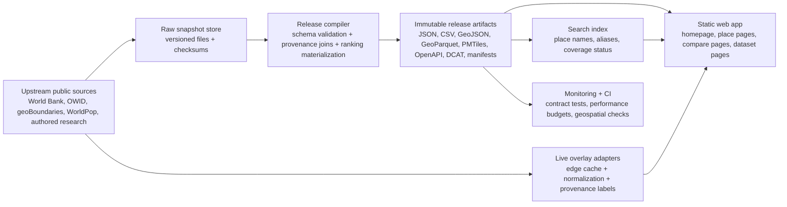

# PainMap Improvement Plan for Codex GPT-5.5-xhigh

## Executive summary

The first source inspected was **painmap.org** itself: the homepage, route pages such as `/about/`, `/api/`, `/places/`, `/methods/`, `/data/`, `/security/`, `/releases/2026-05-31/`, canonical place pages for Brazil and India, and public machine-readable assets including `v1/coverage.json`, `data/openapi.json`, `data/dcat.json`, `data/source-freshness.json`, `data/ui-smoke.json`, `data/endpoint-smoke.json`, `v1/releases.json`, `data/release-modes.json`, and `ogc/index.json`. I also inspected the linked public GitHub repository that appears to back the site. Publicly, PainMap presents itself as a **place-first public research visualization**, not medical or veterinary advice, with explicit provenance, immutable release snapshots, and labeled live overlays. citeturn0view0turn2view0turn2view1turn3view3turn5view0turn24view0turn25view4turn26view0turn27view0turn29view0turn30view0turn30view1turn31view0turn9view0

PainMap already has several unusually strong foundations for a young public atlas: a release-first model with reproducibility language, OpenAPI 3.1, DCAT cataloging, OGC-style discovery endpoints, a public source-freshness registry, explicit uncertainty cues, privacy limits, `security.txt`, and meaningful accessibility affordances such as skip links, a map-independent search path, live regions, and table equivalents. The homepage also uses canonical tags, Open Graph and Twitter metadata, JSON-LD for `Organization`, `WebSite`, and `Dataset`, plus self-hosted vendor scripts with integrity attributes. citeturn35view0turn3view3turn24view0turn25view4turn26view0turn27view0turn28view0turn17view4turn17view6turn17view7turn23view0

The main strategic problem is **not trust or governance**. It is the gap between the product promise and the current depth of place coverage. PainMap says it is a place-first atlas of pain sources, but the current release indexes **2,114 places** while exposing only **2 canonical country profiles**, **8 canonical place measurements**, and **0 direct place-evidence rows**; the coverage JSON also shows **239 country rows**, of which **237 are boundary-only**, plus **1,874 ADM1 poverty-context rows**. That means the site already has a sophisticated shell around a still-thin canonical data core. Improving perceived and actual coverage should come before adding more surface complexity. citeturn35view0turn5view0

My highest-confidence recommendation is to **preserve PainMap’s static, immutable, provenance-first philosophy**, while upgrading three layers in order: first, refactor the frontend and data contracts without changing the public concept; second, build a proper release compiler and normalized data model; third, add a scalable geospatial delivery layer for deeper place navigation, using **Equal Earth for the global thematic atlas** and **MapLibre + PMTiles or PostGIS-generated vector tiles** for detailed slippy-map exploration where needed. Equal Earth is appropriate for global thematic maps because it preserves relative area on world maps; vector-tile systems are excellent for interaction and scale, but the mainstream tile ecosystem is usually Web Mercator, so the two-map approach is the right compromise. citeturn42search3turn42search10turn42search21turn41search4turn41search5turn41search10turn41search17

Overall confidence is **high** for the current-state findings taken directly from public pages and assets, **moderate** for implementation inferences, and **limited** for deployment internals that were not observable publicly, such as real traffic, CDN header configuration at the edge, or whether the public GitHub repository is the sole source of truth in production.

## Inspection of the current site

### What PainMap already does well

The current homepage is unusually explicit about evidence posture. It distinguishes a default **snapshot** mode from a **live overlay** mode, stating that snapshot mode reads the frozen `2026-05-31.atlas.2` release and that live overlay mode may query current public rows from **World Bank, OWID, geoBoundaries, and WorldPop** without treating them as immutable release measurements. This is excellent product thinking because it separates reproducible analysis from exploratory freshness. The `release-modes.json` contract and `v1/releases.json` reinforce that architecture and expose a “latest alias” while still telling downstream users to cite immutable release manifests. citeturn35view0turn30view0turn30view1turn16view6

The site also takes provenance seriously. The homepage has a visible “Map provenance” tray, the DCAT catalog enumerates datasets and distributions, and the release surface explicitly advertises checksums, schemas, manifests, and migration artifacts. The public `source-freshness.json` goes further than most small research sites by defining review cadences, source vintages, next-review dates, and update lanes for ten named source groups. That is a strong basis for a credible atlas whose claims are sensitive, contestable, and likely to evolve. citeturn17view2turn24view0turn25view4turn29view0

Accessibility is also better than typical custom-map sites. The inspected homepage has a skip link, a real search form, a combobox input with listbox semantics, status live regions for the search and the map, a tablist for release-mode switching, and explicit copy that the search field and data tables are the “complete non-map path.” The public UI smoke manifest confirms that the site is already checking for ARIA wiring, accessible names, live region IDs, canonical metadata, and route-level visual contracts. That said, a semantic scaffold is not the same thing as fully conformant behavior under keyboard and assistive-technology use, so this foundation should be treated as promising but not yet finished. citeturn18view0turn18view1turn18view2turn18view3turn18view5turn18view7turn26view0turn26view3turn43search0turn43search1

Security and governance are also stronger than expected for a static map project. PainMap exposes a `security/` page, publishes `/.well-known/security.txt`, states that the public surface is read-only with no accounts or payments, and says that CSP, referrer policy, SRI, and static headers are part of its baseline. The homepage HTML includes a CSP meta tag and a strict-origin-when-cross-origin referrer policy, and the stylesheet plus local scripts carry integrity attributes. This is meaningfully better than the default posture of many static research sites. citeturn27view0turn28view0turn23view0turn17view6turn17view7turn44search2turn44search9

### The most important current weaknesses

The biggest weakness is coverage depth. A place atlas that currently surfaces only two canonical country profiles and zero direct place-evidence rows invites a severe expectation mismatch, especially because the interface is polished enough to imply broader maturity. Users can reasonably interpret the site as “global and place-complete,” but the current canonical layer is much closer to “global discovery shell with two deeply authored country profiles and many context placeholders.” PainMap should therefore make coverage status impossible to miss, and should organize the next engineering cycle around increasing canonical place depth and coverage signaling. citeturn35view0turn5view0

The second major weakness is maintainability risk in the frontend. The public repository shows a mostly static site with a **32.3 KB** `index.html`, a **221 KB** `script.js` spanning **5,003 lines**, and a **28.8 KB** `styles.css` spanning **1,562 lines**. The package manifest is minimal and publicly visible scripts are essentially `check` and `serve`. This architecture can work for a focused static microsite, but it is not the right long-term shape for a place atlas that already has releases, source freshness policies, API contracts, comparison pages, events, and structured datasets. citeturn14view0turn11view0turn15view2turn10view0

The third weakness is that the current mapping stack is likely to strain as place coverage deepens. The live site and public code show that the homepage uses self-hosted **D3** and **TopoJSON**, a local Natural Earth country asset, and an **Equal Earth** default thematic view with a globe alternative. That is a sensible choice for a world-scale thematic atlas, especially because Equal Earth is an equal-area projection designed for world thematic maps. But a custom SVG/D3 renderer is not the best fit once PainMap starts carrying denser ADM1 or finer-grained boundary layers, large comparative overlays, or highly interactive detail views. At that point, GPU-backed vector tiles become the better delivery format. citeturn17view1turn17view6turn15view1turn35view0turn42search3turn42search10turn41search4turn41search12

The fourth weakness is that some performance and motion-hardening basics still look unfinished. PainMap already publishes field and cache budgets, which is good discipline, and the published thresholds match modern Core Web Vitals guidance: LCP around 2.5 seconds, INP around 200 milliseconds, and CLS around 0.1. But I did not find `prefers-reduced-motion` handling in current CSS, did not find a service worker in the public script, and did not find `preconnect` or `modulepreload` hints in the homepage HTML. The site is likely still fast at current scope, but it needs automated performance enforcement before the atlas grows much further. citeturn3view4turn43search3turn19view2turn16view8turn23view4turn23view5

### What this implies for the next build

PainMap should **not** be rewritten as a generic GIS stack, nor as a commercial slippy-map clone. Its differentiator is the combination of place-first inquiry, explicit uncertainty, and reproducible release publishing. The right move is to keep that product philosophy while changing implementation shape: release compilation should be normalized and testable, canonical data should become the real product center, and map rendering should become a two-speed system—**Equal Earth for the global thematic story, vector tiles for detailed boundary interaction**. GeoJSON should remain the human-readable interchange format where practical, but machine-scale distributions should expand toward **GeoParquet**, and the OGC-like feature surfaces should move closer to full standards compliance if dynamic querying is added. citeturn40search0turn40search3turn40search5turn45search0turn45search1turn41search5turn41search17

## Prioritized implementation brief for Codex

### The target architecture

The recommended target state keeps immutable public releases as the center of gravity and adds optional live overlays at the edge rather than in the browser alone.



This architecture matches PainMap’s current release philosophy and public artifacts while splitting concerns much more cleanly. It also keeps the release compiler—not the browser—as the place where rankings, provenance joins, and coverage status are materialized. That is the right choice because current PainMap already distinguishes immutable release artifacts from live exploratory overlays, exposes OpenAPI and DCAT assets, and publishes freshness/review rules. citeturn30view0turn30view1turn24view0turn25view4turn29view0

### Recommended deliverables for Codex

The table below is the implementation order I would give Codex. Estimated hours assume one strong full-stack engineer using Codex heavily, not a large team.

| Priority | Deliverable | Acceptance criteria | Est. hours | Risk |
|---|---|---|---:|---|
| P0 | **Coverage-status model and UI honesty pass** | Every place page and map selection shows one of `canonical`, `derived_overlay`, `boundary_only`, or `no_data`; coverage badges are present in map legend, search results, place pages, and `/places/` listings | 18 | Low |
| P0 | **Frontend modularization** | Split current monolith into typed modules, route chunks, and testable UI stores without changing public URLs | 45 | Medium |
| P0 | **Release compiler and typed contracts** | One build command produces validated JSON/CSV/GeoJSON/manifest outputs, with JSON Schema checks and checksum generation | 36 | Medium |
| P0 | **Accessibility hardening** | Keyboard navigation for combobox, tablist, tables, compare flows, and map fallback verified in Playwright; reduced-motion support added | 24 | Medium |
| P0 | **Performance budget automation** | Lighthouse CI blocks regressions against PainMap’s published budgets or updated agreed budgets | 16 | Low |
| P1 | **Per-place metadata and SEO upgrade** | Every place page gets canonical metadata, richer JSON-LD, Open Graph, and place-specific titles/descriptions | 18 | Low |
| P1 | **PMTiles detail-map pipeline** | Country and ADM1 layers build into PMTiles; detail map loads lazily; static Equal Earth atlas remains default | 42 | Medium |
| P1 | **Edge live-overlay API** | Overlay endpoints cache upstream data, attach provenance labels, and never overwrite release rows | 30 | Medium |
| P1 | **Observability and privacy-safe analytics** | Route, search, layer-mode, compare, and place-selection events are aggregated without persistent user IDs | 18 | Low |
| P2 | **PostGIS authoring/query backend** | Optional backend supports richer filtering, geometry QA, and editorial workflows while keeping releases static | 60 | High |
| P2 | **Realtime adapter framework** | Adapters support scheduled checks, cache invalidation, and release-candidate PR creation for volatile sources | 32 | Medium |

### Code-level tasks for Codex

#### Refactor the repository into explicit packages

The public repository looks like a mostly static site today, with large single files and a minimal package manifest. Refactor into a release compiler plus app shell instead of keeping all domain logic inside `script.js`. citeturn10view0turn11view0turn15view2

```text
painmap/
  apps/
    web/
      src/
        routes/
        components/
        maps/
        stores/
        styles/
      public/
  packages/
    schemas/
    atlas-core/
    release-compiler/
    source-adapters/
    search-index/
  workers/
    live-overlay/
  data/
    raw/
    compiled/
      releases/
  scripts/
    build-release.ts
    verify-release.ts
    build-pmtiles.ts
```

#### Introduce a normalized database schema even if the first release compiler is file-backed

PainMap already thinks in terms of places, sources, releases, and provenance. Make that model explicit instead of burying it inside browser code. The schema below is suitable whether you back it with SQLite/DuckDB for the compiler or full PostgreSQL/PostGIS later. Current PainMap already publishes place indexes, source registries, release manifests, and canonical measurement artifacts, so this schema aligns with the public contract rather than inventing a new concept model. citeturn24view0turn25view4turn29view0turn30view0

```sql
create table release (
  release_id text primary key,
  release_date date not null,
  immutable boolean not null default true,
  notes text,
  manifest_sha256 text not null
);

create table place (
  place_id text primary key,          -- e.g. WLD, BRA, IND-AN
  parent_place_id text references place(place_id),
  level text not null check (level in ('world', 'country', 'adm1')),
  iso3 text,
  adm1_code text,
  display_name text not null,
  coverage_status text not null check (
    coverage_status in ('canonical', 'derived_overlay', 'boundary_only', 'no_data')
  ),
  boundary_source_id text,
  centroid_lon double precision,
  centroid_lat double precision
);

create table source (
  source_id text primary key,
  label text not null,
  publisher text not null,
  evidence_kind text not null,
  upstream_url text not null,
  cadence text,
  cadence_days integer,
  last_review_date date,
  next_review_due date
);

create table measurement (
  measurement_id bigserial primary key,
  release_id text not null references release(release_id),
  place_id text not null references place(place_id),
  layer_id text not null,             -- human-suffering, animal-suffering, death, etc.
  metric_id text not null,
  rank_mode text not null,            -- improvement, total, per-being
  evidence_kind text not null,        -- direct, modeled, proxy, overlay
  value_numeric double precision,
  unit text,
  confidence_label text,
  source_id text not null references source(source_id),
  source_vintage text,
  method_version text,
  caveat text,
  payload jsonb not null default '{}'::jsonb
);

create table provenance_edge (
  edge_id bigserial primary key,
  release_id text not null references release(release_id),
  subject_type text not null,         -- measurement, artifact, place
  subject_id text not null,
  predicate text not null,            -- derived_from, generated_by, reviewed_by
  object_type text not null,          -- source, artifact, activity, agent
  object_id text not null,
  metadata jsonb not null default '{}'::jsonb
);
```

#### Define a cleaner public API around immutable releases

OpenAPI 3.1 is already the right direction. Keep what exists, but add versioned, predictable surfaces that make the place status model explicit. OpenAPI’s value is exactly that both humans and machines can understand a service without reading source code, and current PainMap already advertises OpenAPI 3.1 publicly. citeturn3view3turn44search3turn44search11

```yaml
openapi: 3.1.0
info:
  title: PainMap API
  version: 2.0.0
paths:
  /v2/releases/{releaseId}/places/{placeId}:
    get:
      summary: Get a place profile for an immutable release
      parameters:
        - in: path
          name: releaseId
          required: true
          schema: { type: string }
        - in: path
          name: placeId
          required: true
          schema: { type: string }
      responses:
        "200":
          description: Place profile
          content:
            application/json:
              schema:
                $ref: "#/components/schemas/PlaceProfile"
components:
  schemas:
    PlaceProfile:
      type: object
      required:
        - release_id
        - place
        - coverage_status
        - measurements
        - provenance
      properties:
        release_id:
          type: string
        place:
          type: object
          required: [place_id, display_name, level]
          properties:
            place_id: { type: string }
            display_name: { type: string }
            level: { type: string, enum: [world, country, adm1] }
        coverage_status:
          type: string
          enum: [canonical, derived_overlay, boundary_only, no_data]
        measurements:
          type: array
          items:
            $ref: "#/components/schemas/Measurement"
        provenance:
          type: array
          items:
            $ref: "#/components/schemas/ProvenanceEdge"
```

#### Keep Equal Earth for the world atlas and add a lazy detail map for deep navigation

This is the single most important geospatial design recommendation. Equal Earth is suitable for world thematic display because area comparison matters for a global burden atlas. PMTiles and vector tiles are excellent for deeper local interaction because they reduce tile-server overhead and work well with MapLibre. But PMTiles and mainstream vector-tile workflows generally assume pseudo-Mercator/Web Mercator, so Codex should implement a **dual-renderer strategy**, not a forced single-map rewrite. citeturn42search3turn42search10turn41search4turn41search5turn41search10turn41search17

```ts
// apps/web/src/maps/detailMap.ts
import maplibregl from "maplibre-gl";
import { Protocol } from "pmtiles";

export function mountDetailMap(container: HTMLElement) {
  const protocol = new Protocol();
  // @ts-ignore
  maplibregl.addProtocol("pmtiles", protocol.tile);

  const map = new maplibregl.Map({
    container,
    style: {
      version: 8,
      sources: {
        adm1: {
          type: "vector",
          url: "pmtiles://https://cdn.painmap.org/tiles/adm1.pmtiles"
        }
      },
      layers: [
        {
          id: "adm1-fill",
          type: "fill",
          source: "adm1",
          "source-layer": "adm1",
          paint: {
            "fill-opacity": 0.55
          }
        },
        {
          id: "adm1-outline",
          type: "line",
          source: "adm1",
          "source-layer": "adm1",
          paint: {
            "line-width": 1
          }
        }
      ]
    },
    center: [0, 20],
    zoom: 1.8
  });

  return map;
}
```

#### Add an edge overlay adapter that caches public-source responses and stamps provenance

PainMap’s public contract already says live overlays are short-lived, exploratory, and separate from immutable release rows. Preserve that. Do not let browser code freehand-fetch upstreams and merge them opaquely. Move overlays behind a thin cache/provenance layer. citeturn30view1turn25view4

```ts
// workers/live-overlay/src/index.ts
export interface Env {
  CACHE_TTL_SECONDS: string;
}

export default {
  async fetch(request: Request, env: Env, ctx: ExecutionContext): Promise<Response> {
    const url = new URL(request.url);
    const placeId = url.searchParams.get("placeId");
    if (!placeId) {
      return new Response(JSON.stringify({ error: "placeId required" }), { status: 400 });
    }

    const cacheKey = new Request(url.toString(), request);
    const cache = caches.default;
    const hit = await cache.match(cacheKey);
    if (hit) return hit;

    const upstream = `https://api.worldbank.org/v2/country/${placeId.toLowerCase()}/indicator/SP.POP.TOTL?format=json`;
    const res = await fetch(upstream, {
      headers: { "User-Agent": "PainMap live overlay adapter" }
    });

    const body = await res.text();
    const payload = JSON.stringify({
      mode: "live-overlay",
      place_id: placeId,
      fetched_at: new Date().toISOString(),
      provenance: {
        source_id: "world-bank-indicators",
        upstream_url: upstream,
        cache_ttl_seconds: Number(env.CACHE_TTL_SECONDS || "86400")
      },
      data: JSON.parse(body)
    });

    const response = new Response(payload, {
      headers: {
        "content-type": "application/json; charset=utf-8",
        "cache-control": `public, max-age=${env.CACHE_TTL_SECONDS || "86400"}`
      }
    });

    ctx.waitUntil(cache.put(cacheKey, response.clone()));
    return response;
  }
};
```

#### Implement a real CI pipeline rather than relying on ad hoc checks

GitHub Actions is a natural fit because PainMap already has a public GitHub repo, public smoke manifests, and a static release posture. Add contract tests, Playwright, Lighthouse CI, and release verification as mandatory gates. GitHub Actions is designed for customized CI/CD workflows; Playwright supports accessibility testing; Lighthouse CI is designed to assert performance audits in CI. citeturn46search0turn46search1turn46search3turn46search11turn46search15

```yaml
name: painmap-ci

on:
  pull_request:
  push:
    branches: [main]

jobs:
  build-test-release:
    runs-on: ubuntu-latest
    steps:
      - uses: actions/checkout@v4

      - uses: actions/setup-node@v4
        with:
          node-version: 22
          cache: npm

      - run: npm ci
      - run: npm run lint
      - run: npm run typecheck
      - run: npm run test
      - run: npm run build:release
      - run: npm run verify:schemas
      - run: npm run verify:geospatial
      - run: npx playwright install --with-deps
      - run: npm run test:e2e
      - run: npm run test:a11y
      - run: npm run test:lighthouse

      - name: Upload release artifacts
        if: github.ref == 'refs/heads/main'
        uses: actions/upload-artifact@v4
        with:
          name: painmap-release
          path: data/compiled/releases/**
```

## Migration and testing strategy

### Migration path

Do **not** do a big-bang rewrite. The public release design is already one of PainMap’s strongest assets, so the safest path is evolutionary.

Start by freezing the current public contract. Generate typed schemas directly from current JSON assets and ensure the existing homepage, canonical place pages, compare page, release page, and dataset pages can be rebuilt from the new compiler without URL changes. Then carve `script.js` into modules behind the same UI. Only after parity is achieved should Codex introduce a lazy-loaded detail map layer and optional edge overlay endpoints. Finally, if editorial workflows or complex filtering demand it, move the compiler inputs into PostGIS-backed staging tables. This sequence minimizes user-facing risk while steadily increasing internal rigor. citeturn11view0turn24view0turn26view0turn29view0turn30view1

### Testing strategy

PainMap needs five parallel test lanes.

First, **contract tests**: every published artifact should validate against JSON Schema 2020-12, and the OpenAPI document should validate cleanly. PainMap already exposes schema files and an OpenAPI contract; formal validation should become part of release creation, not only documentation. citeturn24view0turn45search2turn45search4turn45search23turn44search3

Second, **accessibility tests**: Playwright should assert the keyboard and screen-reader paths for the combobox, release-mode tabs, compare flows, and place tables, while manual review confirms behavior against the WAI APG combobox pattern and WCAG 2.2. PainMap already exposes the semantic pieces; now it must prove interaction fidelity. citeturn18view0turn18view1turn18view3turn26view0turn43search0turn43search1turn46search1

Third, **performance tests**: Lighthouse CI should run on `/`, `/place/BRA/`, `/place/IND/`, `/compare/`, and `/data/`, and block merges that exceed agreed budgets. Since PainMap already publishes performance budgets and modern Core Web Vitals thresholds are well defined, those targets should become PR gates rather than aspirations. citeturn3view4turn43search3turn43search6turn46search3turn46search15

Fourth, **geospatial accuracy tests**: if PostGIS enters the toolchain, use `ST_IsValid` and `ST_IsValidDetail` to guarantee geometry hygiene, `ST_Transform` to make CRS changes explicit, `ST_Area` to compare expected area calculations, and `ST_Contains` or `ST_Within` to verify representative points and selection logic. Because GeoJSON and OGC API Features core assume WGS84 longitude/latitude, those tests should explicitly separate source CRS, storage CRS, and rendered CRS. citeturn48search0turn48search1turn48search2turn48search3turn48search13turn40search0turn40search5

A practical geospatial test pack should include these hard thresholds:

| Check | Proposed threshold | Why it matters |
|---|---|---|
| Geometry validity | 100% of released geometries valid | Prevents broken rendering and wrong hit-testing |
| Representative point containment | 100% of place representative points fall inside their polygons | Prevents wrong click/focus mapping |
| Area drift after transform/simplification | `< 1%` for canonical country boundaries; tighter where possible | Preserves thematic credibility |
| Feature count drift | Explicit allowlist only; otherwise zero unexpected adds/drops per release | Prevents silent coverage regressions |
| Boundary-source traceability | 100% of features carry source ID, source vintage, release ID | Supports auditability |

Fifth, **release integrity tests**: the manifest should verify checksums for dataset artifacts, schemas, static routes, and security artifacts before publication. PainMap already says release manifests exist precisely for verification and replay; CI should make that statement mechanically true on every release. citeturn29view0turn30view0turn25view4

## Monitoring, maintenance, security, and ethics

### Monitoring and maintenance plan

PainMap already publishes a source-freshness policy with weekly, monthly, quarterly, and per-release review cadences. Use that public file as the canonical schedule and wire alerts directly to it. The simplest model is: every source has a `next_review_due`, and CI opens a release-candidate issue or pull request when due dates pass or upstream checksums move. citeturn25view4

The recurring operating dashboard should track at least these metrics:

| Metric | Target | Notes |
|---|---|---|
| LCP / INP / CLS | Good thresholds at p75 | Align with web.dev thresholds and PainMap budgets citeturn43search3turn3view4 |
| Release build success | 100% | No partial artifact publication |
| Schema validation pass rate | 100% | JSON Schema + OpenAPI validation citeturn45search2turn44search3 |
| Geometry validity | 100% | PostGIS QA if spatial DB used citeturn48search0turn48search15 |
| Overlay cache hit ratio | High and improving | Indicates edge efficiency |
| Stale source count | 0 overdue critical sources | Derived from `source-freshness.json` citeturn25view4 |
| Search success rate | > 90% for place-search sessions | Indicates naming/alias quality |
| Coverage transparency rate | 100% place pages show status | Prevents false completeness |

### Security priorities

Security should stay boring and explicit.

Keep the current strengths: CSP, referrer policy, SRI, `security.txt`, and a no-account, read-only public surface. Then tighten delivery: enforce secure headers at the CDN or host layer, add dependency and secret scanning in CI, rate-limit any live overlay endpoints, and restrict outbound overlay fetches to a documented allowlist of upstream domains. OWASP treats CSP and secure headers as meaningful defense-in-depth, while RFC 9116 defines `security.txt` precisely for machine-readable vulnerability disclosure. PainMap has already done much of the policy work; now it should operationalize it. citeturn27view0turn28view0turn23view0turn44search0turn44search1turn44search2turn44search9

### Ethical checks specific to a global pain atlas

PainMap is especially vulnerable to **misinterpretation**, **stigmatization**, and **false precision**. The site already labels uncertainty and distinguishes direct evidence, modeled estimates, proxies, and overlays. That is the right starting norm and should be expanded into release-blocking editorial checks. Every place-level ranking should carry: evidence kind, source vintage, caveat, method version, and whether the value is canonical or overlay-only. The provenance registry is already conceptually close to W3C PROV; turning the registry into a PROV-O-aligned export would make lineage clearer to downstream reusers. citeturn35view0turn25view4turn17view2turn45search0turn45search1turn45search5

For PainMap specifically, I recommend these release-blocking ethical rules:

| Check | Release rule |
|---|---|
| Proxy-vs-direct distinction | A place cannot visually resemble a direct-measurement profile if it is boundary-only or proxy-derived |
| Human-vs-animal comparability | Keep separate evidence labels and method notes; never imply a settled universal conversion |
| Boundary politics | Attach boundary source and vintage to every geometry; preserve a public boundary-claims note |
| Sensitive misuse | Do not add user-submitted pain reports or inferred personal geodata into the public atlas |
| Coverage honesty | Never let sparse coverage masquerade as global completeness |
| Correction channel | Every claim surface links to issue reporting or correction workflow |

These are extensions of PainMap’s own public statements: it already says the site is not a personal-data product, already foregrounds caveats, and already exposes corrections and security channels. citeturn35view0turn27view0turn28view1

## Stack options, costs, libraries, and final recommendation

### Tech-stack and hosting comparison

Because traffic and editorial cadence are unknown, the right recommendation is conditional rather than absolute.

| Option | Best when | Core components | Published cost floor | Pros | Cons |
|---|---|---|---|---|---|
| **Stay static-first on GitHub Pages** | Small team, mostly immutable releases, low ongoing cost | Static HTML/JS/CSS, JSON/CSV/GeoJSON artifacts, GitHub Actions | **$0 + domain**, but GitHub Pages has a **soft 100 GB/month bandwidth limit** and **1 GB published site limit** citeturn39search2turn39search4 | Very simple, reproducible, good for immutable datasets | Tight limits for growth; weak for overlays, tiles, and heavy traffic |
| **Cloudflare Pages + Workers + R2** | Best default for PainMap’s next stage | Static app, edge overlay adapters, R2 object storage, PMTiles | Pages static hosting can start free; Workers Paid begins at **$5/month/account**, and Pages Functions bill through Workers; Workers pricing states **no additional egress charges** on that plan citeturn38search4turn38search12turn38search8 | Excellent fit for static releases plus cached overlays and PMTiles | Slightly more moving parts than GitHub Pages |
| **Vercel + managed DB** | Premium DX matters more than infra cost | App on Vercel, optional serverless/edge routes, external Postgres | **$20/month per Pro seat**, plus usage-based overages and product-specific billing citeturn38search1turn38search5turn38search9 | Great developer experience, simple previews | Can become expensive; less aligned with static-first austerity |
| **Netlify + managed DB** | Team wants integrated deploy previews and credits model | Netlify app + functions + external DB | Free tier available; **Personal $9/month**, **Pro $20/month with unlimited seats** under current pricing pages citeturn38search2turn38search18turn38search26 | Good previews and workflow ergonomics | Credit model adds cost-planning complexity |
| **Cloudflare or Vercel front-end + Supabase** | You need Postgres/PostGIS, auth-free APIs, optional realtime | Static/SSR frontend + Supabase Postgres, storage, edge functions | Supabase Pro starts at **$25/project**, with public pricing showing included MAUs and egress before overages citeturn38search3turn38search27 | Strong path if PainMap needs authoring workflows and geospatial SQL | More backend complexity than PainMap currently appears to need |

My recommendation is **Cloudflare Pages + Workers + R2** as the next default target, with the important caveat that PainMap should remain **static-release-first**. That option fits immutable artifacts, optional edge overlays, and PMTiles unusually well. If the project remains small and mostly release-driven, GitHub Pages is still viable in the very near term, but the bandwidth and size limits make it a weak medium-term home once PMTiles and richer place pages arrive. citeturn39search2turn38search4turn38search12turn41search5turn41search17

### Suggested open-source libraries and licenses

| Library | Recommended use | License |
|---|---|---|
| **MapLibre GL JS** | High-performance interactive detail maps from vector tiles | **BSD 3-Clause** citeturn47search1 |
| **PMTiles** | Single-file vector/raster tile archives on object storage | Reference implementations: **BSD 3-Clause**; spec public-domain/CC0 where applicable citeturn41search13 |
| **D3** | Keep for Equal Earth atlas rendering, custom data visuals, and non-slippy explanatory graphics | **ISC** citeturn47search16turn47search4 |
| **Vite** | Frontend build, route chunking, fast dev and production bundling | **MIT** citeturn47search3turn47search7 |
| **Vitest** | Unit and contract tests for frontend and release compiler logic | **MIT** citeturn46search10 |
| **Playwright** | End-to-end, accessibility, and regression testing across Chromium/Firefox/WebKit | **Apache-2.0** citeturn47search0turn47search2 |

### Final implementation recommendation

If I were handing this to Codex GPT-5.5-xhigh, the core instruction would be:

> **Do not replace PainMap’s product philosophy.** Preserve immutable releases, provenance-first communication, and the equal-area world-atlas default. Refactor the site into typed modules and a release compiler, make coverage status explicit everywhere, then add a lazy detail-map layer using MapLibre + PMTiles for deeper exploration. Treat live overlays as edge-cached, labeled context—not canonical truth. Block merges on schema validation, accessibility, geospatial integrity, and performance budgets.

That recommendation is grounded in the strongest parts of PainMap’s current public design: release snapshots, manifest/checksum language, explicit uncertainty, public source schedules, and accessibility-aware non-map paths. The engineering work now should make the implementation worthy of the concept. citeturn35view0turn29view0turn30view1turn25view4turn26view0

### Open questions and limitations

Some important factors were not determinable from public inspection alone: actual production traffic and bandwidth, whether the public GitHub repository is the complete deployment source of truth, current CDN and host response headers at the edge, team size, preferred editorial workflow, appetite for operating a spatial database, and whether deeper ADM2 or city-level coverage is planned. Those uncertainties do not change the priority order above, but they do affect whether PainMap should stop at a static compiler plus edge overlays or proceed into a fuller PostGIS-backed platform.