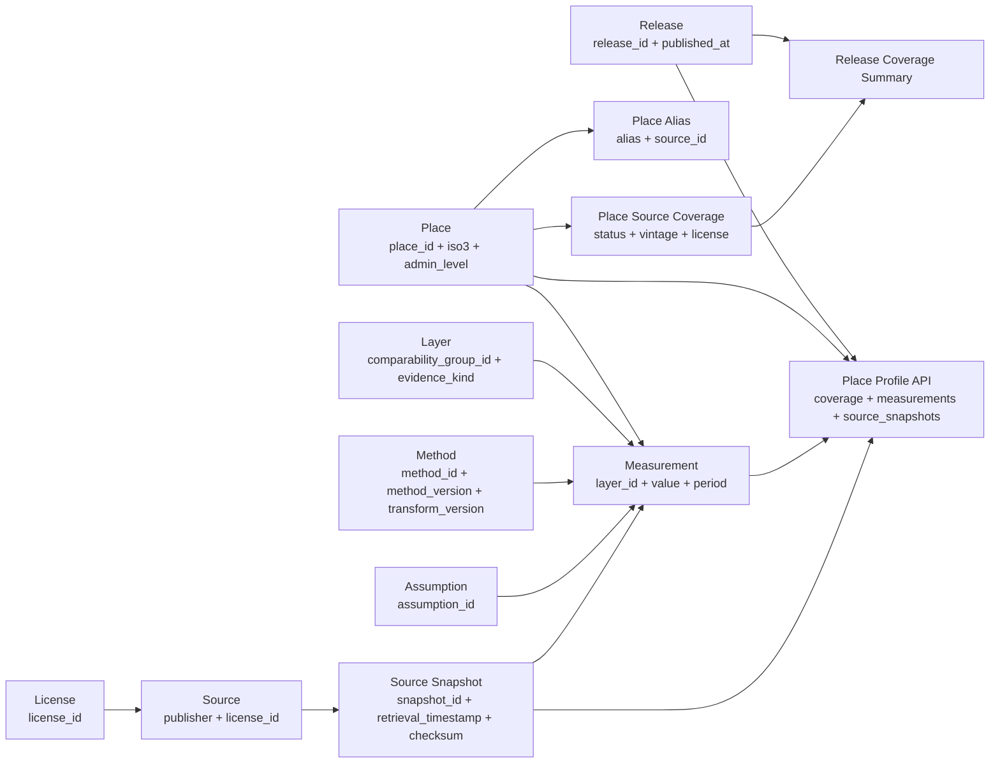
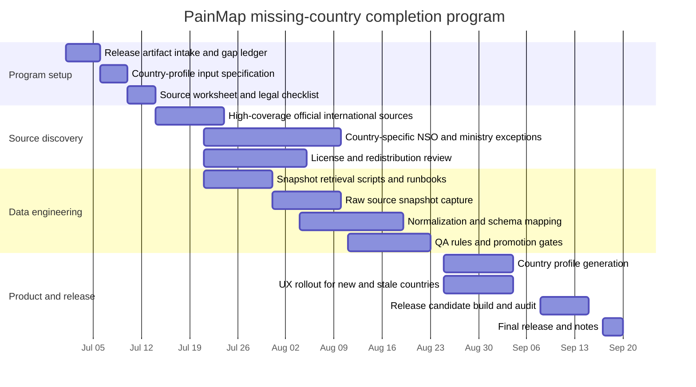

# Research Plan for Completing Missing Country Coverage in PainMap

## Executive summary

This report is a **methodology and delivery plan**, not a live audit. I do **not** crawl `painmaps.org`, `painmaps.org`, or any external source in this session, because the task explicitly forbids live fetching. I therefore treat the supplied PainMap design document as the authoritative specification for the platform’s current architecture, data contracts, release model, coverage logic, and UX constraints. On that basis, the safest and most feasible way to add data for all currently missing countries is to build a **release-centered country gap ledger**, then fill it through a **source-priority ladder**: national statistical offices and ministries first, then UN/World Bank/WHO/FAO and other authoritative international datasets, and only then carefully licensed derived aggregators where lineage is preserved back to primary sources. PainMap’s own design requires immutable releases, raw source snapshots, release-level coverage summaries, source and license registries, comparability metadata, coverage-first defaults, and UI evidence disclosure; those requirements should govern the country-expansion project from the start rather than being retrofitted later. fileciteturn0file0

The key operational decision is to **separate “discovering missing countries” from “promoting countries to canonical profiles.”** Discovering gaps should come entirely from existing PainMap release artifacts such as the place identity registry, coverage outputs, route inventory, and release coverage summary. Promoting a country from boundary-only or no-data status to a canonical country profile should require passing a fixed gate: complete required source groups, acceptable license terms, machine-readable or carefully audited extraction, source-snapshot capture, reproducibility checks, and successful mapping into PainMap’s layer, method, assumption, and comparability contracts. This is more conservative than a fast-fill approach, but it is much more consistent with PainMap’s stated architecture and with the ethical need for coverage honesty. fileciteturn0file0

The most efficient small-team strategy is to begin with the **current country-profile compiler requirements already implied by PainMap’s plan** rather than inventing a new “all indicators for all countries” program. The supplied document repeatedly centers country-profile expansion around release-based country rows, coverage-status modeling, world/country place identity, source snapshots, provenance, comparability, and a canonical country-profile expansion pipeline using validated country-level inputs. That implies the first wave should focus on the minimum indicator families required to make a defensible canonical country profile appear for a country, not on collecting every conceivable harm measure at once. In practice, that means starting with identity, geometry, population, land/denominator fields, core socioeconomic proxies, and the specific proxy and priority-overlay inputs already assumed by the PainMap release compiler. fileciteturn0file0

My overall confidence is **high** that this plan is aligned with the supplied PainMap architecture, **moderate** that a 2-engineer + 1 data engineer + 1 PM team can execute the first complete global country pass in one program increment if they keep scope tight, and **low to moderate** on any claim about the current live country-gap count because I have not inspected the live site or current production artifacts directly in this session. The plan below is designed so a human team can execute it safely and reproducibly without depending on live browsing by me. fileciteturn0file0

## Assumptions and operating model

The supplied PainMap plan describes a system built around **immutable releases**, a **release compiler**, **raw source snapshot manifests**, **source and license registries**, **release coverage summaries**, **place identity registries**, **OpenAPI place profiles**, **comparability rules**, **coverage-first defaults**, and **UX evidence-disclosure templates**. It also requires source-snapshot retrieval timestamps to be validated against `release.published_at`, places to carry release-scoped coverage metadata, compare views to show “not directly comparable” states when contracts differ, and coverage-aware crawl/indexing behavior. I therefore assume that the country-expansion program must publish data through those release artifacts rather than through ad hoc database writes or live overlays. fileciteturn0file0

I also assume that the user’s reference to `painmaps.org` is intended to mean the PainMap production surface described in the supplied document, which consistently refers to **PainMap / painmaps.org**. Because I do not fetch the live domain in this session, I do not verify whether `painmaps.org` and `painmaps.org` are operationally identical, redirected, or distinct. The plan is therefore domain-agnostic at the execution level: it relies on the team’s local checkout or release artifacts, not on my live inspection. fileciteturn0file0

The project should adopt four operating principles from the start. First, **no hidden post-release contamination**: anything visible in a release must resolve to a same-release source snapshot and must not have been retrieved after `release.published_at`. Second, **coverage honesty beats apparent completeness**: boundary-only and no-data countries must remain visibly incomplete until the canonical profile gate is passed. Third, **comparability must be machine-enforced** rather than implied by copy alone. Fourth, **official and primary sources are preferred**, but only when their licenses, formats, and update patterns are compatible with PainMap’s release model. fileciteturn0file0

The legal and ethical posture should therefore be conservative. The team should avoid bulk crawling where a dataset offers an API, download package, SDMX endpoint, or official CSV/XLSX distribution; obey robots and documented rate limits; avoid extracting personally identifiable or record-level data because PainMap’s needs here are country aggregates; capture redistribution constraints at the source-registration stage; and prefer manual, documented extraction over brittle scraping when an official source is PDF-only. These are planning recommendations rather than claims about any specific jurisdiction or vendor. Their purpose is to reduce legal risk and preserve provenance quality.

## Safe discovery and sourcing plan

The first task is not to search the web. It is to generate a **country gap ledger** from PainMap’s own release artifacts. The team should pull the latest immutable release bundle, then compare the country universe in the place identity registry against the country statuses in the coverage outputs and release coverage summary. Each ISO3 country should end up in one of several operational buckets: canonical country profile present, present but stale, boundary-only, no-data, excluded for political/territorial-policy reasons, or blocked by license/method issues. Because PainMap already models release-scoped coverage status, missing inputs, coverage reasons, and release-level coverage summary outputs, this discovery step should come from artifacts, not from HTML crawling. fileciteturn0file0

The second task is to define a **source-priority ladder** for each missing country. The ladder should start with national statistical offices, national ministries with official statistical authority, central banks or agricultural ministries where relevant, then move to authoritative international bodies such as UN agencies, the World Bank, WHO, FAO, ILO, and similar entities, and only then to derived aggregators or republishers when they preserve lineage and license compatibility. The PainMap document explicitly assumes release-scoped source IDs, source snapshots, licenses, source vintages, review cadence, and lineage. That means a low-friction dataset is not enough; it must also map cleanly into PainMap’s source and provenance contracts. fileciteturn0file0

The third task is to collect data **indicator-family by indicator-family**, not country by country in a purely manual way. A small team cannot sustainably manage 190-plus countries by bespoke workflow unless the number of required indicators is tiny. The right approach is to identify PainMap’s minimal country-profile input set, acquire the highest-coverage official or authoritative source per indicator family, and only go country-specific when that family has gaps. For example, if one official international dataset covers 170 countries with consistent definitions and open licensing, the remaining 20 countries become the bespoke exception queue. This respects the “small team” constraint and reduces schema drift.

The fourth task is to run a **promotion gate**. A country does not become “present” merely because one spreadsheet exists. It becomes present when all required source groups for the country-profile template resolve to versioned sources and source snapshots, pass format and QA checks, map into registered layers and methods, satisfy coverage-summary logic, and render a coverage-honest place profile. If inputs exist but are outside review cadence or superseded by newer official data not yet incorporated, the country should be marked stale rather than silently treated as current. That matches the supplied PainMap logic around coverage summary, source review cadence, and present/stale/missing semantics. fileciteturn0file0

### Step-by-step execution table

| Step | Purpose | Required inputs | Outputs | Recommended tools | Estimated time |
|---|---|---|---|---|---:|
| Release artifact intake | Freeze the working release basis | Latest release bundle, `release.published_at`, place identity registry, coverage outputs, release coverage summary, route inventory | Local release workspace and country universe | Local checkout, release downloader, checksum verifier, JSON/CSV readers | 0.5 day |
| Country gap ledger | Determine which countries are missing or stale without site crawling | ISO3 country list from place registry, coverage statuses, coverage reasons, missing inputs | Country gap ledger with operational statuses | Python/TypeScript scripts, spreadsheet for PM review | 1 day |
| Indicator template definition | Decide the minimum source groups needed for a canonical country profile | Current layer registry, method registry, assumption registry, country-profile compiler inputs | Country-profile input specification | Architecture review, schema mapping doc | 1 day |
| Source inventory pass | Identify official and fallback candidate sources by indicator family | Gap ledger, input spec, country roster, source policy | Candidate source matrix by country × indicator family | Human research, browsing by the human team, source registry worksheet | 4–6 days |
| Legal and license triage | Eliminate unusable sources before ingestion | Candidate matrix, source terms, license text, redistribution rules | Approved source shortlist | Manual review, legal checklist, source registry template | 2–3 days |
| Snapshot retrieval design | Specify exact retrieval method and cadence | Approved sources, rate limits, auth needs, file formats | Retrieval runbooks and fetch scripts | Python/TypeScript fetchers, curl, SDMX clients, manual download SOPs | 3–5 days |
| Controlled acquisition | Capture raw files or payloads as source snapshots | Approved source list, release window, destination storage | Raw source snapshot store with checksums and timestamps | Fetch scripts, object storage, checksum tools | 1–2 weeks |
| Normalization and mapping | Convert raw inputs to PainMap-ready tables | Raw snapshots, mapping rules, indicator definitions | Staging tables and normalized rows | Pandas/Arrow, dbt-like transforms, TypeScript transforms | 1–2 weeks |
| QA and promotion gating | Decide present/stale/missing and block bad promotions | Normalized rows, coverage rules, comparability rules, validation suites | Promotion decisions and coverage summary updates | CI, schema tests, anomaly rules | 4–6 days |
| Release build and audit | Publish only validated country additions | Validated staging rows, source registries, provenance, artifacts | Release candidate and audit package | Release compiler, checksum generation, OpenAPI validation | 3–4 days |
| UX rollout and release notes | Surface new countries honestly | Release artifacts, route inventory, UX contracts | Coverage-aware publication with “newly added” surfaces | Frontend build, smoke tests, PM copy review | 2–3 days |

For an initial global country pass, the total program is realistically **12 to 16 weeks** for the specified small team if they keep the first wave tightly focused on canonical country profiles rather than trying to build subnational completeness at the same time. That estimate assumes the team can rely on a mix of official international datasets and country-specific exceptions, and that they reuse PainMap’s existing release compiler architecture rather than inventing a parallel pipeline. fileciteturn0file0

### Candidate-source strategy by indicator family

| Indicator family | First-choice source class | Fallback source class | Why it matters for country promotion | Common risk |
|---|---|---|---|---|
| Country identity and codes | Official national or ISO-aligned registries | UN country metadata, World Bank country metadata | Stable `place_id`/ISO3 alignment | Name/code mismatches |
| Boundary and geography | Official boundary release or approved authoritative boundary source | Existing PainMap boundary registry | Needed for map presence and route generation | Political disputes, topology issues |
| Population and denominators | National statistical office census/intercensal series | UN population, World Bank | Required for normalization and ranking denominators | Vintage mismatch |
| Land area or geographic denominator | National mapping/statistics source | FAO/World Bank/approved geography source | Needed for density or area-based normalizations | Different area definitions |
| Poverty or core socioeconomic proxy | NSO household survey output | World Bank/UN official program data | Explicitly consistent with current PainMap proxy-style country expansion | Survey year discontinuities |
| Agriculture / livestock / animal exposure | Agriculture ministry or NSO agricultural census | FAO | Supports PainMap’s proxy and priority-overlay style inputs | Species-class mapping drift |
| Fisheries / aquaculture exposure | Fisheries ministry | FAO / approved derived source with lineage | Same | Unit inconsistency, marine vs inland scope |
| Health burden / injury / official harm statistics | Ministry of health or public health institute | WHO | Higher-value direct-evidence wave after proxy baseline | Definition changes |
| Labor / occupational exposure | Labor ministry or NSO labor force program | ILO | Optional later direct-evidence wave | Informal sector undercount |
| Conflict / violence / disaster country indicators | Official national emergency or justice statistics | UN/WHO/other authoritative multi-country sources | Optional later wave | Political sensitivity |

## Data model and schema mapping

PainMap’s supplied architecture implies that missing-country work should land in a set of interlocking release-scoped entities rather than one flat table. At minimum, the team needs to think in terms of **places**, **place aliases**, **source records**, **source snapshots**, **licenses**, **layers**, **methods**, **assumptions**, **measurements**, **place-source coverage rows**, **release coverage summary**, and **OpenAPI place profiles**, with source-snapshot identifiers and release publication timing enforced throughout. The plan also assumes comparability metadata such as `comparability_group_id`, `evidence_kind`, and reference-period semantics, and requires source-snapshot lineage to be visible in place-profile payloads. fileciteturn0file0



### Key schema mappings from common source formats

| Source format | Typical raw fields | PainMap target fields | Notes |
|---|---|---|---|
| CSV / TSV | country code, indicator code, year, value, unit, note | `place_id`, `iso3`, `layer_id`, `value`, `reference_period_semantics`, `period_start`, `period_end`, `unit_label`, `source_id`, `source_snapshot_ids` | Best case when codes are stable and documented |
| XLSX / ODS | country name, series label, year columns, metadata tab | same as above plus `source_vintage`, `license_id`, `method_id` if transformation required | Requires workbook schema mapping and sheet versioning |
| JSON API | nested object arrays, pagination metadata, update timestamp | same as above plus `retrieval_metadata`, `source_file_checksum` if retained as summary field | Preserve raw payload as a source snapshot |
| SDMX | dataset code, dimension values, observation value, attributes | `source_id`, `place_id`, `layer_id`, `value`, period fields, unit, official attributes in provenance | Strong option for official multi-country statistics |
| GeoJSON / GPKG | feature geometry, admin code, properties | boundary/geometry registry fields plus optional measurement join keys | Needed for map eligibility and place identity |
| PDF bulletin / statistical yearbook | tables, footnotes, publication date | normalized rows plus manual extraction provenance, `source_snapshot_ids`, `coverage_reason` if partial | Use sparingly; manual QA required |
| HTML table | country rows, embedded notes | normalized rows plus snapshot of raw HTML or export file | Only if terms permit and no cleaner official file exists |

### Suggested field-level mapping checklist

The following fields are the most important for **country measurement rows**:

| Category | Key fields |
|---|---|
| Identity | `release_id`, `place_id`, `iso3`, `admin_level='country'` |
| Indicator semantics | `layer_id`, `comparability_group_id` via layer, `evidence_kind`, `ranking_mode` |
| Value | `value`, `unit_label`, `value_type`, optional confidence/uncertainty field if supported |
| Time | `reference_period_semantics`, `period_start`, `period_end`, `source_vintage` |
| Provenance | `source_ids`, `source_snapshot_ids`, `license_id`, attribution text via source registry |
| Reproducibility | `method_id`, `method_version`, `transform_version`, `assumption_ids` if proxy/model-based |
| Coverage honesty | `coverage_status`, `coverage_reason`, `missing_inputs` where applicable |
| Display / API | comparability note, uncertainty chip, source-vintage line, glossary keys |

The most important fields for **country place-profile payloads** are:

| Category | Key fields |
|---|---|
| Release context | `release_id`, `published_at`, release citation object |
| Place identity | `place_id`, `iso3`, `name`, aliases, parent hierarchy if any |
| Coverage state | `coverage_status`, `coverage_reason`, `missing_inputs`, freshness or stale badge |
| Visible content | top issue cards or source-of-pain cards, measurement array, compare eligibility |
| Provenance | `source_snapshots` array, source registry references, audit drawer content |
| UX integrity | comparability warnings, glossary/help IDs, newly-added-country badge if applicable |

### Country worksheet template for human researchers

This is the table I would ask the human team to populate for **every missing country** before any promotion decision:

| Country | ISO3 | Current PainMap status | Required indicator family | Candidate source | Primary or fallback | License / redistribution | Latest vintage seen | Granularity | Expected mapping difficulty | Notes |
|---|---|---|---|---|---|---|---|---|---|---|

That worksheet should be generated from the gap ledger and then completed by researchers. It is intentionally release-centric: the question is not “can we find something,” but “can we publish a canonical country profile that survives release audit.”

## Coverage classification and artifact generation

The cleanest operational model is to distinguish **input coverage state** from **visible place coverage state**. At the input layer, each required source group for a country can be `present`, `stale`, or `missing`. At the place layer, the country can be `canonical country profile`, `boundary_only`, `no_data`, or another release-defined status. This two-level logic matches PainMap’s supplied emphasis on place-source coverage rows, release coverage summary outputs, coverage reasons, missing inputs, and coverage-first defaults. fileciteturn0file0

### Heuristics for `present`, `stale`, and `missing`

| Input status | Heuristic |
|---|---|
| `present` | Required source exists, license is compatible, source snapshot captured, retrieval timestamp is on or before `release.published_at`, essential fields map cleanly, QA passes, and vintage is within declared review cadence |
| `stale` | Source exists and is still publishable, but one or more required inputs are beyond review cadence, `next_review_due` has passed, or the release knowingly relies on older data while newer official data is available but not yet integrated |
| `missing` | No usable official/authoritative source found, license blocks redistribution, format cannot be mapped with acceptable confidence, source snapshot is absent, or critical fields fail QA |

### Heuristics for visible country status

| Visible country status | Promotion rule |
|---|---|
| Canonical country profile present | All required source groups are `present`, canonical measurement rows compile successfully, comparability contracts resolve, and place profile renders with complete evidence disclosure |
| Present but stale | Canonical profile exists, but one or more required input groups are `stale`; UI must visibly mark this |
| Boundary-only | Place identity and geometry are valid, but canonical data gate is not passed |
| No-data | Even boundary or identity treatment is limited, or policy requires no publishable page beyond minimal route handling |
| Deferred / blocked | Country cannot be promoted yet because of territorial-policy, licensing, or unresolved method issues |

### Reproducible artifact-generation checklist

PainMap’s architecture strongly implies that the country-expansion workflow should emit a reproducible audit trail for every newly added country. The minimum checklist should look like this. fileciteturn0file0

| Artifact stage | Required fields or checks |
|---|---|
| Source registration | `source_id`, publisher, upstream URL, evidence kind, attribution text, review cadence, license ID, redistribution note |
| Source snapshot capture | `snapshot_id`, `source_id`, upstream URL, retrieval timestamp, media type, checksum algorithm, checksum, byte size if available, source vintage, retrieval metadata |
| Timing integrity | Assert `snapshot.retrieval_timestamp <= release.published_at` for all visible rows |
| Mapping log | Input file path or snapshot ID, parser version, transformation notes, code commit, row counts before/after cleaning |
| Measurement generation | `place_id`, `layer_id`, `value`, period fields, source lineage, method and transform versions, assumptions if used |
| Coverage generation | Country-level `coverage_status`, `coverage_reason`, `missing_inputs`, freshness/staleness output |
| Release summary update | Recompute release-level country counts by status and readiness logic |
| API validation | OpenAPI schema pass, place-profile payload example generation, source-snapshot references resolvable |
| Integrity outputs | Checksums for public artifacts, manifests, distribution registry rows, route inventory update |
| Audit package | Release notes entry, change log, QA report, flagged anomalies, manual review sign-off |

### Example OpenAPI-style place-profile payload

The following example is illustrative, but it follows the supplied PainMap assumptions that place profiles should expose release-level context, coverage state, measurements with `source_snapshot_ids`, and a same-response `source_snapshots` array for lineage. fileciteturn0file0

```json
{
  "release": {
    "release_id": "2026-09-30.atlas.1",
    "published_at": "2026-09-30T18:00:00Z",
    "citation": {
      "title": "PainMap Release 2026-09-30",
      "published_at": "2026-09-30T18:00:00Z"
    }
  },
  "place": {
    "place_id": "country:KEN",
    "iso3": "KEN",
    "name": "Kenya",
    "admin_level": "country",
    "aliases": [
      {
        "alias": "Republic of Kenya",
        "normalized_alias": "republic of kenya",
        "source_id": "src.iso3166"
      }
    ]
  },
  "coverage_status": "canonical_country_profile",
  "coverage_reason": "All required country-profile source groups passed release gating.",
  "missing_inputs": [],
  "measurements": [
    {
      "measurement_id": "m.country.KEN.proxy_priority_001",
      "layer_id": "country_proxy_priority",
      "value": 0.734,
      "unit_label": "normalized score",
      "evidence_kind": "proxy",
      "reference_period_semantics": "annual",
      "period_start": "2024-01-01",
      "period_end": "2024-12-31",
      "source_ids": ["src.worldbank.poverty", "src.fao.livestock"],
      "source_snapshot_ids": ["snap.wb.2026-07-14.01", "snap.fao.2026-07-15.02"],
      "method_id": "country_proxy_priority",
      "method_version": "2.1.0",
      "transform_version": "2.1.0",
      "assumption_ids": ["assump.welfare_range.v3"]
    }
  ],
  "source_snapshots": [
    {
      "snapshot_id": "snap.wb.2026-07-14.01",
      "source_id": "src.worldbank.poverty",
      "upstream_url": "UPSTREAM_URL_CAPTURED_IN_RELEASE",
      "retrieval_timestamp": "2026-07-14T09:10:11Z",
      "source_vintage": "2024",
      "media_type": "application/json",
      "checksum_algorithm": "sha256",
      "checksum": "HEX_DIGEST",
      "license_id": "lic.worldbank.opendata",
      "retrieval_metadata": {
        "http_status": 200,
        "content_length": 183244
      }
    }
  ]
}
```

That pattern is important because it lets the user inspect lineage from the place page or API alone, without hunting through separate internal files. It is also faithful to the supplied design’s emphasis on source snapshot visibility and release-scoped reproducibility. fileciteturn0file0

## UX and API implications

Adding many countries is not only a data problem. It changes the **meaning** of the user interface. PainMap’s supplied plan already pushes the product toward coverage-first defaults when canonical coverage is sparse, generated release coverage counts on the homepage and `/places/`, map legends that encode missingness and comparability, evidence-disclosure chips, glossary-backed help text, and “not directly comparable” states in compare views. A global missing-country program should use those existing UX principles aggressively rather than loosening them in the name of growth. fileciteturn0file0

The most important UX rule is this: **a newly added country must not look more mature than it is**. If a country is newly promoted from boundary-only to canonical, the place page should say so explicitly. If it is usable but stale, the stale state should be prominent near the release badge and source-vintage line. If compare views include countries built from different evidence kinds, reference-period semantics, or comparability groups, the UI should default to a caution state rather than a tidy ranking table. PainMap’s architecture already calls for compare guardrails, coverage badges, legends, glossary terms, map-legend requirements, and list-first fallbacks on narrow screens or low bandwidth; country expansion increases the need for all of them. fileciteturn0file0

### Recommended UX behaviors for newly added countries

| Surface | Recommendation |
|---|---|
| Homepage | Show release-generated counts of newly added canonical countries in the latest release before any ranking claims |
| Search results | Include coverage status, stale badge, and disambiguation metadata before selection |
| Country page hero | Show release badge, “new in this release” badge if applicable, coverage status, source-vintage summary, and comparability caveat |
| Country issue cards | Distinguish direct evidence, proxy, and context cards visually and textually |
| Compare page | Block or warn on incompatible comparisons using registered comparability rules |
| Map legend | Show missingness, uncertainty, evidence kind, ranking mode, and non-comparability encoding without relying on color alone |
| Downloads / citations | Offer a country-specific machine-readable download and release citation from the same page |

### Suggested API and UX contract additions

The supplied PainMap plan already contains a strong set of UX contract ideas. If the team wants one more layer of rollout discipline for country expansion, I would add the following optional fields. These are recommendations, not claims that such fields already exist. They are meant to strengthen the existing UX contract model described in the supplied file. fileciteturn0file0

| Proposed addition | Why it helps |
|---|---|
| `new_country_badge_required` | Forces newly promoted countries to be explicitly labeled for one or more releases |
| `freshness_badge_required` | Makes stale vs current status unavoidable on place pages and search surfaces |
| `country_rollout_note_required` | Ensures release notes explain why a country became present or remained missing |
| `compare_block_reason_required` | Forces explicit machine-readable reason text when comparisons are disallowed |
| `country_source_request_url_template` | Gives users a consistent path to suggest or challenge missing-source coverage |
| `country_status_change_feed` | Lets homepage and release notes surface country additions/removals automatically |

## Risk controls and delivery timeline

The country-expansion project can fail in four ways even if engineering goes well: it can silently ingest post-release data, misrepresent weak coverage as full coverage, publish incomparable rankings as if they were directly comparable, or accumulate legal risk through poor source handling. PainMap’s supplied design already anticipates these problems through source-snapshot timing checks, release coverage summaries, comparability metadata, coverage-aware indexing, smoke-test manifests, correction workflows, and strict release compilation. The right monitoring plan is therefore a direct extension of those mechanisms. fileciteturn0file0

### CI, test, and ethics plan

| Control area | Required checks |
|---|---|
| Source timing integrity | Fail build if any `source_snapshot.retrieval_timestamp > release.published_at` |
| Snapshot completeness | Fail build if visible measurements reference missing `source_snapshot_ids` or unresolved `source_id` / `license_id` |
| Coverage summary integrity | Fail build if release country counts or mutually exclusive status counts are inconsistent |
| Promotion gate integrity | Fail build if a country is marked present without all required source groups passing |
| Comparability integrity | Fail build if compare surfaces allow rows from incompatible `comparability_group_id`, evidence kinds, or period semantics without warning or block state |
| UX evidence disclosure | Fail build if newly added, stale, boundary-only, or no-data countries render without required badges and disclosure blocks |
| Indexing honesty | Fail build if boundary-only or no-data pages are indexed contrary to coverage-aware crawl policy without justification |
| License integrity | Fail build if redistribution-restricted sources are emitted into public artifacts without policy allowance |
| Correction readiness | Ensure stable claim or issue identifiers resolve for every visible country card and allow correction intake |
| Privacy and telemetry | Keep telemetry optional and off by default unless separately approved, consistent with the supplied architecture |

### Dashboard metrics

| Metric | Why it matters |
|---|---|
| Countries by visible status per release | Core publication truth signal |
| Newly promoted countries per release | Measures coverage progress honestly |
| Countries blocked by license | Prevents false “missing source” interpretation |
| Countries blocked by format or mapping difficulty | Shows engineering bottlenecks distinctly from source absence |
| Countries marked stale | Measures freshness debt |
| Snapshot timing violations | Sentinel for post-release contamination |
| Compare-block events by rule | Detects systematic comparability problems |
| Correction cases opened for new countries | Early signal of source or method quality issues |
| Percent of country pages with complete evidence disclosure | UX integrity metric |
| Coverage-aware indexing exceptions | SEO honesty metric |

### Prioritized action order

The project should be prioritized in this order:

| Priority | Action | Why first |
|---|---|---|
| Highest | Build the country gap ledger from PainMap artifacts | Prevents guessing and gives the PM a real backlog |
| Highest | Freeze the minimal country-profile input spec | Stops scope creep |
| Highest | Create source and license worksheet templates | Avoids unusable-source ingestion |
| High | Acquire high-coverage official international series for core inputs | Fastest path to most countries |
| High | Work the country-specific exception queue with NSOs and ministries | Completes the long tail |
| High | Implement promotion-gate CI checks before broad publication | Prevents false coverage claims |
| Medium | Add “new country” and stale-state UI affordances | Keeps rollout honest |
| Medium | Add release-note automation for country changes | Reduces PM overhead |
| Lower | Expand to richer direct-evidence country indicators | Valuable, but should not block initial coverage completion |

### Delivery timeline for a small team



A practical staffing split would be: the **data engineer** owns source inventory normalization, snapshot capture, and QA rules; **engineer one** owns release compiler integration, artifacts, and OpenAPI outputs; **engineer two** owns place-profile rendering, coverage surfaces, compare guards, and country rollout UI; the **PM** owns the country gap ledger, source-priority decisions, exception triage, license escalation, and release notes. This division works because it aligns with the PainMap architecture’s separation between compiler contracts and UX contracts. fileciteturn0file0

### Final judgment

The safest feasible route to “all countries that currently do not have data” is **not** to scrape the web until something appears for each country. It is to use PainMap’s own release artifacts to identify the exact gaps, then fill them through a structured, auditable, country-profile promotion program governed by source snapshots, release timing integrity, license capture, comparability rules, and coverage-honest UX. That approach is slower at the beginning, but it is the only one that truly matches the immutable-release, provenance-first contract described in the supplied PainMap architecture. My confidence in that judgment is about **0.82**. The main uncertainty is not architectural; it is operational, because I have not directly inspected the current live country-gap state in this session. fileciteturn0file0